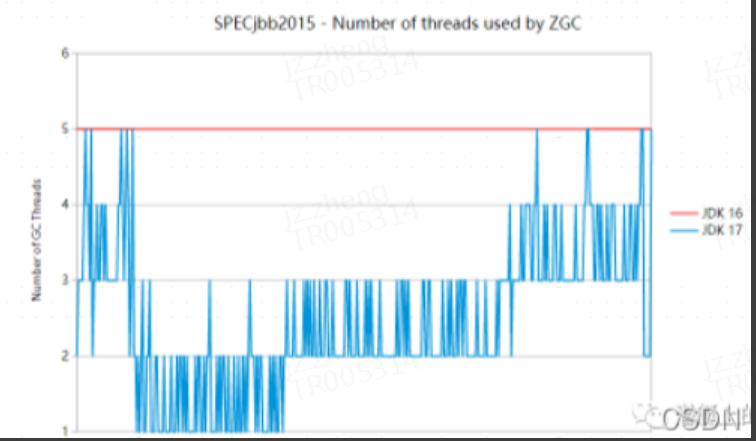

## ZGC

https://github.com/yetianlong/ZGC_Analysis

### Allocation Stall

ZGC日志中可以看到**大量的秒级Allocation Stall**，已经类似于FGC了。Allocation Stall是一种**GC吞吐量不够时触发的线程级的STW**：当没有剩余内存可供申请时，ZGC会暂停当前用户线程并专注于回收内存。

G1和ZGC都基于标记-复制算法，但算法具体实现的不同就导致了巨大的性能差异

### G1的停顿性能瓶颈

> G1未能解决转移过程中准确定位对象地址的问题

- 标记阶段，即从GC Roots集合开始，标记活跃对象；
  - **初始标记阶段**：初始标记阶段是指**从GC Roots出发标记全部直接子节点的过程，该阶段是STW的**。由于GC Roots数量不多，通常该阶段耗时非常短。
  - 并发标记阶段：并发标记阶段是指从GC Roots开始对堆中对象进行可达性分析，找出存活对象。该阶段是并发的，即应用线程和GC线程可以同时活动。并发标记耗时相对长很多，但因为不是STW，所以我们不太关心该阶段耗时的长短。
  - **再标记阶段：重新标记那些在并发标记阶段发生变化的对象。该阶段是STW的**。
- 清理阶段：
  - 清理阶段清点出有存活对象的分区和没有存活对象的分区，该阶段不会清理垃圾对象，也不会执行存活对象的复制。**该阶段是STW的**。
- 复制阶段
  - 转移阶段，即把活跃对象复制到新的内存地址上；
    - 复制算法中的转移阶段需要分配新内存和复制对象的成员变量。**转移阶段是STW的**，其中内存分配通常耗时非常短，但对象成员变量的复制耗时有可能较长，这是因为复制耗时与存活对象数量与对象复杂度成正比。对象越复杂，复制耗时越长。
  - 重定位阶段，因为转移导致对象的地址发生了变化，在重定位阶段，所有指向对象旧地址的指针都要调整到对象新的地址上。

四个STW过程中，初始标记因为只标记GC Roots，耗时较短。再标记因为对象数少，耗时也较短。清理阶段因为内存分区数量少，耗时也较短。转移阶段要处理所有存活的对象，耗时会较长。因此，**G1停顿时间的瓶颈主要是标记-复制中的转移阶段STW**。**为什么转移阶段不能和标记阶段一样并发执行呢？主要是G1未能解决转移过程中准确定位对象地址的问题。**

### ZGC原理

> 全并发GC：ZGC在标记、转移和重定位阶段几乎都是并发的，这是ZGC实现停顿时间小于10ms目标的最关键原因

ZGC只有三个STW阶段：**初始标记**，**再标记**，**初始转移**

其中，初始标记和初始转移分别都只需要扫描所有GC Roots，其处理时间和GC Roots的数量成正比，一般情况耗时非常短；再标记阶段STW时间很短，最多1ms，超过1ms则再次进入并发标记阶段。即，**ZGC几乎所有暂停都只依赖于GC Roots集合大小，停顿时间不会随着堆的大小或者活跃对象的大小而增加**。与ZGC对比，G1的转移阶段完全STW的，且停顿时间随存活对象的大小增加而增加。

**！！！JDK17开始，ZGC的运行时线程数是动态的！！！**

（之前版本如果要使用ZGC需要调优ZGC的：

- **-XX:ConcGCThreads** ：并发回收垃圾的线程； 
- **-XX:ParallelGCThreads**：STW阶段使用线程数
-  **-XX:ZCollectionInterval**：ZGC发生的最小时间间隔，单位秒
- **-XX:ZAllocationSpikeTolerance**：ZGC触发自适应算法的修正系数，默认2，数值越大，越早的触发ZGC
-  **-XX:+UnlockDiagnosticVMOptions -XX:-ZProactive**：是否启用主动回收，默认开启，这里的配置表示关闭
- **-Xlog**：设置GC日志中的内容、格式、位置以及每个日志的大小
- ）

作为第一个支持生产版本ZGC的LTS版本的JDK，JDK17中对ZGC做了下述优化：

支持 JVM 选项 -XX:+UseDynamicNumberOfGCThreads。此功能默认启用，并告诉 ZGC 对其使用的 GC 线程数保持智能，这通常会导致 Java 应用程序级别的更高吞吐量和更低延迟。

使用了ZGC的JVM在停止运行时， 基本上是实时的，而之前版本花费的时间更多。

标记算法现在通常使用更少的内存，并且不再容易出现过多的内存使用。

ZGC 现在可以在 macOS/Aarch64 上运行。

ZGC 现在发布了两个 GarbageCollectorMXBean，以提供有关 GC 周期和 GC 暂停的信息。

##### 解决转移过程中准确访问对象的问题

ZGC通过着色指针和读屏障技术，解决了转移过程中准确访问对象的问题，实现了并发转移。大致原理描述如下：并发转移中“并发”意味着GC线程在转移对象的过程中，应用线程也在不停地访问对象。假设对象发生转移，但对象地址未及时更新，那么应用线程可能访问到旧地址，从而造成错误。而在ZGC中，应用线程访问对象将触发“读屏障”，如果发现对象被移动了，那么“读屏障”会把读出来的指针更新到对象的新地址上，这样应用线程始终访问的都是对象的新地址。那么，JVM是如何判断对象被移动过呢？就是利用对象引用的地址，即着色指针。下面介绍着色指针和读屏障技术细节。

https://tech.meituan.com/2020/08/06/new-zgc-practice-in-meituan.html

### ZGC非“银弹”

ZGC 在内存整理和引用更新上采取了不同的策略，给垃圾回收过程带来了巨大的性能提升。内存整理和引用更新都是并发的，也是交替进行的（其他的垃圾回收算法在更新引用时需要所有的线程到达 safe-point ）。但与此同时，我们也应该看到，并发带来的 GC 吞吐率的下降也是不可忽视的。

ZGC：

- 当响应时间比吞吐量占有更高的优先级
- 对那些不能接受长时间暂停的应用程序

G1:

- 对于那些只是在后台进行密集计算的应用程序，G1 或者 Parallel 垃圾回收器可能具有更好的垃圾回收性能

**ZGC Cycles：统计的是ZGC发生的次数以及总耗时**

**ZGC Pauses：统计的是ZGC在GC过程中暂停的次数及暂停时间**