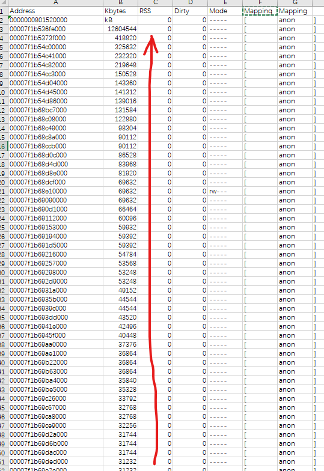

## 堆外泄漏分析

### 问题描述：

JVM内存正常，Docker OOM


### Native Memory Tracking (NMT)

NMT是JVM自带的本地内存追踪工具，能够分析JVM自身分配的一些内存，但是无法追踪非JVM分配的内存

- summary：配合mode=summary使用，输出内存分配的概要信息
- detail：配合mode=detail使用，输出内存分配的概要信息+虚拟内存地址
- baseline：记录一次baseline，用于后续diff
- summary.diff：输出与baseline的概要diff，必须先执行baseline
- detail.diff：输出与baseline的详情diff，必须先执行baseline


**JDK1.8有11项输出结果，含义说明如下：**

| 名称                   | 说明                                                         | 相关JVM参数                                         |
| :--------------------- | :----------------------------------------------------------- | :-------------------------------------------------- |
| Java Heap              | Java堆占用的内存                                             | -Xmx；-Xms                                          |
| Class                  | 元空间占用的内存                                             | -XX:MetaspaceSize；-XX:MaxMetaspaceSize             |
| Thread                 | 线程占用的内存，与线程数相关                                 | -Xss                                                |
| Code                   | JIT生成的代码占用的内存                                      | -XX:InitialCodeCacheSize；-XX:ReservedCodeCacheSize |
| GC                     | 垃圾收集器使用的内存，例如G1的CardTable/RememberedSet等      |                                                     |
| Compiler               | C1/C2编译器优化代码时使用的内存                              |                                                     |
| Symbol                 | 常量池、符号表等，与String.intern也有关系                    | -XX:StringTableSize                                 |
| Native Memory Tracking | NMT使用的内存                                                |                                                     |
| Arena Chunk            |                                                              |                                                     |
| Internal               | 除了上述外的其他内存占用，一般和DirectBuffer、JVMTI有关，Unsafe_AllocateMemory |                                                     |
| Unknown                | 其他无法确定的内存                                           |                                                     |

```shell
Native Memory Tracking:

Total: reserved=12259645KB（保留内存）, committed=11036265KB （提交内存）
堆内存使用情况，保留内存和提交内存和Xms、Xmx一致，都是8G。
-                 Java Heap (reserved=8388608KB, committed=8388608KB)
                            (mmap: reserved=8388608KB, committed=8388608KB)
用于存储类元数据信息使用到的原生内存，总共12045个类，整体实际使用了79M内存。
-                     Class (reserved=1119963KB, committed=79751KB)
                            (classes #12045)
                            (malloc=1755KB #29277)
                            (mmap: reserved=1118208KB, committed=77996KB)
总共2064个线程，提交内存是2.1G左右，一个线程1M，和设置Xss1m相符。
-                    Thread (reserved=2130294KB, committed=2130294KB)
                            (thread #2064)
                            (stack: reserved=2120764KB, committed=2120764KB)
                            (malloc=6824KB #10341)
                            (arena=2706KB #4127)
JIT的代码缓存，12045个类JIT编译后代码缓存整体使用79M内存。
-                      Code (reserved=263071KB, committed=79903KB)
                            (malloc=13471KB #15191)
                            (mmap: reserved=249600KB, committed=66432KB)
GC相关使用到的一些堆外内存，比如GC算法的处理锁会使用一些堆外空间。118M左右。
-                        GC (reserved=118432KB, committed=118432KB)
                            (malloc=93848KB #453)
                            (mmap: reserved=24584KB, committed=24584KB)
JAVA编译器自身操作使用到的一些堆外内存，很少。
-                  Compiler (reserved=975KB, committed=975KB)
                            (malloc=844KB #1074)
                            (arena=131KB #3)
Internal：memory used by the command line parser, JVMTI, properties等。
-                  Internal (reserved=117158KB, committed=117158KB)
                            (malloc=117126KB #44857)
                            (mmap: reserved=32KB, committed=32KB)
Symbol：保留字符串（Interned String）的引用与符号表引用放在这里，17M左右
-                    Symbol (reserved=17133KB, committed=17133KB)
                            (malloc=13354KB #145640)
                            (arena=3780KB #1)
NMT本身占用的堆外内存，4M左右
-    Native Memory Tracking (reserved=4402KB, committed=4402KB)
                            (malloc=396KB #5287)
                            (tracking overhead=4006KB)
不知道啥，用的很少。
-               Arena Chunk (reserved=272KB, committed=272KB)
                            (malloc=272KB)
其他未分类的堆外内存占用，100M左右。
-                   Unknown (reserved=99336KB, committed=99336KB)
                            (mmap: reserved=99336KB, committed=99336KB)
```


**Reserved vs Committed vs Resident**

NMT输出的内存分为Reserved和Committed两类，使用pmap/top输出的内存有Virtual、Rss和Share几类，说明如下：

- Resident：驻留集，实际占用物理内存的大小，包括Share的内存
- Committed：占用的物理内存 + mmap标记为Read/Write的内存，近似于Resident
- Reserved：Committed + mmap标记为NONE的内存，大于Committed
- Virtual：虚拟内存空间，JDK8与Reserved近似

上述几个内存，一般看Resident和Committed，其余的没有必要关注。

- 保留内存（reserved）：reserved memory 是指JVM 通过mmaped PROT_NONE 申请的虚拟地址空间，在页表中已经存在了记录（entries），保证了其他进程不会被占用，且保证了逻辑地址的连续性，能简化指针运算。
- 提交内存（commited）：committed memory 是JVM向操做系统实际分配的内存（malloc/mmap）,mmaped PROT_READ | PROT_WRITE,仍然会page faults，但是跟 reserved 不同，完全内核处理像什么也没发生一样。


**开启**

- JVM开启本地内存跟踪：-XX:NativeMemoryTracking=detail
  - 对性能有影响5%-10%

**jcmd简单查看**

- 先设置一个基准线：
  - jcmd <pid> VM.native_memory baseline
- 运行一段时间后：
  - jcmd <pid> VM.native_memory summary.diff
- 对比地看一下统计信息
  - 看是否是malloc增加


### pmap

查看内存段的情况，可多次采样分析，排除JVM的内存

```shell
pmap <pid | sort -nk2 | less

Address           Kbytes     RSS   Dirty Mode  Mapping
00007f1c9c9c3000  139016   20276       0 r--s- modules
00007f1c6aa00000   36864   23908   23908 rw---   [ anon ]
00007f1c12e00000   69632   24032   24032 rw---   [ anon ]
00007f1c3f000000   53248   25420   25420 rw---   [ anon ]
00007f1bd00fc000   98304   32776   32776 rw---   [ anon ]
00007f1be3200000   69632   36156   36156 rw---   [ anon ]
00007f1c47800000   83968   36844   36844 rw---   [ anon ]
00007f1c89700000   49152   37544   37544 rw---   [ anon ]
00007f1bd617e000   81920   49164   49164 rw---   [ anon ]
00007f1c9548b000   53568   53556   53556 rwx--   [ anon ]
00007f1bdd800000   90112   53616   53616 rw---   [ anon ]
00007f1c8df54000   60096   60040   60040 rwx--   [ anon ]
00007f1c33200000  143360   70308   70308 rw---   [ anon ]
00007f1c6fdff000  418820  417812  417812 rw---   [ anon ]
0000000500000000 12604544 8338128 8338128 rw---   [ anon ]  -- 0000000500000000就是jvm申请的内存，这里有12G
total kB         18561468 9917808 9875224
```

分析发现，堆外的内存呈现逐渐变大的趋势，初步认为就是这边内存块有问题



一般大多数情况是DirectByteBuffer等问题，比如Netty版本bug，可尝试在JVM中设置-Dio.netty.allocator.type=unpooled参数关闭池化，看看效果


### smaps

可以输出内存块使用的详情，包括地址范围和来源

```shell
$ cat /proc/<pid>/smaps > smaps.txt

7f1bd00bf000-7f1bd00fc000 rw-p 00000000 00:00 0 
Size:                244 kB
KernelPageSize:        4 kB
MMUPageSize:           4 kB
Rss:                 104 kB
Pss:                 104 kB
Shared_Clean:          0 kB
Shared_Dirty:          0 kB
Private_Clean:         0 kB
Private_Dirty:       104 kB
Referenced:          104 kB
Anonymous:           104 kB
LazyFree:              0 kB
AnonHugePages:         0 kB
ShmemPmdMapped:        0 kB
FilePmdMapped:         0 kB
Shared_Hugetlb:        0 kB
Private_Hugetlb:       0 kB
Swap:                  0 kB
SwapPss:               0 kB
Locked:                0 kB
THPeligible:    0
ProtectionKey:         0
VmFlags: rd wr mr mw me ac sd 
7f1bd00fc000-7f1bd60fc000 rw-p 00000000 00:00 0 
Size:              98304 kB
KernelPageSize:        4 kB
MMUPageSize:           4 kB
Rss:               32776 kB
Pss:               32776 kB
Shared_Clean:          0 kB
Shared_Dirty:          0 kB
Private_Clean:         0 kB
Private_Dirty:     32776 kB
Referenced:        32776 kB
Anonymous:         32776 kB
LazyFree:              0 kB
AnonHugePages:         0 kB
ShmemPmdMapped:        0 kB
FilePmdMapped:         0 kB
Shared_Hugetlb:        0 kB
Private_Hugetlb:       0 kB
Swap:                  0 kB
SwapPss:               0 kB
Locked:                0 kB
THPeligible:    0
ProtectionKey:         0
VmFlags: rd wr mr mw me nr sd 
```


### gdb

gdb可以dump进程的内存信息查看，知道内存中是什么内容后，可以进一步排查是否存在泄露的情况

1. 安装gdb: **sudo yum install** -y gdb
2. attach: **sudo -u adam gdb** --pid={pid}
3. dump内存: **dump memory** {path} {start_address} {end_address}（内存地址可以使用**pmap**或**less /proc/{pid}/maps**查看）
4. 查看内存中的字面量: **strings** {path}


### perf

perf主要是看线程栈调用的情况（perf record && perf report）


### 内存分配器

Jemalloc：既能提升分配效率，又能dump heap 

1. 下载Jemalloc: https://github.com/jemalloc/jemalloc/releases
2. 安装相关依赖：sudo yum install -y bzip2 gcc make graphviz

在存放Jemalloc压缩包的目录下执行如下操作，假设jemalloc的版本为{version}

1. 解压：**tar** **-xvf** jemalloc-{version}.tar.bz2
2. 编译：**cd** jemalloc-{version} && **./configure** --enable-prof && **make** && **sudo make install**
3. 验证：**jeprof** --version

使用

安装好Jemalloc后，需要在JVM启动时指定使用Jemalloc进行内存分配

指定方式为在JVM参数中设置如下环境变量：

```shell
export LD_PRELOAD=/usr/local/lib/libjemalloc.so
export MALLOC_CONF=prof:true,lg_prof_interval:30,lg_prof_sample:17,prof_prefix:/mnt/mesos/sandbox/{name}/jeprof
#
#LD_PRELOAD: 指定了在JVM启动时需要链接的文件。
#MALLOC_CONF: 指定了Heap profiling的参数。
# - prof：是否需要做Heap profiling。
# - lg_prof_interval：Heap profiling的间隔，以2为底数的指数，单位为bytes，30意味着每分配（2^30 bytes = 1 GB）就生成一dump文件。
# - lg_prof_sample：Heap allocation采样的精度，以2为底的指数，单位bytes，17意味着每分配（2^17 bytes = 128 KB）就做一次采样，值越高保真度越低，但程序性能越好。
# - prof_prefix：Heap dump的路径及前缀，需要确保程序对该路径有写入权限，生成的文件名格式为<prefix>.<pid>.<seq>.i<iseq>.heap。
```

生成dump报告:（https://github.com/jemalloc/jemalloc/wiki/Use-Case:-Leak-Checking）

```shell
# 如果上述步骤进行无误，程序运行后一段时间可以在**{prof_prefix}**指定的目录下看到一些名为jeprof.*.heap的文件。执行如下命令：
sudo -u adam /usr/local/bin/jeprof --show_bytes --pdf /usr/java/jdk1.8/bin/java /mnt/mesos/sandbox/{name}/jeprof.* > ~/output.pdf
# 执行完成后就可以看到Heap dump的内容了，通过该内容可以判断是哪里产生了Native Memory分配
```


### DirectByteBuffer

由于服务使用的RPC框架底层采用了Netty等NIO框架，会使用到DirectByteBuffer这种“冰山对象”，先简单排查一下。关于DirectByteBuffer先介绍一下：JDK 1.5之后ByteBuffer类提供allocateDirect(int capacity)进行堆外内存的申请，底层通过unsafe.allocateMemory(size)实现，会调用malloc方法进行内存分配。

实际上，在java堆里是维护了一个记录堆外地址和大小的DirectByteBuffer的对象，所以GC是能通过操作DirectByteBuffer对象来间接操作对应的堆外内存，从而达到释放堆外内存的目的。但如果一旦这个DirectByteBuffer对象熬过了young GC到达了Old区，同时Old区一直又没做CMS GC或者Full GC的话，这些“冰山对象”会将系统物理内存慢慢消耗掉。**或者这个DirectByteBuffer在使用完后，应该被框架回收掉，但是因为框架bug，比如在回收前，框架异常了，则无法触发回收，那么机器内存就会持续上升，最终docker oom**

对于这种情况JVM留了后手，Bits给DirectByteBuffer前首先需要向Bits类申请额度，Bits类维护了一个全局的totalCapacity变量，记录着全部DirectByteBuffer的总大小，每次申请，都先看看是否超限（堆外内存的限额默认与堆内内存Xmx设定相仿），如果已经超限，会主动执行Sytem.gc()，System.gc()会对新生代的老生代都会进行内存回收，这样会比较彻底地回收DirectByteBuffer对象以及他们关联的堆外内存。但如果启动时通过-DisableExplicitGC禁止了System.gc()，那么这里就会出现比较严重的问题，导致回收不了DirectByteBuffer底下的堆外内存了。所以在类似Netty的框架里对DirectByteBuffer是框架自己主动回收来避免这个问题。

##### DirectByteBuffer为什么要用堆外内存

DirectByteBuffer是直接通过native方法使用malloc分配内存，这块内存位于java堆之外，对GC没有影响；其次，在通信场景下，堆外内存能减少IO时的内存复制，不需要堆内存Buffer拷贝一份到直接内存中，然后才写入Socket中。所以DirectByteBuffer一般用于通信过程中作为缓冲池来减少内存拷贝。当然，由于直接用malloc在OS里申请一段内存，比在已申请好的JVM堆内内存里划一块出来要慢，所以在Netty中一般用**池化的 PooledDirectByteBuf** 对DirectByteBuffer进行重用进一步提升性能。

##### 如何排查DirectByteBuffer的使用情况

JMX提供了监控direct buffer的MXBean，启动服务时开启-Dcom.sun.management.jmxremote.port=9527 -Dcom.sun.management.jmxremote -Dcom.sun.management.jmxremote.authenticate=false -Dcom.sun.management.jmxremote.ssl=false -Djava.rmi.server.hostname=10.79.40.147，JMC挂上后运行一段时间，此时Xmx是8G的情况下整体RES逐渐增长到13G，MBean里找到java.nio.BufferPool下的direct节点，查看direct buffer的情况，发现总共才213M。为了进一步排除，在启动时通过**-XX:MaxDirectMemorySize来限制DirectByteBuffer的最大限额**，调整为1G后，进程整体常驻内存的增长并没有限制住，因此这里基本排除了DirectByteBuffer的嫌疑。


####  其他：

- gperftools：
  - https://kkewwei.github.io/elasticsearch_learning/2016/12/15/jvm%E5%86%85%E5%AD%98%E6%B3%84%E9%9C%B2%E6%8E%92%E6%9F%A5%E5%B7%A5%E5%85%B7/

- linux glibc内存泄漏：https://heapdump.cn/article/1709425
- jemalloc
  - https://github.com/jemalloc/jemalloc/wiki/Getting-Started
  - http://jemalloc.net/jemalloc.3.html#opt.lg_prof_sample
  - https://github.com/jeffgriffith/native-jvm-leaks
  - [Troubleshooting_native_memory_leaks.pdf](http://conf.ctripcorp.com/download/attachments/477283528/Troubleshooting_native_memory_leaks_1540301908390001k6DR.pdf?version=1&modificationDate=1608097838000&api=v2)