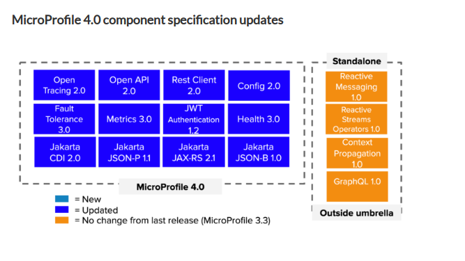

## MicroProfile Design

> Microprofile Config does not contain an implementation itself but only provides the specified API, a TCK and documentation.

**[Java Specification Requests(JSR)](https://jcp.org/en/jsr/all)**

JavaEE And MicroProfile1.0：

MicroProfile4.0：（云）

##### 重点JSR：

- JSR-330：inject
- JSR-365：CDI（Contexts and Dependency Injection for Java 2.0）

##### 相关文档

- [Spring And MicroProfile](https://www.eclipse.org/community/eclipse_newsletter/2019/september/microprofile.php)

- JSF：Jakarta Server Face or JavaServer Faces：一种Java规范，用于为Web 应用程序构建基于组件的用户界面，通过JCP的认证。同时他也是一个MVC框架

  ​		JSF 2 使用Facelets作为它的默认模板系统。也可以采用其他视图技术，例如XUL或普通 Java。相比之下，JSF 1.x 使用JavaServer Pages (JSP) 作为其默认模板系统。

- JCP：Java Community Process，Java社区进程

- JSP：JavaServer Pages

- JSON-P：Json Process，Json处理

- JSON-B：Json Bind，Json绑定，同pojo

- JAX-RS：Java Api for Restful Web Service

- CDI：Contexts and Dependency Injection for Java 2.0

- OSGi：Open Service Gateway Initiative（开发服务网关倡议），Java 动态化模块化系统的一系列规范。OSGi 一方面指维护 OSGi 规范的 OSGi Alliance(OSGi 联盟)，另一方面指的是该组织维护的基于 Java 语言的服务(业务)规范。简单来说，OSGi 可以认为是 Java 平台的模块层，为大型分布式系统以及嵌入式系统提供一种模块化架构减少了软件的复杂度。

