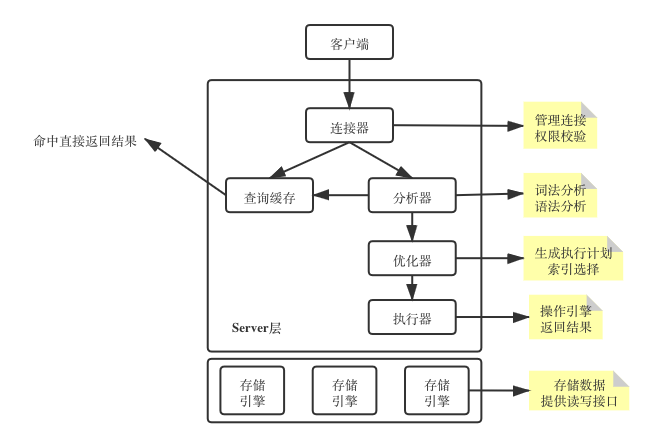
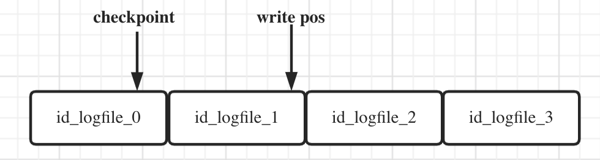
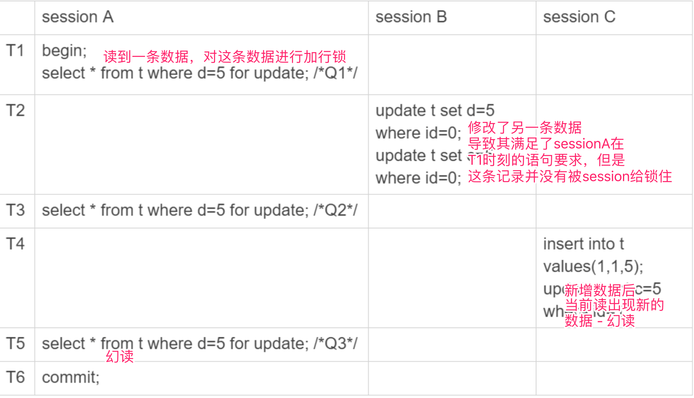
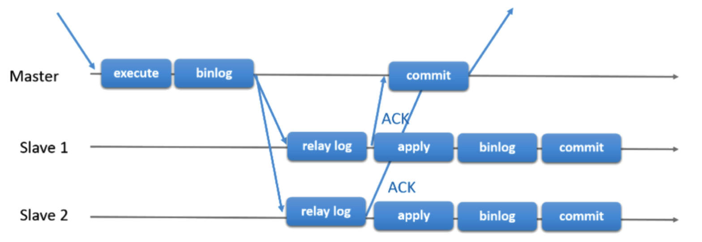
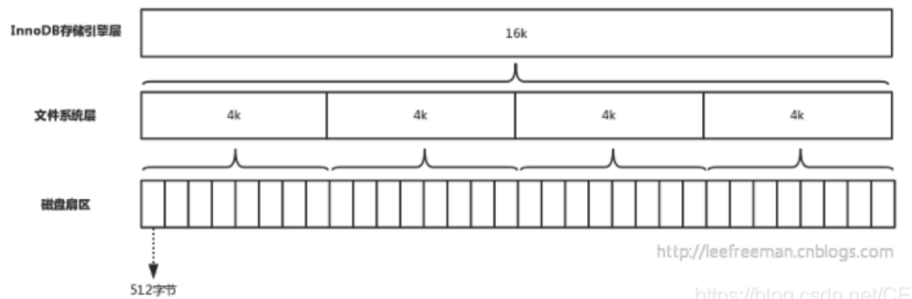

## MySQL

### 基础架构




### Redo Log & Binlog

##### Redo Log：重做日志

- 是**WAL（Write-Ahead Logging）方案**的载体：先写日志（这里的Redo Log），再写存储引擎；分层操作，可提升性能，防止操作丢失（**crash-safe**）

- **工作在存储引擎层**：因为MySQL期初是没有InnoDB的，而Server的Binlog是没有crash-safe功能的，所有InnoDB实现的WAL

- 配置为一组4个文件，每个文件1G，从头开始写，写到末尾就又回到开 头循环写。
  - 两个指针操作日志偏移量（write pos）与持久化偏移量（checkpoint）：



- **redo log buffer**
  - redo log 的写入策略：参数 innodb_flush_log_at_trx_commit 控制（SHOW GLOBAL VARIABLES LIKE 'innodb_flush_log%';）
    - 设置为 0 的时候，表示每次事务提交时都只是把 redo log 留在 redo log buffer 中
    - 设置为 1 的时候，表示每次事务提交时都将 redo log 直接持久化到磁盘
    - 设置为 2 的时候，表示每次事务提交时都只是把 redo log 写到 page cache - **推荐**
  - InnoDB 有一个后台线程，每隔 1 秒，就会把 redo log buffer 中的日志，调用 write 写到文件 系统的 page cache，然后调用 fsync 持久化到磁盘；一个没有提交的事务的 redo log，也是可能已经 持久化到磁盘的
    - **一种是，redo log buffer 占用的空间即将达到 innodb_log_buffer_size 一半的时候，后 台线程会主动写盘**
    - **另一种是，并行的事务提交的时候，顺带将这个事务的 redo log buffer 持久化到磁盘**


##### BinLog：归档日志

- 工作在Server层
- tx start -> binlog cache -> tx commit -> write to FS page cache -> fsync to hard disc
  - write 和 fsync 的时机，是由参数 **sync_binlog** 控制的:
    - sync_binlog=0 的时候，表示每次提交事务都只 write，不 fsync  - **推荐**
    - sync_binlog=1 的时候，表示每次提交事务都会执行 fsync
    - sync_binlog=N(N>1) 的时候，表示每次提交事务都 write，但累积 N 个事务后才 fsync
  - 将 sync_binlog 设置为 N，对应的风险是:如果主机发生异常重启，**会丢失最近 N 个事 务的 binlog 日志**


##### 对比：

| Redo Log                                     | Binlog                                                       |
| -------------------------------------------- | ------------------------------------------------------------ |
| InnoDB引擎特有                               | Server层通用                                                 |
| 物理日志（记录了：某个数据页上做了什么修改） | 逻辑日志（记录语句的原始逻辑，比如：给ID=2这一行的c字段加1） |
| 循环写，固定大小                             | 追加写，写到一定大小后，会创建下一个文件                     |

通常我们说 MySQL 的“**双 1”配置**，指的就是 sync_binlog 和 innodb_flush_log_at_trx_commit 都设置成 1。也就是说，一个事务完整提交前，需要等待两 次刷盘，一次是 redo log(prepare 阶段)，一次是 binlog。


**问题：为什么有两套日志？**

答：期初MySQL无InnoDB引擎，只能利用Binlog进行日志归档，后期InnoDB引擎为支持crash-safe，实现了WAL方案

**问题：先写redo log还是先写binlog**

答：先写redo log，再写binlog：执行器写完数据后（redolog已写完），才会生成binlog记录操作归档，写入磁盘，重点是这两个流程需要一个两阶段提交来保证一致性


### 组提交(group commit)机制

批量提交redolog 和 binlog


### Update/Insert执行流程

> update T set c=c+1 where ID=2;

1. 执行器先找引擎取 ID=2 这一行。ID 是主键，引擎直接用树搜索找到这一行。如果 ID=2 这一行所在的数据页本来就在内存中，就直接返回给执行器;否则，需要先从磁盘读入内 存，然后再返回。
2. 执行器拿到引擎给的行数据，把这个值加上 1，比如原来是 N，现在就是 N+1，得到新的 一行数据，再调用引擎接口写入这行新数据。
3. 引擎将这行新数据更新到内存中，同时将这个更新操作记录到 redo log 里面，此时 redo log 处于 **prepare** 状态。然后告知执行器执行完成了，随时可以提交事务。
4. 执行器生成这个操作的 binlog，并把 binlog 写入磁盘。
5. 执行器调用引擎的提交事务接口，引擎把刚刚写入的 redo log 改成提交(**commit**)状 态，更新完成。


### 两阶段提交

redo log 与 binlog存在依赖关系，任何一个中间出现问题，就会导致异常数据恢复时，出现不一致情况，所以使用两阶段提交（prepare、commit）来解决这个问题

- 如果在binlog写入磁盘后，发送异常，redo log 是prepare状态，但是binlog已经完整了，这时候崩溃恢复过程会认可这个事务，提交掉。


### 事务

##### ACID：

- read uncommitted：一个事务还没提交时，它做的变更就能被别的事务看到
- read committed：一个事务提交之后，它做的变更才会被其他事务看到
- repeatable read：一个事务执行过程中看到的数据，总是跟这个事务在启动时看到的数据是一 致的（**零时视图**）。当然在可重复读隔离级别下，未提交变更对其他事务也是不可见的
- serializable：对于同一行记录，“写”会加“写锁”，“读”会加“读锁”。当出现 读写锁冲突的时候，后访问的事务必须等前一个事务执行完成，才能继续执行

##### Problem：

- dirty read
- nonrepeatable read
- phantom read

##### 实现：

在实现上，数据库里面会创建一个视图，访问的时候以视图的逻辑结果为准。在“可重复读”隔 离级别下，这个视图是在事务启动时创建的，整个事务存在期间都用这个视图。在“读提交”隔 离级别下，这个视图是在每个 SQL 语句开始执行的时候创建的。这里需要注意的是，“读未提 交”隔离级别下直接返回记录上的最新值，没有视图概念;而“串行化”隔离级别下直接用加锁 的方式来避免并行访问。

- **快照**：MySQL通过全局事务id（row trx_id） + 数据多版本 来实现快照功能（**MVCC：Multiversion concurrency**）

  - 可重复读情况下：

    - 事务开启前就已经表明了他能接受的最大事务id

    - 如果某天数据在本事务更新之前，被别的事务改变了，则需要遵循：**更新数据都是先读后写的，而这个读，只能读当前的值，称 为“当前读(current read)”**

      - 除了 update 语句外，**select 语句如果加锁，也 是当前读**

      - 下面这两个 select 语句，分别加了**读锁(S 锁，共享锁)**和 **写锁(X 锁，排他锁)**

        ```sql
        mysql> select k from t where id=1 lock in share mode;
        # lock in share mode 的 SQL 语句，是当前读
        mysql> select k from t where id=1 for update;
        ```

    - 事务总能读到自己更新后的新值（发现数据的当前trx_id是自己的事务id，则直接读取）

- **回滚段**：每条记录在更新的时候都会同时记录一条回滚操作。记录上的最新值，通 过回滚操作，都可以得到前一个状态的值
  
  - undo log： 
    - 事务失败的时候，需要恢复到之前版本
    - 当没有事务再需要它的时候，就可以删掉

##### 区别：

读提交的逻辑和可重复读的逻辑类似，它们最主要的区别是:

- 在可重复读隔离级别下，只需要在事务开始的时候找到那个 **up_limit_id**，之后事务里的其他 查询都共用这个 up_limit_id;
- 在读提交隔离级别下，每一个语句执行前都会重新算一次 up_limit_id 的值。


##### Phantom Read（幻读）

在repeatable read模式下，在同一个事务内，两次 当前读 的结果出现不一致的情况

- **幻读在 “当前读” 下才会出现**
- **幻读仅专指 “新插入的行”**（更新数据，不算幻读，是正常的当前读） - **所以下图T3时刻读到不同的数据集是正常现象**



幻读引发问题：

- 语义不一致：不能锁住期望锁住的记录
- 数据不一致：binlog记录的操作会出现与数据不一致的问题（binlog在statement模式下）
  - 解决：要解决可能出现的数据和日志不一致问题，需要把 binlog 格式设 置为 row

解决：**间隙锁（Gap Lock）**

- 在一行行扫描的过程中，不仅将给行加上了行锁，还给行两边的空隙，也加上 了间隙锁
- **跟间隙锁存在冲突关系的，是“往这个间隙中插入一个记录”这个操作。**间 隙锁之间都不存在冲突关系
- **next-key lock**：间隙锁和行锁合称
- 间隙锁的引入虽然解决了幻读出现的问题，但是也增加了性能开销
  - 间隙锁是在可重复读隔离级别下才会生效的，可把隔离级别设置为读提交


### 索引

##### B+Tree

- 数据块：每个数据块可存储**1200条数据**
  - 层高一定的情况下，可存储更多数据
  - 层高减少，可减少访问磁盘的次数，如果有N层，则最多需要放完N-1层磁盘（减一：是因为一般MySQL会将第一层放入内存）
  - B+Tree读写性能优秀（读log(n)，写log(n)）
  - 页分裂：新增数据，B+Tree为保证一定的顺序性，需要移动数据，如果刚好一个数据块已经满了，则会发生页分裂，新开辟一个数据页存储
  - 页合并：由于删除了数据，空间利用率降低，则会触发数据页的合并
  - 在 InnoDB 中， 每个数据页的大小默认是 **16KB**
- 主键索引：叶子节点存储整行数据
- 非主键索引：叶子节点存储主键
  - 获取真实数据需要“回表”操作
- 如果对字段做了函数计算，就 用不上索引了，这是 MySQL 的规定
  - 因为 B+Tree 在寻找元素的时候，兄弟节点是有顺序的，如果用函数运算后的新值，不在树上维护，则无法知道下一次要往哪走
  - 索引还是会使用的，只是无法快速定位，只会触发索引的全扫描


### 锁

- 全局锁：
  - 使用场景：备份数据库
    - FTWRL方式：该方式下，会在全库增加一个全局锁，使得所有表都是只读状态
    - MVCC方式：依赖事务型引擎，可在并发场景下，保证前后视图逻辑一致：mysqldump -single-transaction
  
- 表锁：
  - lock tables .... read/write：正常表锁，一般也不用了，粒度还是太粗
  - MDL：metadata lock，对表的元数据进行读写限制
    - 不需要显式使用，在访问一个表的时候会被 自动加上
    
    - 保证读写的正确性：在读数据的时候，不能有语句对表的元数据进行修改
    
    -  MySQL 5.5 版本中引入了 MDL，当对一个表做增删改查操作的时候，加 MDL 读 锁;当要对表做结构变更操作的时候，加 MDL 写锁
      - 读锁之间不互斥，因此你可以有多个线程同时对一张表增删改查。
      - 读写锁之间，写锁之间是互斥的，用来保证变更表结构操作的安全性。因此，如果有两个线 程要同时给一个表加字段，其中一个要等另一个执行完才能开始执行。
      
    - 查询MDL写锁阻塞的线程pid：
    
      ```sql
      select blocking_pid from sys.schema_table_lock_waits
      ```
  
- 行锁
  - 两阶段锁协议：**在 InnoDB 事务中，行锁是在需要的时候才加上的，但并不是不需要了就立刻释放，而是要等到事务结束时才释放。这个就是两阶段锁协议。**
    - 知道了这个设定，对我们使用事务有什么帮助呢? **那就是，如果你的事务中需要锁多个行，要把 最可能造成锁冲突、最可能影响并发度的锁尽量往后放。**

  - 死锁：

    - 两个事务，互相在等待对方释放行锁资源
    - 解决方案：
      - 直接进入等待，直到超时。这个超时时间可以通过参数 innodb_lock_wait_timeout 来设置
        - **在 InnoDB 中，innodb_lock_wait_timeout 的默认值是 50s，太久了，业务无法接受**
      - 发起死锁检测，发现死锁后，主动回滚死锁链条中的某一个事务，让其他事 务得以继续执行。将参数 innodb_deadlock_detect 设置为 on，表示开启这个逻辑
        - **正常情况下我们还是要采用第二种策略**

  - 查询行锁阻塞位置：

    ```sql
    select * from t sys.innodb_lock_waits where locked_table=`'test'.'t'`\G
    ```

    **blocking_pid: 4**

    **sql_kill_blocking_query: KILL QUERY 4**

    **sql_kill_blocking_connection: KILL 4**

- Flush Table：关闭MySQL表

```sql
# 如果 flush table 被别的操作阻塞，则会导致我们其他的select阻塞
flush tables t with read lock;
flush tables with read lock;
```


### Change Buffer

更新数据时，如果数据块在内存中，则直接操作内存，如果数据库不在内存中，为避免磁盘操作，提升性能，MySQL设计了Change Buffer，该Change Buffer具备持久化功能（merge），MySQL后台会定时merge Change Buffer到磁盘，同时，如果需要从磁盘读取数据块到内存时，也会触发merge

使用场景：只有 **“普通索引”** 可以使用，对于写多读少的业务来说性能更优秀（账单类、日志类）

配置：change buffer 的大小，可 以通过参数 **innodb_change_buffer_max_size** 来动态设置。这个参数设置为 50 的时候，表示 change buffer 的大小最多只能占用 buffer pool 的 50%


### 空间回收

**参数** **innodb_file_per_table**

- drop命令可回收磁盘空间

- 设置表数据存储在**共享表空间**或者**单独文件**
- OFF：表示存储在共享空间（与数据字典放在一起）- **即使drop掉表，也不会回收空间**
- ON：以单独文件存储，drop表后，直接删除文件
- 从 MySQL 5.6.6 版本开始，它的默认值就是 ON 了

**删除数据行，空间未减少问题：**

InnoDB引擎，delete操作导致：

- 对应数据位置标记为删除，新记录可复用该位置；当整个数据块都被删除，则整个数据块被标记为可复用，如果相邻数据块的利用率都不高，就会合并数据块，标记被合并的区域为可复用，磁盘空间不会释放
- 解决：
  - 重建表
    - alter table t engine=InnoDB
    - analyze table
    - optimize table
  - 重建表的实时方式：
    - 非Online DDL
    - Online DDL
    - Ghost：[gh-ost](https://www.cnblogs.com/zhoujinyi/p/9187502.html)为github开源项目，模拟MySQL slave来达到数据回放
  - 在重建表的时候，InnoDB 不会把 整张表占满，每个页留了 1/16 给后续的更新用。也就是说，其实重建表之后不是“最”紧凑 的。


### 排序

##### order by

**全字段排序 VS rowid 排序**

sort_buffer：排序缓存区，未超过排序缓存区大小（**sort_buffer_size**），则直接 在内存中使用**快排**，超过缓存区大小，则使用磁盘临时文件（生成多个磁盘文件，使用**归并排序**）

如果查询的所有字段加起来的长度很长，超过了 **max_length_for_sort_data** 设置的长度大小，则MySQL会优化：只将 需要排序的字段 + id放入sort_buffer或者临时文件，排序后，再语句id回表获取剩余需要的字段（称之为：rowid排序）

体现了 MySQL 的一个设计思想:**如果内存够，就要多利用内存，尽量减少磁盘访问**

##### 优先队列排序算法

对**快排**和**归并排序**的优化，因为在MySQL中，如果你使用了 order by xxx **limit x** ，如果x的数据量小于**sort_buffer_size**，那么排序时就不要维护所有数据的顺序，使用优先级队列能够减少不必要的排序消耗

##### order by rand() 

使用了**内存临时表**，内存临时表排序的时候使用 了 rowid 排序方法。

##### 磁盘临时表

tmp_table_size 这个配置限制了内存临时表的大小，默认值是 16M。如果临时表 大小超过了 **tmp_table_size**，那么内存临时表就会转成磁盘临时表

##### 严格随机

1. 取得整个表的行数，并记为 C。
2. 取得 Y = floor(C * rand())。 floor 函数在这里的作用，就是取整数部分。 
3. 再用 limit Y,1 取得一行。

```sql
# limit 后面的参数不能直接跟变量
mysql> select count(*) into @C from t;
set @Y = floor(@C * rand());
set @sql = concat("select * from t limit ", @Y, ",1"); 4 prepare stmt from @sql;
execute stmt;
DEALLOCATE prepare stmt;
```


### 并行复制

##### MySQL 5.7并行复制策略 - 组提交

原则：

- **能够在同一组里提交的事务，一定不会修改同一行**

- **主库上可以并行执行的事务，备库上也一定是可以并行执行的**

实现：

- 在MySQL 5.7版本中，其设计方式是将组提交的信息存放在**GTID**中

-  同时处于 prepare 状态的事务，在备库执行时是可以并行的
- 处于 prepare 状态的事务，与处于 commit 状态的事务之间，在备库执行时也是可以并行 的

GTID：Global Transaction Identifier

- 开启：gtid_mode=on 和 enforce_gtid_consistency=on 


##### MySQL 5.7.22 并行复制策略

WRITESET新策略 - 使用参数  binlog-transaction-dependency-tracking  开启：

- **COMMIT_ORDER**：表示的就是前面介绍的，根据同时进入 prepare 和 commit 来判断是 否可以并行的策略
- **WRITESET**：表示的是对于事务涉及更新的每一行，计算出这一行的 hash 值，组成集合 writeset。如果两个事务没有操作相同的行，也就是说它们的 writeset 没有交集，就可以并 行。

当然为了唯一标识，这个 hash 值是通过“库名 + 表名 + 索引名 + 值”计算出来的。如果一个 表上除了有主键索引外，还有其他唯一索引，那么对于每个唯一索引，insert 语句对应的 writeset 就要多增加一个 hash 值。

**对于“表上没主键”和“外键约束”的场景，WRITESET 策略也是没法并行的，也会暂 时退化为单线程模型**


##### MySQL8.0 并行复制策略 - 集合

MySQL8.0 是基于write-set的并行复制。MySQL会有一个集合变量来存储事务修改的记录信息（主键哈希值），所有**已经提交的事务所修改的主键值经过hash后都会与那个变量的集合进行对比**，来判断改行是否与其冲突，并以此来确定依赖关系，没有冲突即可并行。这样的粒度，就到了 row级别了，此时并行的粒度更加精细，并行的速度会更快。

并行复制配置与调优

```
binlog_transaction_dependency_history_size 用于控制集合变量的大小

binlog_transaction_depandency_tracking
用于控制binlog文件中事务之间的依赖关系，即last_committed值

COMMIT_ORDERE: 基于组提交机制
WRITESET: 基于写集合机制
WRITESET_SESSION: 基于写集合，比writeset多了一个约束，同一个session中的事务last_committed按先后顺序递增
transaction_write_set_extraction
用于控制事务的检测算法，参数值为：OFF、 XXHASH64、MURMUR32

master_info_repository
开启MTS功能后，务必将参数master_info_repostitory设置为TABLE，这样性能可以有50%~80%的提升。这是因为并行复制开启后对于元master.info这个文件的更新将会大幅提升，资源的竞争也会变大。

slave_parallel_workers
若将slave_parallel_workers设置为0，则MySQL 5.7退化为原单线程复制，但将slave_parallel_workers设置为1，则SQL线程功能转化为coordinator线程，但是只有1个worker线程进行回放，也是单线程复制。然而，这两种性能却又有一些的区别，因为多了一次coordinator线程的转发，因此slave_parallel_workers=1的性能反而比0还要差

slave_preserve_commit_order
MySQL 5.7后的MTS可以实现更小粒度的并行复制，但需要将slave_parallel_type设置为LOGICAL_CLOCK，但仅仅设置为LOGICAL_CLOCK也会存在问题，因为此时在slave上应用事务的顺序是无序的，和relay log中记录的事务顺序不一样，这样数据一致性是无法保证的，为了保证事务是按照relay log中记录的顺序来回放，就需要开启参数slave_preserve_commit_order。
```


### 主从

延迟问题：show slave status：seconds_behind_master，用于表示当前备库延迟了多少秒

- 解决 ：并行复制，参考上面章节

数据丢失问题


##### 半同步复制 - semi-sync  replication

解决 数据丢失问题，从节点在relay log后，会 向主 节点发生Ack

- InnoDB Redo File Write (Prepare Write)
- Binlog File Flush & Sync to Binlog File
- InnoDB Redo File Commit（Commit Write）
- Send Binlog to Slave
  - 当Master不需要关注Slave是否接受到Binlog Event时，即为传统的主从复制。
  - 当Master需要在第三步等待Slave返回ACK时，即为 after-commit，半同步复制（MySQL 5.5引入）。
  - 当Master需要在第二步等待 Slave 返回 ACK 时，即为 after-sync，增强半同步（MySQL 5.7引入）。

下图是 MySQL 官方对于半同步复制的时序图，主库等待从库写入 relay log 并返回 ACK 后才进行Engine Commit



配置半同步复制的重要的参数

- **rpl_semi_sync_master_wait_no_slave   ON** ：是否打开半同步复制
- **rpl_semi_sync_master_wait_for_slave_count   1** ： 半同步复制 至少等待数据复制到几个从节点再返回。这个数量配置的越大，丢数据的风险越小，但是集群的性能和可用性就越差。最大可以配置成和从节点的数量一样，这样就变成了同步复制。
- **rpl_semi_sync_master_wait_point   AFTER_SYNC** ：控制主库执行事务的线程，是在提交事务之前（AFTER_SYNC）等待复制，还是在提交事务之后（AFTER_COMMIT）等待复制。默认是 AFTER_SYNC，也就是先等待复制，再提交事务，这样完全不会丢数据。AFTER_COMMIT 具有更好的性能，不会长时间锁表，但还是存在宕机丢数据的风险。

如果说，主库提交事务的线程等待复制的时间超时了，这种情况下事务仍然会被正常提交。并且，MySQL 会自动降级为异步复制模式，直到有足够多（rpl_semi_sync_master_wait_for_slave_count）的从库追上主库，才能恢复成半同步复制。如果这个期间主库宕机，仍然存在丢数据的风险。


##### MHA高可用方案

MHA Manager负责管理 MySQL主从结构，在MySQL故障切换过程中，MHA能做到在30秒之内自动完成数据库的故障切换操作，并且在进行故障切换的过程中，MHA能在最大程度上保证数据的一致性，以达到真正意义上的高可用。MHA还支持在线快速将Master切换到其他主机，通常只需0.5－2秒。

目前MHA主要支持一主多从的架构，要搭建MHA，要求一个复制集群中必须**最少有三台数据库服务器**

MHA由两部分组成：MHA Manager（管理节点）和MHA Node（数据节点）

MHA故障处理机制

- 把宕机master的binlog保存下来
- 根据binlog位置点找到最新的slave
- 用最新slave的relay log修复其它slave
- 将保存下来的binlog在最新的slave上恢复
- 将最新的slave提升为master
- 将其它slave重新指向新提升的master，并开启主从复制


### 主备

双Master，单写入

一台master只是作为另一个Master的备份节点，在故障恢复的时候进行主备切换

##### MMM架构

MMM（Master-Master Replication Manager for MySQL）是一套用来管理和监控双主复制，支持双主故障切换 的第三方软件。MMM 使用Perl语言开发，虽然是双主架构，但是业务上同一时间只允许一个节点进行写入操作。

##### MMM故障处理机制

MMM包含writer和reader两类角色，分别对应写节点和读节点

-  当 writer节点出现故障，程序会自动移除该节点上的VIP
- 写操作切换到 Master2，并将Master2设置为writer
- 将所有Slave节点会指向Master2

除了管理双主节点，MMM 也会管理 Slave 节点，在出现宕机、复制延迟或复制错误，MMM 会移除该节点的 VIP，直到节点恢复正常。

##### MMM监控机制

MMM 包含monitor和agent两类程序，功能如下：

- monitor：监控集群内数据库的状态，在出现异常时发布切换命令，一般和数据库分开部署。
- agent：运行在每个 MySQL 服务器上的代理进程，monitor 命令的执行者，完成监控的探针工作和具体服务设置，例如设置 VIP（虚拟IP）、指向新同步节点


### 主备切换

主备延迟问题

- 可靠性优先
  - 主备切换过程一般由专门的HA高可用组件完成，但是切换过程中会存在短时间不可用，因为在切换过程中某一时刻主库A和从库B都处于只读状态
- 可用性优先
  - 不等主从同步完成， 直接把业务请求切换至从库B ，并且让 从库B可读写 ，这样几乎不存在不可用时间，但可能会数据不一致。


### 读写分离

##### 延迟问题

导致的数据不一致（虽然有并行复制降低延迟，也有半同步复制ACK保证数据一致，ACK方案如果有多个从节点，那么只要有一个从节点ACK了就会然后成功了，如果查询刚好落在另外未ACK的节点，也会存在数据不一致；同时业务高压力的情况下，依旧会出现主库与从库不一致的情况，从库执行relaylog耗费时间，导致业务提交事务后，立刻查询查询不到数据）

解决：等待 GTID 方案

```sql
select wait_for_executed_gtid_set(gtid_set, 1);
```

这条命令的逻辑是:

1. 等待，直到这个库执行的事务中包含传入的 gtid_set，返回 0;
2. 超时返回 1

MySQL 5.7.6 版本开始，允许在执行完更新类事务后，**把这个事务的 GTID 返回给客户端**，这 样等 GTID 的方案就可以减少一次查询。

这时，等 GTID 的执行流程就变成了:

1. trx1 事务更新完成后，从返回包直接获取这个事务的 GTID，记为 gtid1; 
2. 选定一个从库执行查询语句;
3. 在从库上执行 select wait_for_executed_gtid_set(gtid1, 1);
4. 如果返回值是 0，则在这个从库执行查询语句;
5. 否则，到主库执行查询语句。

跟等主库位点的方案一样，等待超时后是否直接到主库查询，需要业务开发同学来做限流考虑

问题是，怎么 能够让 MySQL 在执行事务后，返回包中带上 GTID 呢? 你只需要将参数 session_track_gtids 设置为 OWN_GTID，然后通过 API 接口


### 大数据量查询

##### Net Buffer - 查询结果集的发送

实际上，服务端并不需要保存一个完整的结果集。取数据和发数据的流程是这样的:

1. 获取一行，写到 net_buffer 中。这块内存的大小是由参数 net_buffer_length 定义 的，默认是 16k。

2. 重复获取行，直到 net_buffer 写满，调用网络接口发出去。

3. 如果发送成功，就清空 net_buffer，然后继续取下一行，并写入 net_buffer。

4. 如果发送函数返回 EAGAIN 或 WSAEWOULDBLOCK，就表示本地网络栈(socket

   send buffer)写满了，进入等待。直到网络栈重新可写，再继续发送。


##### Buffer Pool LRU - 查询数据块内存缓存

InnoDB Buffer Pool 的大小是由参数 **innodb_buffer_pool_size** 确定的，一般建议设置 成可用物理内存的 60%~80%

**InnoDB 内存管理**：最近最少使用 **(Least Recently Used, LRU) 算法**，InnoDB 对 LRU 算法做了改进: 在 InnoDB 实现上，按照 5:3 的比例把整个 LRU 链表分成了 young 区域和 old 区域，这个策略，就是为了处理类似全表扫描的操作量身定制的，对与历史数据的全表扫描，可以优化数据块针对冷热数据的的缓存过期逻辑


### Join

直接使用join语句，MySQL的优化器会自动选择一个表作为join驱动表

强制优化器不走优化：

```sql
select * from t1 straight_join t2 on (t1.a = t2.a);
```

这个过程是先遍历表 t1，然后根据从表 t1 中取出的每行数据中的 a 值，去表 t2 中查找满 足条件的记录。在形式上，这个过程就跟我们写程序时的嵌套查询类似，并且可以用上被 驱动表的索引，所以我们称之为“Index Nested-Loop Join”，简称 NLJ。

整个执行过程，近似复杂度是 N + N*2*log2M。 显然，N 对扫描行数的影响更大，因此**应该让小表来做驱动表**。**但是，你需要注意，这个结论的前提是“可以使用被驱动表的索引”。**

##### NLJ：“Index Nested-Loop Join”：被驱动表走索引的Join

##### “Simple Nested- Loop Join”：被驱动表不走索引的Join，查询的量级 变为 N * M 非常大，MySQL没有选择这种爆炸的方法

##### Block Nested-Loop Join：BNL ，分块 join，MySQL处理 被驱动表不走索引的Join情况

1. 把表 t1 的数据读入线程内存 **join_buffer** 中，由于我们这个语句中写的是 select *，因 此是把整个表 t1 放入了内存;
2. 扫描表 t2，把表 t2 中的每一行取出来，跟 join_buffer 中的数据做对比，满足 join 条 件的，作为结果集的一部分返回。

假设小表的行数是 N，大表的行数是 M，那么在这个算法里:

1. 两个表都做一次全表扫描，所以总的扫描行数是 M+N; 
2. 内存中的判断次数是 M*N。

可以看到，调换这两个算式中的 M 和 N 没差别，因此这时候选择大表还是小表做驱动 表，执行耗时是一样的。

##### join_buffer满了

join_buffer_size 设定的，默认值是 256k，**如果放不下表 t1 的所有数据话，策略很简单，就是分段放**

如果满了，执行过程就变成了:

1. 扫描表 t1，顺序读取数据行放入 join_buffer 中，放完第 88 行 join_buffer 满了，继 续第 2 步;
2. 扫描表 t2，把 t2 中的每一行取出来，跟 join_buffer 中的数据做对比，满足 join 条件 的，作为结果集的一部分返回;
3. 清空 join_buffer;
4. 继续扫描表 t1，顺序读取最后的 12 行数据放入 join_buffer 中，继续执行第 2 步。

我们再来看下，在这种情况下驱动表的选择问题。

假设，驱动表的数据行数是 N，需要分 K 段才能完成算法流程，被驱动表的数据行数是 M。

注意，这里的 K 不是常数，N 越大 K 就会越大，因此把 K 表示为λ*N，显然λ的取值范围 是 (0,1)。

所以，在这个算法的执行过程中:

1. 扫描行数是 N+λ*N*M; 
2. 内存判断 N*M 次。

显然，内存判断次数是不受选择哪个表作为驱动表影响的。而考虑到扫描行数，在 M 和 N 大小确定的情况下，N 小一些，整个算式的结果会更小。

所以结论是，应该**让小表当驱动表**。

join优化细节，参考MySQL性能优化


### 临时表

临时表只能被创建它的 session 访问，所以在这个 session 结束的时候，会自动删除 临时表。也正是由于这个特性，**临时表就特别适合 join 优化这种场景**

由于不用担心线程之间的重名冲突，临时表经常会被用在**复杂查询的优化**过程中

#####  跨库查询

分库分表系统的跨库查询就是一个典型的使用场景

如果一个查询需要到每个分表里面取一批数据 出来，再聚合 order by  limit 之类的

方案：

在 proxy 层 把各个分库拿到的数据，汇总到一个 MySQL 实例的一个表中，然后在 这个汇总实例上做逻辑操作。

```sql
# 原始SQL
select v from ht where k >= M order by t_modified desc limit 100;

# 在汇总库上创建一个临时表 temp_ht，表里包含三个字段 v、k、t_modified; 在各个分库上执行 - 注意select出来的字段
select v,k,t_modified from ht_x where k >= M order by t_modified desc limit 100;

# 把分库执行的结果插入到 temp_ht 表中
# 再 执行
select v from temp_ht order by t_modified desc limit 100;
```

**在实践中，我们往往会发现每个分库的计算量都不饱和，所以会直接把临时表 temp_ht 放到 32 个分库中的某一个上**

如果当前的 binlog_format=row，那么跟临时表有关的语句，就不会记录到 binlog 里（主备双Master结构下，如果是别的binlog记录模式，sql语句在备节点回放的时候，如果不记录临时表，则会出现表不存在异常）


### 内部临时表

##### 场景一：Union：（select a） union （select b）

将第一个查询子集放入内部临时表，再执行第二个查询，拿第二个子集的结果去内部临时表里去重+新增

Union all：不会使用 内部临时表，直接将两个查询子集发送给客户端

##### 场景二：group by

```sql
# 这个语句的逻辑是把表 t1 里的数据，按照 id%10 进行分组统计，并按照 m 的结果排序 后输出
select id%10 as m, count(*) as c from t1 group by m;
```

1. 创建内存 临时表，表里有两个字段 m 和 c，主键是 m;
2. 扫描表 t1 的索引 a，依次取出叶子节点上的 id 值，计算 id%10 的结果，记为 x; 
   1. 如果临时表中没有主键为 x 的行，就插入一个记录 (x,1); 
   2. 如果表中有主键为 x 的行，就将 x 这一行的 c 值加 1;

3. 遍历完成后，**再根据字段 m 做排序**，得到结果集返回给客户端。（如果内存 临时表不够用，会触发生成磁盘临时表 ，默认Innodb引擎）

自动排序了？  个人猜测，是因为既然是表，那就要遵循B+tree的顺序逻辑，因为这个内存临时表默认创建了一个主键字段，所有需要维护树的顺序？

如果你的需求并不需要对结果进行排序，那你可以在 SQL 语句末尾增加 **order by null**， 也就是改成:

```sql
select id%10 as m, count(*) as c from t1 group by m order by null;
```

##### 优化：思路 - 去掉 临时表、大数据量直接使用磁盘临时表

去掉 临时表：

不论是使用内存临时表还是磁盘临时表，**group by 逻辑都需要构造一个带唯 一索引的表**，执行代价都是比较高的。如果表的数据量比较大，上面这个 group by 语句 执行起来就会很慢

如果索引有序，那么group by  就可以直接顺序读索引，直接知道对应group字段的 count值，再进行count就好了，不需要临时表

InnoDB刚好可以满足这样的顺序性

方案：在 MySQL 5.7 版本支持了 generated column 机制，用来实现列数据的关联更新

```sql
# 创建一个列 z，然后在 z 列上创建一个索引
alter table t1 add column z int generated always as(id % 100), add index(z);
# 这样，索引 z 上的数据就是类似图 10 这样有序的了。上面的 group by 语句就可以改 成:
select z, count(*) as c from t1 group by z;
```

大数据量直接使用磁盘临时表（非B+tree模式，采用数组 存储）：

```sql
# MySQL 的优化器一看，磁盘临时表是 B+ 树存储，存储效率不如数组来得高。所以，既 然你告诉我数据量很大，那从磁盘空间考虑，还是直接用数组来存吧
select SQL_BIG_RESULT id%100 as m, count(*) as c from t1 group by m order by null;
```


### 内存表

Memory引擎

内存表的数据部分以数组的方式单独存放，而主键 id 索引里，存的是每个数据 的位置。主键 id 是 hash 索引，可以看到索引上的 key 并不是有序的


### 自增主键

存储位置：

- MyISAM：保存在数据文件中
- InnoDB：
  - 5.7及以前：保存在内存，并未持久化，每次MySQL重启的时候，会先读取表的的最大id，**并将 id+1** 作为当前表的最大值
  - 8.0后：id支持持久化，将自增值的变更记录在了 redo log 中，重启的时候依靠 redo log 恢复重启之前的值

自增逻辑：

- 新增数据时， id 字段指定为 0、null 或未指定值，那么就把这个表当前的 AUTO_INCREMENT 值填到自增字段;
- 如果插入数据时 id 字段指定了具体的值，就直接使用语句里指定的值。
  - 随后触发 **新的自增值生成算法**：从 auto_increment_offset 开始，以 auto_increment_increment 为步长，持续叠加，直到找到第一个大于 X 的值，作为新的 自增值。


### Where And Having

- WHERE 是直接对表中的字段进行限定，来筛选结果

- HAVING 则需要跟分组关键字GROUP BY 一起使用，通过**对分组字段或分组计算函数**进行限定，来筛选结果


### 计算数据量

磁盘扇区、文件系统、InnoDB存储引擎都有各自的最小存储单元




### 数据备份及恢复

可定期dump数据

数据恢复时，可通过dump的数据先还原到某个最近时间点

然后，在通过binlog进行增量回放

- 第一，也是最重要的，“不要把所有的鸡蛋放在同一个篮子中”，无论是全量备份还是 Binlog，都不要和数据库存放在同一个服务器上。最好能做到不同机房，甚至不同城市，离得越远越好。这样即使出现机房着火、光缆被挖断甚至地震也不怕。
- 第二，在回放 Binlog 的时候，指定的起始时间可以比全量备份的时间稍微提前一点儿，确保全量备份之后的所有操作都在恢复的 Binlog 范围内，这样可以保证恢复的数据的完整性。
  - 因为回放 Binlog 的操作是具备幂等性的（为了确保回放幂等，需要设置 Binlog 的格式为 ROW 格式)，多次操作和一次操作对系统的影响是一样的，所以**重复回放的那部分 Binlog 并不会影响数据的准确性**。

