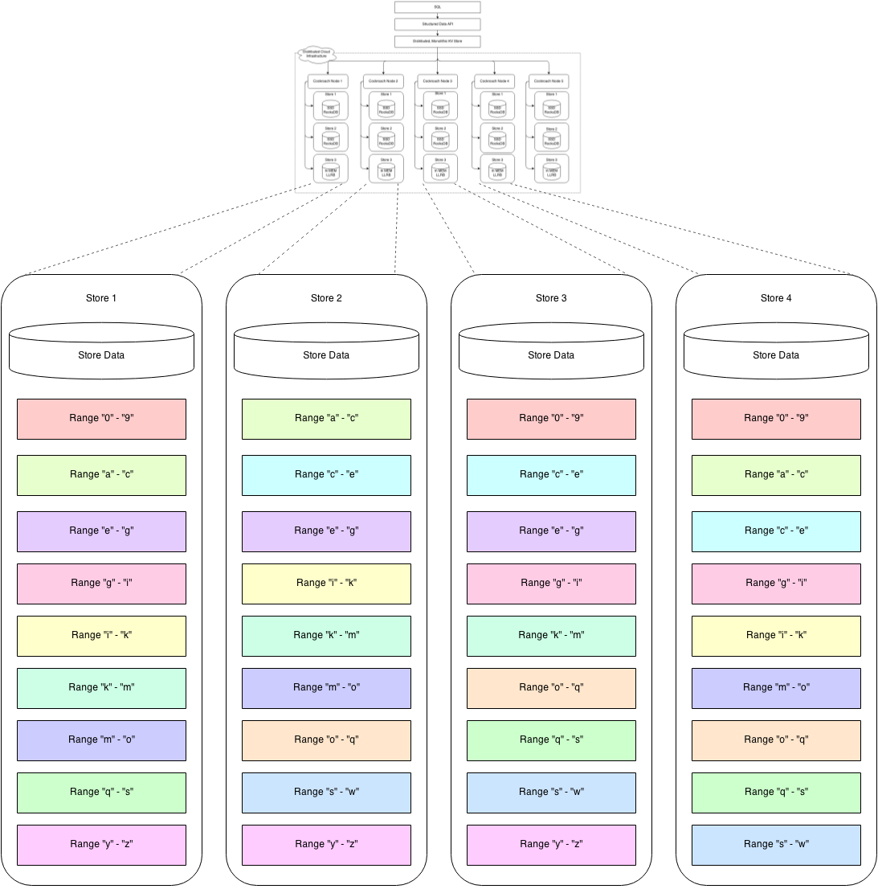
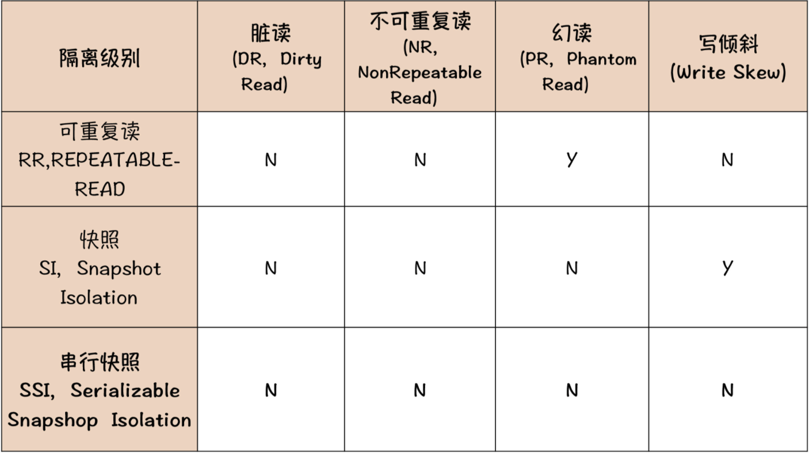

## CockRoachDB

CRDB简称

### 架构：

**去中心化架构**

**计算存储分离架构**

**分层架构：两层SQL层+分布式KV层**

**Range（类似TiDB Region）：采用Raft协议保证Range副本之间的数据强一致性**

CRDB节点之间通过**Gossip协议**进行信息交换。元数据管理采用两级管理，理论上最大支持4EB的数据：

### 隔离级别

CRDB提供两种隔离级别：

- Snapshot Isolation（SI）：快照
- Snapshot Isolation（SSI）：串行快照

”写倾斜“：名词为英译，代指 未进行读写冲突检测，也未加锁，导致的数据写入错误问题

- 快照方式如果存在并发写入，则可能出现数据异常

- 引入 串行快照 解决：SSI 隔离级别在 SI 的基础上，加入了冲突检测的机制，通过检测读写冲突，然后回滚事务的方式来解决写倾斜的问题，当然这种方式付出的代价是降低性能，并且冲突严重的情况下，会频繁地出现事务回滚。

**这两个隔离级别与传统的 RC 和 RR 隔离级别不相上下，可满足大多数在线交易系统对ACID的要求**