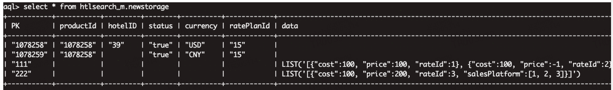
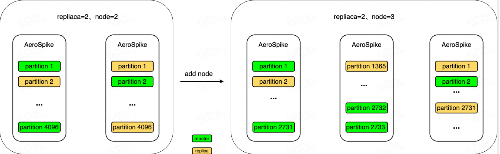
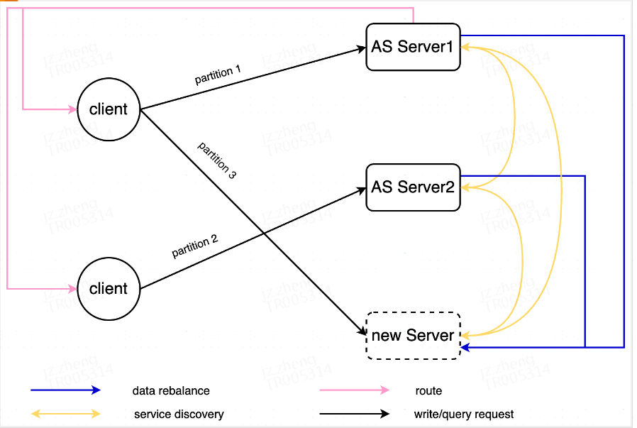
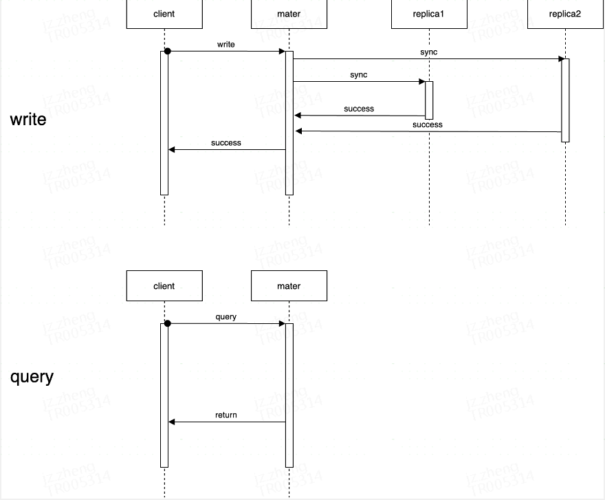

## Aerospike

## AeroSpike是什么？


数据有BIn（列）的概念，schemaless是指数据的Bin的数量和Bin的类型不需要必须一致；

和Redis等KV模型数据库不同的是，数据除了可以通过K（primary index）查询外，还能在非主键列上建立secondary index查询；

标量之外，有CDT（Collection Data Type）,包含了MAP、LIST，可以多层嵌套；

Filter Expression是指写入操作和读取操作带上predicate，用于控制写操作在满足特定要求时写入和在存储侧过滤数据；

可以选择索引和数据全部存在内存和磁盘，也支持索引在内存，数据在磁盘的混合模式；磁盘方式绕过了文件系统，速度更快


## 数据长什么样子

这张图展示了存储的数据，productId、hotelID这些是BIn，其中data这个bin存储的数据类型是CDT的嵌套：List of Map，LIst和Map支持在存储侧排序；




## 分布式集群化部署架构

### 服务端的集群化部署

replica是指集群的复制因子，replica=2表示一份数据有两个节点存储；

目前携程采用物理机方式部署部署AeroSpike；



### 服务端和客户端的交互

AeroSpike是采用shared nothing架构，服务端自管理，集群内部自发现、节点拉出/拉入和数据迁移自管理、服务端可以直接向客户端下发服务端节点信息，只有服务端和客户端两个组件，没有其他的服务发现、故障切换等组件，可以看到整个架构相比携程的redis简单很多；



### 分布式共识

集群间的数据复制采用了最简单的全同步，所以不需要分布式共识算法



## 和其他存储方式的对比

|                                | aerospike                                  | redis                                                        | obkv                                                   | 关系型数据库                                           | mongo                                                        |
| ------------------------------ | ------------------------------------------ | ------------------------------------------------------------ | ------------------------------------------------------ | ------------------------------------------------------ | ------------------------------------------------------------ |
| 纯内存、纯磁盘、混合模式可选择 |  |                    |              |              |                    |
| 二级索引                       |  |                    |              |              |                    |
| Filter Expression              |  |                    | （功能简单） | （SQL实现）  |                    |
| 集合类型（MAP、LIST），可嵌套  |  |                    |              |              |                    |
| JSON                           |  | （redis json插件） |              |              |                    |
| UDF                            |  | （lua）            |              | （存储过程） | （Aggregation Pipeline) |


## Aerospike的特点

1 NoSQL、schemaless，数据有Bin（列）的概念，不需要定义和发布表结构，客户端直接新增字段即可

2 纯内存（纯内存模式也可以设置磁盘数据备份，用于节点重启后的数据恢复）和纯磁盘之外，有混合模式，即索引在内存，数据在磁盘，混合模式能在提供优异性能的前提下降低存储成本；纯内存和混合模式性能优异，能满足缓存的延迟要求；

3 作为KV型存储，在主键查询之外，有二级索引；

4 有强大的Filter Expression，用于控制写操作在满足特定要求时写入和在存储侧过滤数据；

5 标量之外，有CDT（Collection Data Type）,包含了MAP、LIST等数据类型，可以多层嵌套；

6 在CDT数据类型的的支持下，AS支持了JSON，支持JSON PATH过滤数据

7 原生支持集群化，客户端和服务端自管理，客户端感知服务端的变化，不需要服务发现和路由控制层，不需要哨兵机制；

8 有UDF，分为Record UDF（针对单个key，类似于Mysql中的存储过程）和Stream UDF（更加强大，可以在服务端做计算，将结果输出给客户端），UDF可以在服务端注册，也可以直接在客户端将LUA语言写的UDF注册到服务端并调用；

9 有单个key级别的事务能力，事务中可以读写混合；

10 可以设置namespace、set、record级别的TTL，价态缓存数据可以在入住日之后过期；

11 内部架构相对于TIKV和OBKV等分布式持久化存储更简单，没有分布式一致性协议，没有分布式事务，客户端和服务端的交互简单；

12 有集群内数据自平衡能力，有水平扩缩容和故障切换能力；

## 酒店动态信息需要Aerospike的什么功能

动态信息用Aerospike做价态量、产品信息的缓存，用到了以下功能：

1 Aerospike有MAP和LIST的数据类型，且可以嵌套，对酒店价态数据中的酒店-房型-套系等层级关系友好，可以支持房型级别写入数据（部分更新）和酒店级别读取数据，解决B端写入和C端查询之间维度不一致的矛盾；

2 Filter Expression用于过滤无效数据，酒店价态数据中，一个酒店下有很多无价、房态关闭的房型，可以使用Filter Expression在存储侧过滤数据，减少网络IO和反序列化耗时；

3 纯内存和混合模式的性能优异，能满足对于缓存的要求；

4 同一份数据，同时存在有极致性能要求（在线预定，核心）和不要求极致性能但量大（meta投放、预计算，非核心）两种需求，Aerospike能调整存储方式，用一套技术满足不同的需求；

## 其他团队的使用场景

### 酒店算法团队

1 同一份数据，在不同场景有着不同的存储需求，期望能用一套存储介质，应用不要感知不同的存储介质。在线serving场景，对性能有极致要求，使用AS的纯内存或者混合模式；离线训练场景，对性能要求不高，但要求成本低，使用纯磁盘模式；

2 Aerospike支持LIST和MAP等数据类型，对于存在层次关系的数据存储支持友好，如酒店-checkin-实时特征，用户-酒店-序列特征等；

3 和kafka、pulsar、flink这些生态的对接能力

### 酒店查服

1 筛选服务，包括酒店级别的数据、物理房型的数据以及酒店到天级别的数据；当前是放在本地缓存（压缩后仍然接近20G），期望是能分布式存储，降低应用服务器的单机配置和运维压力， 主要功能是读取批量酒店的信息并执行一些筛选逻辑；

2 预计算结果，为各种请求参数（如入住日期、会员等级、站点等）下的产品价格，需要支持的场景有批量酒店的起价、多个入住日期下的起价，以及后续更广范围的模糊查询，考虑使用aerospike，主要是期望使用Collection Data Types、筛选功能等来支持快速查询；

### 度假BU

1 期望能在缓存中做范围查询，现有的redis的范围查询api不太友好；

2 redis集群变大之后面临要么拆分要么迁ROR，但ROR的长尾比较厉害，且redis本身不提供压缩方案，期望能用Aerospike代替；

## 应用

在广告投放、个性化推荐等场景使用较多，在旅游业中，MakeMyTrip使用Aerospike存储用户会话和GDS推送的搜索数据存储；


## aerospike的筛选功能

使用UDF（user defined fuctions）进行MapReduce操作，UDF的开发语言是Lua，可以在服务端定义，然后客户端调用，也可以由客户端定义，注册到服务端执行。

使用Expression进行筛选，query操作中的statement可以指定二级索引的过滤条件，policy中可以指定其他字段的Filter；示例如下：


```java
// Create new query policy
QueryPolicy queryPolicy = new QueryPolicy();
queryPolicy.filterExp = Exp.Build(
    Exp.GeoCompare(Exp.GeoBin("location"), Exp.Geo(region))
);
 
// Create statement
Statement stmt = new Statement();
 
// Set namespace and set name
stmt.SetNamespace("sandbox");
stmt.SetSetName("ufodata");
 
// Create index filter
stmt.SetFilter(Filter.Range("occurred", 20210101, 20211231));
 
// Execute the query
RecordSet recordSet = client.Query(queryPolicy, stmt);
 
// Get the results
try
{
    while(recordSet.Next())
    {
        Key key = recordSet.Key;
        Record record = recordSet.Record;
        // Do something
        Console.WriteLine("Key: {0} | Record: {1}\\n", key.userKey, record.ToString().Split("bins:")[1]);
    }
}
finally
{
    recordSet.Close();
}
 
// Close the connection to the server
client.Close();
```


##### 1 aerospike的索引是怎么存储的？

主键索引红黑树在内存中，二级索引是B+树

##### 2 查询时二级索引可以和Expression一起使用吗？

可以，查询时，二级索引设置在statement中，其他bin的Filter Expression设置在policy中；

##### 3 set index的使用场景？

set在namespace中容量占比越少，set index的效率越高，超过1%时不会提供更高效的性能；

##### 4 二级索引集群模式下查询怎么执行的？

查询任务会被发送到所有节点，各个节点的查询结果在客户端聚合；