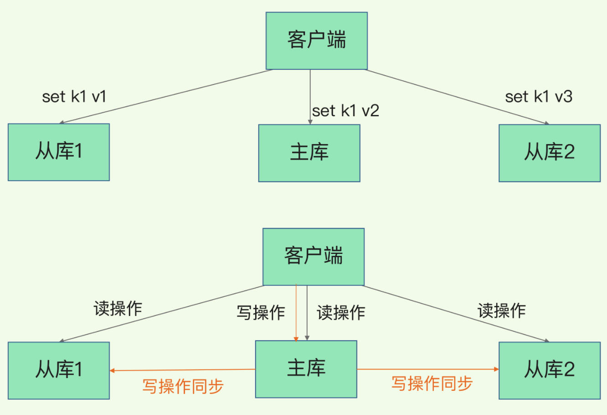
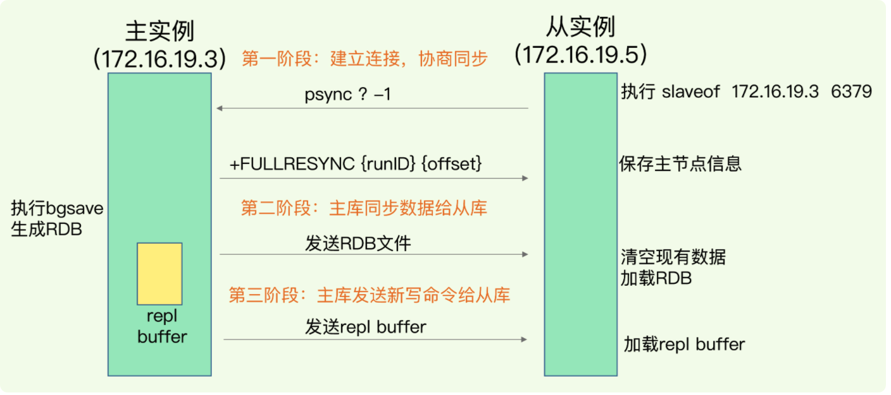
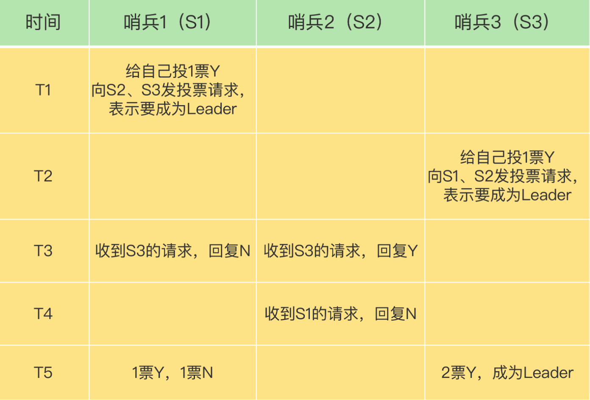
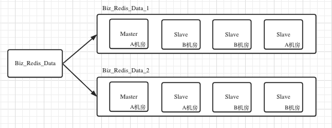

## Redis

### 五大核心数据结构

- **string**

  - 内部编码
    - int：8个字节的长整型
    - embstr：小于等于39个字节的字符串
      - RedisObject的数据同SDS是一块连续的内存区域
    - raw：大于39个字节的字符串
      - RedisObject为SDS分配独立空间，用指针指向SDS
  - 场景
    - 缓存
    - 计数
    - 共享session
    - 限速

- **hash**

  - 内部编码
    - ziplist：压缩列表，当哈希类型元素个数小于`hash-max-ziplist-entries`配置（默认512个）同时所有值都小于`hash-max-ziplist-value`配置（默认64字节）时使用，ziplist使用更加紧凑的结构实现多个元素的连续存储，所以比hashtable更加节省内存。
    - hashtable：哈希表，当ziplist不能满足要求时，会使用hashtable

- **list**

  - 内部编码
    - quicklist
  - 场景
    - 轻量消息队列
    - 栈
    - 文章列表：`lrange key 0 9`分页获取文章列表

- **set**

  - 内部编码

    - intset：整数集合，当集合中的元素都是整数且元素个数小于`set-max-intset-entries`配置（默认512个）时，redis会选用intset来作为集合的内部实现，从而减少内存的使用。
    - hashtable：哈希表，当intset不能满足要求时，会使用hashtable。

  - 场景

    - **用户标签**

      ```shell
      # 给用户打标签
      sadd user:1:tags tag1 tag2
      
      # 给标签添加用户
      sadd tag1:users user:1
      sadd tag2:users user:1
      
      # 使用交集（sinter）求两个user的共同标签
      sinter user:1:tags user:2:tags
      ```

    - 随机

      ```shell
      # 随机获取count个元素，集合元素个数不变
      srandmember key [count]
      
      # 随机弹出count个元素，元素从集合弹出，集合元素个数改变
      spop key [count]
      ```

- **zset**

  - 内部编码

    - ziplist：压缩列表，当有序集合的元素个数小于`list-max-ziplist-entries`配置（默认128个）同时所有值都小于`list-max-ziplist-value`配置（默认64字节）时使用。
    - skiplist：跳跃表，当不满足ziplist的要求时，会使用skiplist。

  - 场景

    - 排行榜Top

      ```shell
      # 用户发布一篇文章，初始点赞数为0，即score为0
      zadd user:article 0 a
      
      # 有人给文章a点赞，递增1
      zincrby user:article 1 a
      
      # 查询点赞前三篇文章
      zrevrange user:article 0 2
      
      # 查询点赞后三篇文章
      zrange user:article 0 2
      ```


### Redis三大扩展数据结构

##### Bitmap

位运算、两值状态


##### HyperLogLog

应对大数据量的基数统计

只需要花费12KB（密集存储结构模式下）内存，即可计算解决2^64个元素的基数

原理：不存储每个元素的值，使用概率算法（通过存储元素的hash值的第一个1的位置，来计算元素数量）

问题：HyperLogLog统计规则是基于概率的，统计会有一定误差，标准误算率是 0.81%


##### GEO

应对 LBS（Location-Based Service）应用

附件餐厅、打车叫车

经纬度范围查询

GEO底层使用Sorted Set实现，配合**GeoHash编码**，Sorted Set的key=car:location；value=车辆id，score=GeoHash编码

**GeoHash编码**：基于二分区间、区间编码

- 先对 经度 和 维度 分别编码
  - 设置分区次数，[-180, 180] 二分区间， [-180, 0)、(0, 180] ，落在左边区间记为0，右边分区记为1
- 再将编码后的经度维度组合成最终的编码
  - 组合规则：最终编码值的偶数位上依次是经度的编码值，奇数位上依次是维度的编码值

使用：

- GEOADD：把一组经纬度信息和相对的一个ID记录到GEO类型的集合中

  ```shell
  GEOADD cars:locations 116.034579 39.030452 33
  ```

- GEORADIUS：根据输入的经纬度信息，查找以这个经纬度为中心的一定范围内的其他元素，范围可自定义

  ```shell
  # 5：查询离当前经纬度中心5公里内的车辆信息
  # ASC：返回车辆离当前位置由近到远的方式排序
  # COUNT：指定返回车辆的数量
  GEORADIUS cars:locations 116.054579 39.030452 5 km ASC COUNT 10
  ```

  


### Hash冲突

解决：hash数组+链表


### Rehash

hash冲突导致链表过长，影响查询效率，引入Rehash策略：增加现有hash桶的数量

为了使 rehash 操作更高效，Redis 默认使用了两个全局哈希表：哈希表 1 和哈希表 2。一开始，当你刚插入数据时，默认使用哈希表 1，此时的哈希表 2 并没有被分配空间。随着数据逐步增多，Redis 开始执行 rehash，这个过程分为三步：

- 给哈希表 2 分配更大的空间，例如是当前哈希表 1 大小的两倍；
- 把哈希表 1 中的数据重新映射并拷贝到哈希表 2 中；
- 释放哈希表 1 的空间。

其中，第二步的Copy数据量大，耗时长，解决方案：**渐进式rehash**

在第二步拷贝数据时，Redis 仍然正常处理客户端请求，每处理一个请求时，从哈希表 1 中的第一个索引位置开始，顺带着将这个索引位置上的所有 entries 拷贝到哈希表 2 中（新增时，就先新增，再copy到哈希表2）；等处理下一个请求时，再顺带拷贝哈希表 1 中的下一个索引位置的 entries。如下图所示：


### IO模型

> Redis 每秒数十万级别处理能力

IO多路复用模型

select/epoll监听连接请求，解析请求，触发事件（Accept事件、Read事件、Write事件），推送入对应事件队列。

线程消费队列，触发回调


### AOF

对比WAL解决方案，Redis采用的相反的方式，“写后记录日志”：先执行Redis命令写内存，再写日志到磁盘

##### Why

AOF文件中存储的是操作Redis的命令，而非操作数据变化


*3：这个命令有三个部分

\$X：每个部分由$开头，X表示这个部分有多少字节

- 为了减少故障恢复的语法检查消耗，Redis选择在写入内存后再进行持久化，避免了记录错误的命令
  - *个人疑问？ 一般很少有操作Redis出现错误命令的情况，这样的解释视乎有一些牵强？*

- 写后操作磁盘，不阻塞写入操作

##### 风险

- 如果写入内存后，未持久化前发生crash，则会导致数据丢失
- AOF的写盘操作在磁盘压力大的情况下，会导致redis执行下一个命令阻塞（AOF日志也是主线程中执行）
  - 写盘策略：appendfsync
    - Always：同步写回，每个命令执行完成，同步将日志写入磁盘
    - Everysec：每秒写回，想将日志写入AOF内存缓存区，每隔一秒刷新到磁盘
    - NO：由操作系统控制写回，先将文件写入AOF的文件缓存区，由操作系统决定何时写入磁盘
- AOF文件过大
  - AOF重写机制
    - 将内存中数据的最新状态转换成redis命令，写入文件
    - 由专门的后台线程执行（避免阻塞主线程）：bgrewriteaof
      - 一个拷贝：
        - 重写时，**主线程fork出后台的bgrewriteaof子线程**，fork会将主线程的内存拷贝一份给到子线程，内存中包含当前最新值，子线程逐一将数据写入重写日志（为了减少进程创建的开销，现代操作系统会使用Copy On Write（COW）**写时复制**技术，父进程与子进程共享同一内存空间，从而实现数据的“拷贝”）
      - 两处日志：
        - 重写时，主线程并未阻塞，后续新的写请求放入AOF缓冲区，持久化到磁盘？重写日志也放入AOF重写缓存区，持久化到磁盘，当重写日志写入完成后，将增量的最新操作写入新的AOF文件？？？


### RDB

内存快照：不存储执行命令，只将内存数据备份到磁盘

命令：

- save：在主线程中执行，会导致阻塞
- bgsave：创建一个子线程，专门用于写入RDB文件，避免了主线程的阻塞，是Redis的默认方式

问题：生成快照过程中数据发生写入改动怎么办？

解决：利用操作系统的Copy On Write（COW）写时复制 来解决


问题：执行快照的时间间隔，决定了故障恢复会丢失多少数据，如何将这个间隔时间变小？

解决：增量快照，开辟额外的内存空间，存放变更的数据


**fork出来的子线程不会阻塞父线程，但是fork这个操作会阻塞主线程**


### AOF and RDB

问题：AOF恢复慢，RDB容易丢失数据，快照创建的频率难控制

Redis解决方案：混合AOF和RDB，RDB正常频率执行，在两次快照间隔时间段内，用AOF记录期间的所有命令


### 主从



##### 读写分离

> 主从库模式一旦采用了读写分离，所有数据的修改只会在主库上进行，不用协调三个实例。主库有了最新的数据后，会同步给从库，这样，主从库的数据就是一致的。

问题：延迟（offset）、数据不一致

##### 第一次主从数据同步：

- 当我们启动多个 Redis 实例的时候，它们相互之间就可以通过 replicaof（Redis 5.0 之前使用 slaveof）命令形成主库和从库的关系，之后会按照三个阶段完成数据的第一次同步。

  

  - runID，是每个 Redis 实例启动时都会自动生成的一个随机 ID，用来唯一标记这个实例。当从库和主库第一次复制时，因为不知道主库的 runID，所以将 runID 设为“？”
  - offset，此时设为 -1，表示第一次复制
  - FULLRESYNC：表示第一次采用全量复制
  - replication buffer：在同步RDB给到从库的过程中，新的写入请求会放入这个buffer

问题：如果从节点过多，生成RDB并传输RDB将耗费主节点大量资源

解决：**主-从-从 模式（主从级联）**

问题：RDB主从复制同步策略是什么？

答：磁盘或者socket：***todo 完善***

- disk-backed；
- diskless


##### 基于长连接的命令传播：

第一次主从数据同步后，需要维护网络连接

问题：网络发生故障，导致数据不一致问题

解决：Redis2.8之前，如果发生连接断开，从库会和主库进行一次全量复制；2.8之后，采用增量复制，只会把主从网络断开期间的命令同步给从库

- 只要有从库存在，这个repl_backlog_buffer就会存在。主库的所有写命令除了传播给从库之外，都会在这个repl_backlog_buffer中记录一份，缓存起来，只有预先缓存了这些命令，当从库断连后，从库重新发送psync \$master_runid  \$offset，主库才能通过\$offset在repl_backlog_buffer中找到从库断开的位置，只发送$offset之后的增量数据给从库即可。
  - repl_backlog_buffer 
    - 是一个环形缓冲区，主库会记录自己写到的位置（**master_repl_offset**），从库则会记录自己已经读到的位置（**slave_repl_offset**）
    - 它是为了从库断开之后，如何找到主从差异数据而设计的环形缓冲区，从而避免全量同步带来的性能开销。如果从库断开时间太久，repl_backlog_buffer环形缓冲区被主库的写命令覆盖了，那么从库连上主库后只能乖乖地进行一次全量同步，所以repl_backlog_buffer配置尽量大一些，可以降低主从断开后全量同步的概率。而在repl_backlog_buffer中找主从差异的数据后，如何发给从库呢？这就用到了replication buffer。
  - replication buffer
    - Redis和客户端通信也好，和从库通信也好，Redis都需要给分配一个 内存buffer进行数据交互，客户端是一个client，从库也是一个client，我们每个client连上Redis后，Redis都会分配一个client buffer，所有数据交互都是通过这个buffer进行的：Redis先把数据写到这个buffer中，然后再把buffer中的数据发到client socket中再通过网络发送出去，这样就完成了数据交互。所以主从在增量同步时，从库作为一个client，也会分配一个buffer，只不过这个buffer专门用来传播用户的写命令到从库，保证主从数据一致，我们通常把它叫做replication buffer
  - 既然有这个内存buffer存在，那么这个buffer有没有限制呢？如果主从在传播命令时，因为某些原因从库处理得非常慢，那么主库上的这个buffer就会持续增长，消耗大量的内存资源，甚至OOM。所以Redis提供了client-output-buffer-limit参数限制这个buffer的大小，如果超过限制，主库会强制断开这个client的连接，也就是说从库处理慢导致主库内存buffer的积压达到限制后，主库会强制断开从库的连接，此时主从复制会中断，中断后如果从库再次发起复制请求，那么此时可能会导致恶性循环，引发复制风暴，这种情况需要格外注意。


### 哨兵

>  监控、选主、通知

监控：周期性的向主从库发送PING命令

选主：如果发现主库挂了，就会触发主从切换

通知：哨兵将新主库的连接信息发送给其他从库，让他们只想replicaof命令，同时，哨兵会将新主库的连接信息发送给客户端，让他们把写请求发送到新主库


问题：误判，在监控过程中，如果由于哨兵节点自身的网络问题导致PING失败，则会出现误判的情况

解决：引入哨兵集群，大多数思想


问题：如何选择新主库？

答：赛选 + 打分：选择网络状态好的从节点，选择数据同步新的节点

- 第一轮：优先级最高的从库得分高
- 第二轮：和旧主库同步程度最接近的从库得分高
  - master_repl_offset
- 第三轮：ID号最小的从库得分最高


### 哨兵集群

哨兵集群通信方式：**Redis提供的Pub/Sub**

- 多个哨兵与主库通过Pub/Sub进行互相注册发现
  - 注册发现后，哨兵之间进行互相连接
- 每个哨兵向主库发送INFO命令，获取从库信息
  - 与从库建立连接
- 每个哨兵通过Pub/Sub向客户端发送各种事件：
  - 主库下线事件
    - +sdown：进入主观下线
    - -sdown：退出主观下线
    - +odown：进入客观下线
    - -odown：退出客观下线
  - 从库重新配置事件
    - +slave-reconfig-sent：哨兵发送 SLAVEOF 命令 重新配置从库
    - +slave-reconfig-inprog：从库配置了新主库，但尚未同步
    - +slave-reconfig-done：从库配置了新主库，且和新主库完成同步
  - 新主库切换事件
    - +switch-master：主库地址发生变化

问题：主从切换由那个哨兵执行？

答：Leader选举

- 要求一：拿到半数以上的赞成票
- 要求二：拿到总票数要大于哨兵配置文件中的quorum值




### 分片集群

在面向百万、千万级别的用户规模时，分片集群将是不错的选择

##### Redis Cluster方案

- Hash Slot：哈希槽，一个切片集群包含 16384个Slot，每个键值对根据算法映射到一个Slot中

  - 映射：去数据key，按照 **CRC16 算法**计算一个16bit的值，然后在用这个16bit值对16384取模

- 使用Redis命名将槽自动分配到各个分片上

- 如果选择手动分配hash slot时，需要将16384个槽全部分配玩，Redis Cluster才能工作

- 客户端定位实例获取数据

  - 客户端会缓存所有hash slot的信息（所在分片等），拿到key后计算之后，直接就能发起对目标分片的调用

- Hash Slot与实例的映射关系发送变化时

  - 新增实例，删除实例时，需要重新分配 Slot
  - 负载均衡，避免热点分片，将部分分片分配到了冷机器

- 客户端缓存失效时

  - Redis Cluster提供的**重定向机制**，如果发现当前获取到的分片上没有目标Slot，改实例就会给客户端发送

    ```shell
    GET my_key
    (error) MOVED 13320 172.xx.xx.xx:6379
    
    # 客户端收到 MOVED命令，会发起重定向请求
    
    # 问题：当目标Slot正在进行切片转移过程中，部分数据并未完全转移到别的分片，此时，会出现 ASK异常
    GET my_key
    (error) ASK 13320 172.xx.xx.xx:6379
    # 此时，客户端需要向 172.xx.xx.xx:6379 发送 ASKING命令，允许该客户端执行接下来的命令，然后再发送GET命令获取数据
    ```

    


### 部署架构参考




### todo list：

- bitmap？

- 大数据量，如何优化？