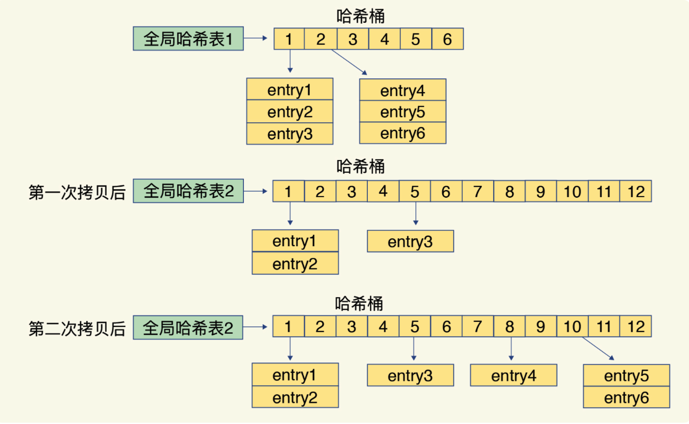
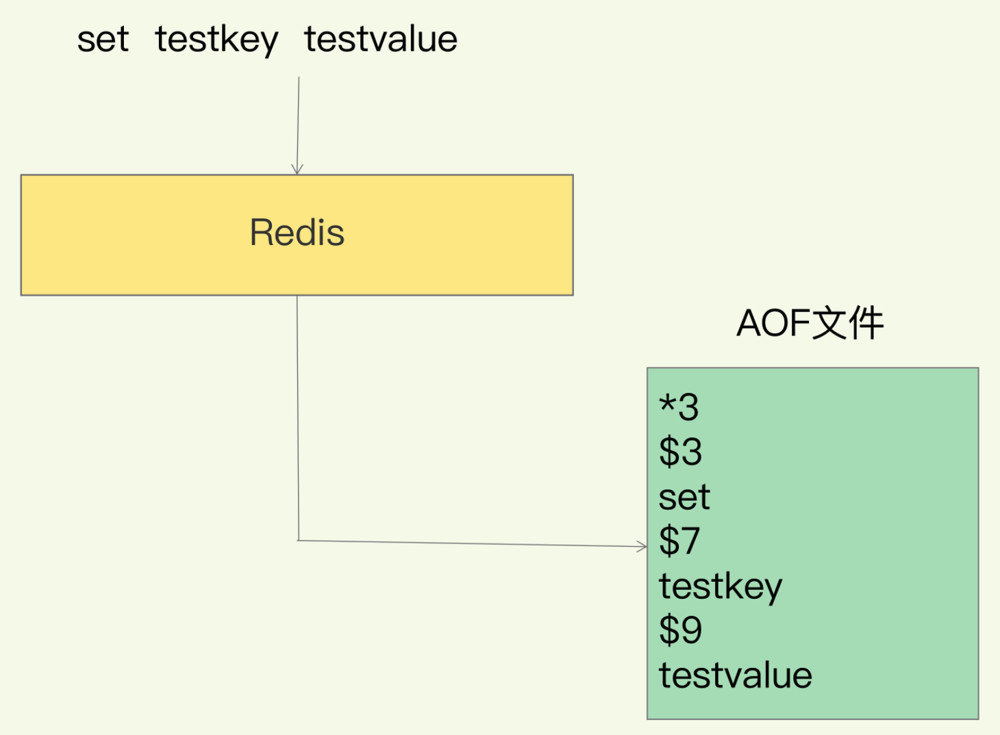

## Redis

### 五大核心数据结构

- **string**

  - 内部编码
    - int：8个字节的长整型
    - embstr：小于等于39个字节的字符串
    - raw：大于39个字节的字符串
  - 场景
    - 缓存
    - 计数
    - 共享session
    - 限速

- **hash**

  - 内部编码
    - ziplist：压缩列表，当哈希类型元素个数小于`hash-max-ziplist-entries`配置（默认512个）同时所有值都小于`hash-max-ziplist-value`配置（默认64字节）时使用，ziplist使用更加紧凑的结构实现多个元素的连续存储，所以比hashtable更加节省内存。
    - hashtable：哈希表，当ziplist不能满足要求时，会使用hashtable

- **list**

  - 内部编码
    - quicklist
  - 场景
    - 轻量消息队列
    - 栈
    - 文章列表：`lrange key 0 9`分页获取文章列表

- **set**

  - 内部编码

    - intset：整数集合，当集合中的元素都是整数且元素个数小于`set-max-intset-entries`配置（默认512个）时，redis会选用intset来作为集合的内部实现，从而减少内存的使用。
    - hashtable：哈希表，当intset不能满足要求时，会使用hashtable。

  - 场景

    - **用户标签**

      ```shell
      # 给用户打标签
      sadd user:1:tags tag1 tag2
      
      # 给标签添加用户
      sadd tag1:users user:1
      sadd tag2:users user:1
      
      # 使用交集（sinter）求两个user的共同标签
      sinter user:1:tags user:2:tags
      ```

    - 随机

      ```shell
      # 随机获取count个元素，集合元素个数不变
      srandmember key [count]
      
      # 随机弹出count个元素，元素从集合弹出，集合元素个数改变
      spop key [count]
      ```

- **zset**

  - 内部编码

    - ziplist：压缩列表，当有序集合的元素个数小于`list-max-ziplist-entries`配置（默认128个）同时所有值都小于`list-max-ziplist-value`配置（默认64字节）时使用。
    - skiplist：跳跃表，当不满足ziplist的要求时，会使用skiplist。

  - 场景

    - 排行榜Top

      ```shell
      # 用户发布一篇文章，初始点赞数为0，即score为0
      zadd user:article 0 a
      
      # 有人给文章a点赞，递增1
      zincrby user:article 1 a
      
      # 查询点赞前三篇文章
      zrevrange user:article 0 2
      
      # 查询点赞后三篇文章
      zrange user:article 0 2
      ```


### Hash冲突

解决：hash数组+链表


### Rehash

hash冲突导致链表过长，影响查询效率，引入Rehash策略：增加现有hash桶的数量

为了使 rehash 操作更高效，Redis 默认使用了两个全局哈希表：哈希表 1 和哈希表 2。一开始，当你刚插入数据时，默认使用哈希表 1，此时的哈希表 2 并没有被分配空间。随着数据逐步增多，Redis 开始执行 rehash，这个过程分为三步：

- 给哈希表 2 分配更大的空间，例如是当前哈希表 1 大小的两倍；
- 把哈希表 1 中的数据重新映射并拷贝到哈希表 2 中；
- 释放哈希表 1 的空间。

其中，第二步的Copy数据量大，耗时长，解决方案：**渐进式rehash**

在第二步拷贝数据时，Redis 仍然正常处理客户端请求，每处理一个请求时，从哈希表 1 中的第一个索引位置开始，顺带着将这个索引位置上的所有 entries 拷贝到哈希表 2 中；等处理下一个请求时，再顺带拷贝哈希表 1 中的下一个索引位置的 entries。如下图所示：




### IO模型

> Redis 每秒数十万级别处理能力

IO多路复用模型

select/epoll监听连接请求，解析请求，触发事件（Accept事件、Read事件、Write事件），推送入对应事件队列。

线程消费队列，触发回调


### AOF

对比WAL解决方案，Redis采用的相反的方式，“写后记录日志”：先执行Redis命令写内存，再写日志到磁盘

##### Why

AOF文件中存储的是操作Redis的命令，而非操作数据变化



*3：这个命令有三个部分

\$X：每个部分由$开头，X表示这个部分有多少字节

- 为了减少故障恢复的语法检查消耗，Redis选择在写入内存后再进行持久化，避免了记录错误的命令
  - *个人疑问？ 一般很少有操作Redis出现错误命令的情况，这样的解释视乎有一些牵强？*

- 写后操作磁盘，不阻塞写入操作

##### 风险

- 如果写入内存后，未持久化前发生crash，则会导致数据丢失
- AOF的写盘操作在磁盘压力大的情况下，会导致redis执行下一个命令阻塞（AOF日志也是主线程中执行）
  - 写盘策略：appendfsync
    - Always：同步写回，每个命令执行完成，同步将日志写入磁盘
    - Everysec：每秒写回，想将日志写入AOF内存缓存区，每隔一秒刷新到磁盘
    - NO：由操作系统控制写回，先将文件写入AOF的文件缓存区，由操作系统决定何时写入磁盘
- AOF文件过大
  - AOF重写机制
    - 将内存中数据的最新状态转换成redis命令，写入文件
    - 由专门的后台线程执行（避免阻塞主线程）：bgrewriteaof
      - 一个拷贝：
        - 重写时，**主线程fork出后台的bgrewriteaof子线程**，fork会将主线程的内存拷贝一份给到子线程，内存中包含当前最新值，子线程逐一将数据写入重写日志（为了减少进程创建的开销，现代操作系统会使用Copy On Write（COW）**写时复制**技术，父进程与子进程共享同一内存空间，从而实现数据的“拷贝”）
      - 两处日志：
        - 重写时，主线程并未阻塞，后续新的写请求放入AOF缓冲区，持久化到磁盘？重写日志也放入AOF重写缓存区，持久化到磁盘，当重写日志写入完成后，将增量的最新操作写入新的AOF文件？？？


### RDB

内存快照：不存储执行命令，只将内存数据备份到磁盘

命令：

- save：在主线程中执行，会导致阻塞
- bgsave：创建一个子线程，专门用于写入RDB文件，避免了主线程的阻塞，是Redis的默认方式

问题：生成快照过程中数据发生写入改动怎么办？

解决：利用操作系统的Copy On Write（COW）写时复制 来解决


问题：执行快照的时间间隔，决定了故障恢复会丢失多少数据，如何将这个间隔时间变小？

解决：增量快照，开辟额外的内存空间，存放变更的数据


**fork出来的子线程不会阻塞父线程，但是fork这个操作会阻塞主线程**


### AOF and RDB

问题：AOF恢复慢，RDB容易丢失数据，快照创建的频率难控制

Redis解决方案：混合AOF和RDB，RDB正常频率执行，在两次快照间隔时间段内，用AOF记录期间的所有命令


### todo list：

- bitmap？

- 大数据量，如何优化？