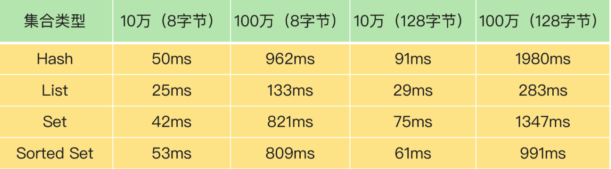

## Redis优化方案


#### 优化方向

- 持久化方案
- 数据结构运用
- 阻塞Redis的内部操作
- CPU核数 和 NUMA架构的影响
- Redis关键配置
- Redis内存碎片
- Redis缓冲区


#### 优化手段

INFO命令：

- latest_fork_usec：最近一次fork耗时


#### 持久化方案优化

使用 RDB + AOF增量的方式，进行主从同步，数据备份


#### 数据结构优化方案

##### 使用集合类型保存单值的键值对

原理：利用 ziplist内部编码解决 多String key 的 distEntry的额外内存消耗

方案：分析String key规则，将key分割为两部分，一部分作为hash集合的key，一部分作为hash的值的key，value保存在hash值的value中

注意点：使用ziplist的条件是，要满足系统配置的两个阈值（当哈希类型元素个数小于`hash-max-ziplist-entries`配置（默认512个）同时所有值都小于`hash-max-ziplist-value`配置（默认64字节）时使用），所以在拆分String key时需要 保证 每个Hash集合中元素的个数，尽量不要超过阈值


#### 阻塞Redis的内部操作

- 客户端 O(N) 的命令操作，应当引起重视

  - 集合全量查询
  - 聚合统计
  - bigkey删除：集合全量删除导致内存释放，放入空闲管理；下方图片为不同集合的删除耗时

  

  - 清空数据库
    - FLUSHDB 和 FLUSHALL

- AOF日志同步写盘

- 分片集群 Hash槽迁移


#### CPU核数 和 NUMA架构的影响

多核CPU优化方案：将Redis与CPU某个核绑定

原理：减少CPU的上下文切换的时间

操作：taskset命令

```shell
# 将redis server 与 编号为 0 的CPU绑定
taskset -c 0 ./redis-server
```


NUMA架构：非统一内存访问架构

同样是将Redis绑定到同一个CPU Socket上

问题：绑定CPU带来的问题是，Redis的一些其他线程，比如AOF、RDB的进程将和主线程竞争资源

解决：

- 一个Redis Server绑定一个物理核，而非逻辑核
- 修改Redis源码，将子线程与主线程绑定到不同CPU


#### 延迟监控

```shell
# 打印120秒内监控到的最大延迟 （基线延迟）
./redis-cli --intrinsic-latency 120

# 运行延迟 - 执行一个命令的延迟
# 如果运行延迟达到的基线延迟的两倍，则可认为Redis变慢了
```

- 当你发现 Redis 性能变慢时，可以通过 Redis 日志，或者是 latency monitor 工具，查询变慢的请求，根据请求对应的具体命令以及官方文档，确认下是否采用了复杂度高的慢查询命令。

- 禁用 KEYS命令

- 删除过期key，如果数据量大，将导致Redis变慢
  - 使用过期时间不同的算法
- 慢查询 - 例如聚合 - 优化方案，或放到客户端聚合


#### Swap

```
# 获取 Redis进程pid
./redis-cli info | grep process_id
# 到机器的对应目录下
cd /proc/pid
# 查看Redis进程使用情况
cat smaps | egrep '^(Swap|Size)'
```


#### 内存大页

操作系统提供的机制

问题：内存大页虽然可以给Redis的内存分配带来好处，但是 在 Redis进行快照复制的时候，对复制过程中的 新变更，需要 使用 写时复制 技术，这样将会导致很小的变动，需要复制整个内存页，所以需要关闭内存大页功能

```shell
# 查看
cat /sys/kernel/mm/transparent_hugepage/enabled
# 设置
echo never /sys/kernel/mm/transparent_hugepage/enabled
```


#### 内存碎片

```shell
# 使用Redis：info memory 命令，查看内存使用情况： 
# Redis为保存数据实际申请的空间
used_memory:1073741736
# 操作系统实际分配给Redis的物理内存空间
used_memory_rss:1997159792
# Redis当前内存碎片率
mem_fragmentation_ratio:1.86
```

mem_fragmentation_ratio：经验阈值

- 大于1 但小于 1.5 ： 合理
- 大于1.5：表明内存碎片已经超过50%，需要采取措施来降低内存碎片率

##### 清理内存碎片：

Redis4.0后，提供了自动清理内存碎片的方法：（基本思路：拷贝、合并空间）

```shell
# 开启Redis内存碎片自动清理
config set activedefrag yes

# 开始清理的条件 （两个需同时满足）
active-defrag-ignore-bytes 100mb  # 表示内存碎片的字节数达到100MB时，开始清理
active-defrag-threshold-lower 10  # 表示内存碎片空间占操作系统分配给Redis的总空间的比例达到 10% 时，开始清理

# 清理的CPU占用控制
active-defrag-cycle-min 25        # 自动清理过程所用CPU时间的比例不低于25%，保证清理工作正常开展
active-defrag-cycle-max 75        # 自动清理过程所用CPU时间的比例不高于75%，一旦超过，就停止清理，避免大量内存拷贝阻塞Redis
```


#### 缓存区

```shell
# 使用 client list 命令，查看 每个客户端 的输入缓存区的使用情况
redis 127.0.0.1:6379> CLIENT LIST
addr=127.0.0.1:43143 fd=6 age=183 idle=0 flags=N db=0 sub=0 psub=0 multi=-1 qbuf=0 qbuf-free=32768 obl=0 oll=0 omem=0 events=r cmd=client
```

- age ： 以秒计算的已连接时长
- idle ： 以秒计算的空闲时长
- qbuf ： 查询缓冲区的长度（字节为单位， 0 表示没有分配查询缓冲区）
- qbuf-free ： 查询缓冲区剩余空间的长度（字节为单位， 0 表示没有剩余空间）
- obl ： 输出缓冲区的长度（字节为单位， 0 表示没有分配输出缓冲区）
- oll ： 输出列表包含的对象数量（当输出缓冲区没有剩余空间时，命令回复会以字符串对象的形式被入队到这个队列里）
- omem ： 输出缓冲区和输出列表占用的内存总量

当缓存区溢出时，Redis会将与该客户端的连接关闭

Redis 的客户端输入缓冲区大小的上限阈值，在代码中就设定为了 1GB。也就是说，Redis 服务器端允许为每个客户端最多暂存 1GB 的命令和数据。1GB 的大小，对于一般的生产环境已经是比较合适的了。一方面，这个大小对于处理绝大部分客户端的请求已经够用了；另一方面，如果再大的话，Redis 就有可能因为客户端占用了过多的内存资源而崩溃。

- 减少BigKey的大量查询

- 不要在生产使用 monitor 命令监控Redis

- 设置合理的缓冲区大小：输出缓存区可以通过 client-output-buffer-limit 配置项来设置

  ```shell
  # normal 表示当前设置的是普通客户端，第 1 个 0 设置的是缓冲区大小限制，第 2 个 0 和第 3 个 0 分别表示缓冲区持续写入量限制和持续写入时间限制。
  # 0表示不作限制
  client-output-buffer-limit normal 0 0 0
  
  # pubsub 参数表示当前是对订阅客户端进行设置；8mb 表示输出缓冲区的大小上限为 8MB，一旦实际占用的缓冲区大小要超过 8MB，服务器端就会直接关闭客户端的连接；2mb 和 60 表示，如果连续 60 秒内对输出缓冲区的写入量超过 2MB 的话，服务器端也会关闭客户端连接。
  client-output-buffer-limit pubsub 8mb 2mb 60
  ```

- 主从复制缓冲区

  ```shell
  # slave 参数表明该配置项是针对复制缓冲区的。512mb 代表将缓冲区大小的上限设置为 512MB；128mb 和 60 代表的设置是，如果连续 60 秒内的写入量超过 128MB 的话，也会触发缓冲区溢出。
  config set client-output-buffer-limit slave 512mb 128mb 60
  ```

  

#### 主从

- **使用ExpireAt命令替换Expire命令**，避免因主从复制延迟到达读取到已过期数据（注意：主从节点的时钟要保持一致）

- 调大 cluster-node-timeout 到10 - 20 秒，保证主从切换过程中，心跳超时能正常工作


#### 脑裂

Redis 已经提供了两个配置项来限制主库的请求处理，分别是 min-slaves-to-write 和 min-slaves-max-lag。

- min-slaves-to-write：这个配置项设置了主库能进行数据同步的最少从库数量；
- min-slaves-max-lag：这个配置项设置了主从库间进行数据复制时，从库给主库发送 ACK 消息的最大延迟（以秒为单位）。

我们可以把 min-slaves-to-write 和 min-slaves-max-lag 这两个配置项搭配起来使用，分别给它们设置一定的阈值，假设为 N 和 T。这两个配置项组合后的要求是，主库连接的从库中至少有 N 个从库，和主库进行数据复制时的 ACK 消息延迟不能超过 T 秒，否则，主库就不会再接收客户端的请求了。

即使原主库是假故障，它在假故障期间也无法响应哨兵心跳，也不能和从库进行同步，自然也就无法和从库进行 ACK 确认了。这样一来，min-slaves-to-write 和 min-slaves-max-lag 的组合要求就无法得到满足，原主库就会被限制接收客户端请求，客户端也就不能在原主库中写入新数据了。


#### 大数据量优化方案

- Bitmap二值方案
- HyperLogLog方案

- 集群分片


