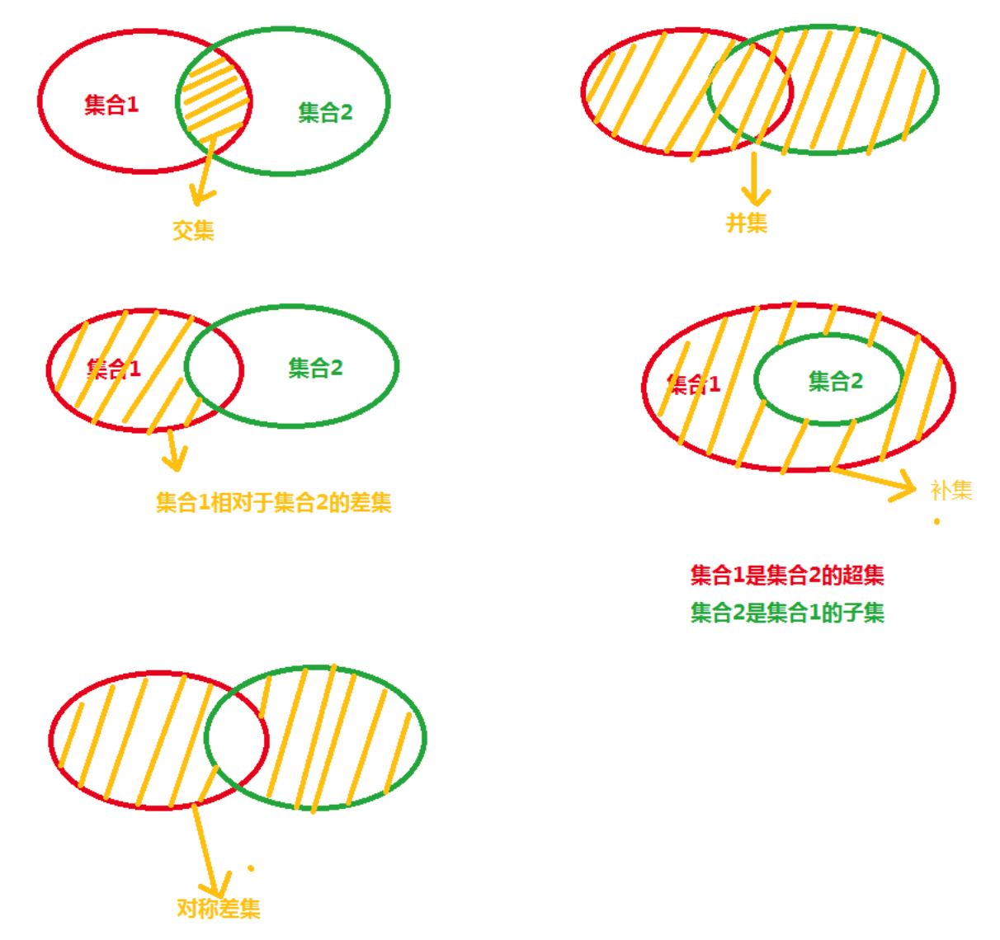

## Redis统计方案

### 场景：

- 在移动应用中，需要统计每天的新增用户数和第二天的留存用户数；
- 在电商网站的商品评论中，需要统计评论列表中的最新评论；
- 在签到打卡中，需要统计一个月内连续打卡的用户数；
- 在网页访问记录中，需要统计独立访客（Unique Visitor，UV）量。


### 集合统计模式

##### 聚合统计

> 交集，并集，差集，补集，对称差集




- 一个Set集合，存放所有登录用户id
  - key：`user:id`
  - value: ["001","002"]
- 每日一个Set，存放每日登录用户id
  - key：`user:id:20211025`
  - value:["002","003"]

新增用户数：使用差集

- 先计算差集，然后将今日新增数据 添加到 所有登录用户id集合中
- SDIFFSTORE   `user:new`     `user:id:20211025`    `user:id`

第二天留存数：交集

- SINTERSTORE   `user:rem`     `user:id:20211025`    `user:id:20211026`

*并集命令：SUNION*

**问题**：Set集合在做聚合计算时，消耗比较大，数据量大时，会导致Redis实例阻塞，建议 **在主从集群中选择一个从库专门负责聚合计算，或者将数据读取到客户端进行聚合**


##### 排序统计

List和Sorted Set（zset）都具备排序功能，List是以元素进入先后为顺序，zset可设置元素的排序权重（或者叫得分 score）来排序

问题：List排序常见问题，在分页场景下LRANGE分页如果在分页过程中有新数据写入List，则会导致LRANGE出现旧数据

Sorted Set不存在这个问题：因为它是基于权重来排序和**查询**数据的

假设最新的评论权重越大，目前最新评论权重是N

```shell
# 寻找最小 score 的成员（member），命令如下：
ZRANGEBYSCORE myzset -inf +inf WITHSCORES LIMIT 0 1
# 寻找最大 score 的成员（member），命令如下：
ZREVRANGEBYSCORE myzset +inf -inf WITHSCORES LIMIT 0 1

# 获取最新的10条评论
ZREVRANGEBYSCORE myzset N N-9
```


##### 二值状态统计

二值状态指集合中元素的取值只有 0 和 1 两种

签到打开场景下，签到为1， 未签到为 0

**Bitmap：Redis提供的扩展数据类型**

- Bitmap本身是使用String类型作为底层数据结构实现的一种统计二值状态的数据类型
- offset从0开始算
- BITCOUNT：统计该Bitmap中为“1”的数量

假设我们要统计 ID 3000 的用户在 2020 年 8 月份的签到情况，就可以按照下面的步骤进行操作

第一步，执行下面的命令，记录该用户 8 月 3 号已签到

```shell
# offset： 3-1 = 2 
SETBIT uid:sign:3000:202008 2 1 
```


**问题：如果记录了 1 亿个用户 10 天的签到情况，你有办法统计出这 10 天连续签到的用户总数吗？**

知识点：**BITOP**

Bitmap的使用BITOP可对过个Bitmap进行按位 “与“、”或”、“异或”，并且其操作结果会保存到一个新的Bitmap中

答：

- 为每一天创建一个Bitmap，每个bitmap有1亿个bit，每个bit对应一个用户的当天签到情况；
- 对10个Bitmap进行 “与” 操作，生成一个新的Bitmap，再使用BITCOUNT即可获取10天内连续登陆的用户总数
- 内存消耗：
  - 一个Bitmap 10^8/8/1024/1025 = 12MB；
  - 10个Bitmap需要消耗120MB
  - **需要对Bitmap设置缓存失效时间，节约内存**

对与能够在业务上定性为两值的业务场景，都可以使用Bitmap进行海量数据的存储统计


##### 基数统计

**HyperLogLog**

只需要花费12KB内存，即可计算解决2^64个元素的基数

问题：HyperLogLog统计规则是基于概率的，统计会有一定误差，标准误算率是 0.81%
