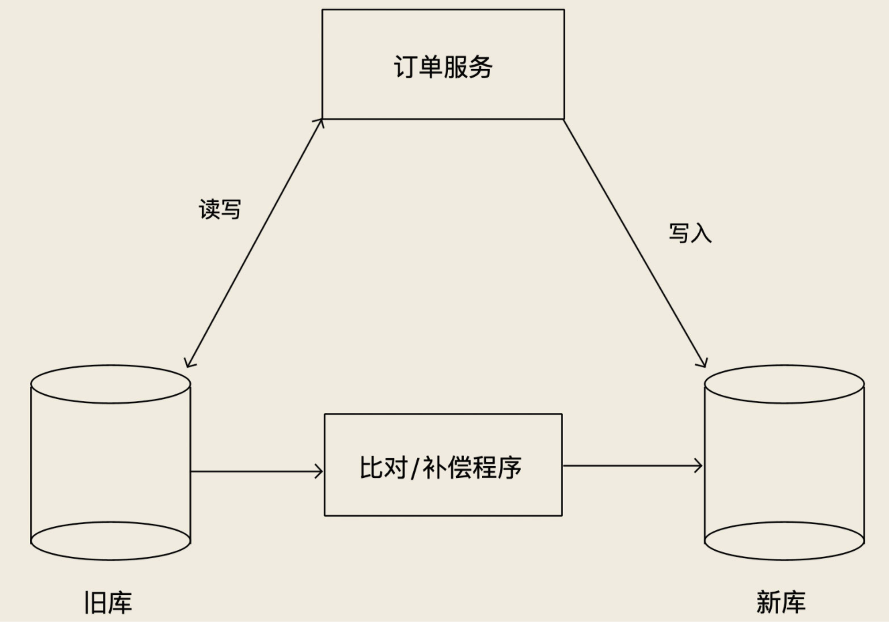

## 数据同步/采集方案

> ##### 专用型
>
> - canel && otter
> - datax
> - sqoop - 大数据
>
> ##### 通用型
>
> - Flink CDC

### 不停机跟换数据库

- 第一步：实时同步旧库到新库
  - 上线新版订单服务，支持双写新旧库，预留热切换开关：只写旧库，只写新库和同步双写
  - 只开启  只写新库 - **正确运行一两周**，验证新旧订单库中的数据是否一致

- 第二步：开启双写，同时关闭实时同步程序
  - 这个双写的业务逻辑，一定是先写旧库，再写新库，并且以写旧库的结果为准
  - 新旧库数据可能不一致：
    - 一是停止同步程序和开启双写，这两个过程很难做到无缝衔接。
    - 二是双写的策略也不保证新旧库强一致，这时候我们需要上线一个**对比和补偿的程**序，这个程序对比旧库最近的数据变更，然后检查新库中的数据是否一致，如果不一致，还要进行补偿。
  - **稳定运行一两周**

- 第三步：灰度切换读请求到新库，**稳定运行一两周**
- 第四步：停掉对比程序，把订单服务的热开关切换到只写新库，下线旧库，后续订单服务的版本去掉双写功能

##### 对比补偿程序

按照不同业务数据场景设计对比补偿程序

- 订单数据：订单完成后，订单数据基本不会变，可依据订单完成时间，每次只对比这个时间窗口内完成的订单。补偿逻辑只要发现不一致，就用旧库的订单数据覆盖新库的订单数据
- 商品信息数据：随时都有可能会变化。如果说数据上有更新时间，那我们的对比程序可以利用这个更新时间，每次在旧库取一个更新时间窗口内的数据，去新库上找相同主键的数据进行对比，发现数据不一致，还要对比一下更新时间。如果新库数据的更新时间晚于旧库数据，那可能是对比期间数据发生了变化，这种情况暂时不要补偿，放到下个时间窗口去继续对比。另外，时间窗口的结束时间，不要选取当前时间，而是要比当前时间早一点儿，比如 1 分钟前，避免去对比正在写入的数据。
- 如果数据连时间戳也没有，那只能去旧库读取 Binlog，获取数据变化，然后去新库对比和补偿。
