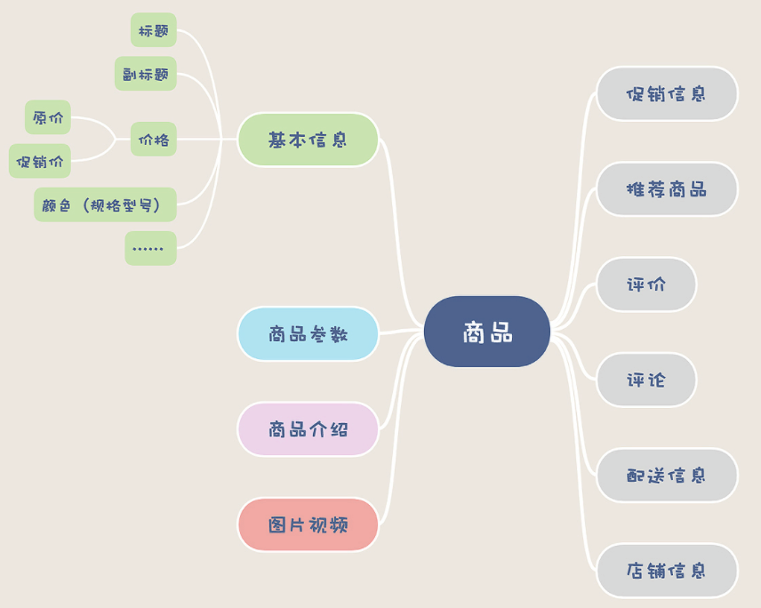

## 电商存储系统

电商系统术语：

> DAU：日均访问次数
>
> SKU：库存单元，即商品

电商系统大致模块:

> - 商品
> - 订单
> - 购物车
> - 支付
> - 库存
> - 促销
> - 用户
> - 账户
> - 搜索推荐
> - 报表

### 重复下单

- 方案一：下单之前，先调用订单号生成服务，前端用生成的唯一订单号进行下单，下单接口即可保证幂等
- 方案二：进入填单页，可生成一个唯一的token，下单时一并传递到后端，后端基于这个唯一token进行幂等保证

### ABA问题

更新订单状态时，如果出现网络抖动的情况，会导致ABA问题，影响订单数据的正确性

方案：给每个订单增加一个version字段，在每次更新时提供version即可避免ABA问题

### 商品详情页

> 灰色的为商品以外的信息

特点：

- 数量多：国内一线电商，SKU大约在几亿到几十亿量级（包括商品的不同型号和版本，马甲）
- 重量大：详情页内容多，包括文字，图片，视频，甚至有AR/VR玩法

存储思路：

- ***分而治之***

##### 商品基本信息

> 设计商品基本信息表来存储

- 增加缓存，提速基本信息的访问
- **必须保留每个商品数据的历史版本**
  - 因为商品数据是随时变化的，但是订单中关联的商品数据，必须是下单那个时刻的商品数据。
  - 你可以为每一个历史版本的商品数据保存一个快照，可以创建一个历史表保存到 MySQL 中，也可以保存到一些 KV 存储中。

##### 商品参数

> 使用MongoDB保存商品参数

商品参数就是商品的特征，不同商品他的特征都不一样，所以没办法用统一的表字段来描述

参数属性不固定，则可以考虑使用NoSQL

##### 图片/视频

> 使用对象存储系统

数据库中存储图片或视频的ID或URL

可选择云厂商，也可选择使用开源的 如 MinIO

几乎所有的云厂商的对象存储服务都支持**CDN加速**

国内的很多云厂商的对象存储对图片和视频，都做了非常多的针对性优化。最有用的是，**缩放图片和视频转码**，你只要把图片和视频丢到对象存储中，就可以随时获得任意尺寸大小的图片，视频也会自动转码成各种格式和码率的版本，适配各种 App 和场景。

##### 商品介绍

> 商品介绍文本，带格式文本等
>
> 一般都是随着商详页一起 **静态化**，保存到 HTML 中
>
> 使用**Nginx访问静态资源**，而非使用Tomcat动态生成，同时可搭配**CDN加速**，把商详页放到离用户最近的CDN服务器上

商品详情页的内容大部分是商品介绍，不怎么变动，将页面事先生成好，保存成静态的HTML文件，访问商详页时，直接返回这个HTML，这就是静态化

### 购物车

> 设计一个购物车的对象

如果用户未登录，需在浏览器记录用户未登录时加入的购物车，当用户操作登录后，将数据合并到用户名下的购物车中

##### 暂存购物车

- Cookie存储，小巧方便（4KB大小限制）
- LocalStorage存储，容量大，实现稍复杂，不占用带宽

### 最终一致性

> - 本地事务表
> - RocketMQ事务消息