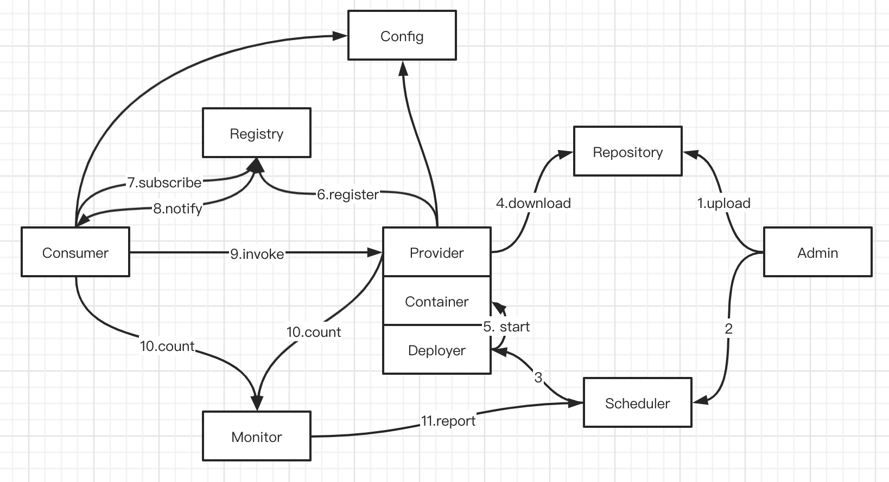

## Dubbo源码分析（一）- Design

##### 架构图：

##### 整体设计：

Dubbo的URL模式

- 解析配置
- SPI动态适配不同配置
- URL分类：
  - configuratorURLs
  - routerURLs
  - providerURLs

##### 领域模型

- Protocol 是服务域，它是 Invoker 暴露和引用的主功能入口，它负责 Invoker 的生命周期管理。
- Invoker 是实体域，它是 Dubbo 的核心模型，其它模型都向它靠扰，或转换成它，它代表一个可执行体，可向它发起 invoke 调用，它有可能是一个本地的实现，也可能是一个远程的实现，也可能一个集群实现。
- Invocation 是会话域，它持有调用过程中的变量，比如方法名，参数等。

##### 类功能：

- Directory：维护所有服务提供者信息

- RegistryDirectory：注册中心提供Directory  - 持有 ZookeeperRegistry 和 Urls（queryMap），订阅（subscirbe），监听节点变更时间 （notify）

- RegistryProtocol：注册协议

- RpcStatus：保存Rpc调用的状态：存活连接数、总连接数，错误数

##### 调用链路：

ReferenceConfig（引用对象） -> UserService（服务接口、Proxy） -> Invoker（执行器:FailoverClusterInvoker）-> Directory -> URLs（提供者列表）