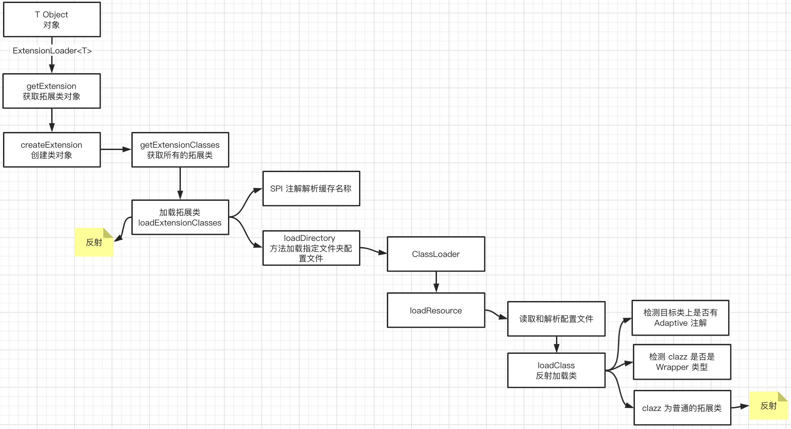

## Dubbo源码分析（三）- SPI

Dubbo Service Provider Interface

- 核心类：ExtensionLoader
- 接口需添加@SPI注解
- Dubbo SPI 除了支持按需加载接口实现类，还增加了 IOC 和 AOP 等特性


##### 加载流程




- Activate
- Wrapper


##### Dubbo IOC特性

Dubbo IOC 是通过 setter 方法注入依赖

Dubbo 首先会通过反射获取到实例的所有方法，然后再遍历方法列表，检测方法名是否具有 setter 方法特征。若有，则通过 ObjectFactory 获取依赖对象，最后通过反射调用 setter 方法将依赖设置到目标对象中。


objectFactory 变量的类型为 AdaptiveExtensionFactory，AdaptiveExtensionFactory 内部维护了一个 ExtensionFactory 列表，用于存储其他类型的 ExtensionFactory。Dubbo 目前提供了两种 ExtensionFactory，分别是 SpiExtensionFactory 和 SpringExtensionFactory。前者用于创建自适应的拓展，后者是用于从 Spring 的 IOC 容器中获取所需的拓展。


##### 扩展自适应

上面的 AdaptiveExtensionFactory 就是 @Adaptive

Adaptive 可注解在类或方法上

Adaptive 注解在类上的情况很少，在 Dubbo 中，仅有两个类被 Adaptive 注解了，分别是 AdaptiveCompiler 和 AdaptiveExtensionFactory

```java
/**
 * WheelMaker 接口的自适应实现类
 *
 * @author Adam
 * @date 2021/4/23
 */
public class AdaptiveWheelMaker implements WheelMaker {

    /**
     * 1. 从 URL 中获取 WheelMaker 名称
     * 2. 通过 SPI 加载具体的 WheelMaker 实现类
     * 3. 调用目标方法
     */
    @Override
    public Wheel makeWheel(URL url) {
        if (url == null) {
            throw new IllegalArgumentException("url == null");
        }

        // 1.从 URL 中获取 WheelMaker 名称
        String wheelMakerName = url.getParameter("Wheel.maker");
        if (wheelMakerName == null) {
            throw new IllegalArgumentException("wheelMakerName == null");
        }

        // 2.通过 SPI 加载具体的 WheelMaker
        WheelMaker wheelMaker = ExtensionLoader
                .getExtensionLoader(WheelMaker.class).getExtension(wheelMakerName);

        // 3.调用目标方法
        return wheelMaker.makeWheel(url);
    }
}
```


##### @Adaptive注解在方法上：（复杂）

- 相当于动态构建一个AdaptiveXXX的代理，给添加注解的方法做增强逻辑（就是根据注解的value，去获取URL里面的关键信息，从而得到对应的extName，再通过ExtensionLoader.getExtensionLoader(XXX.class).getExtension(extName)）获取 extension，最后构建 return extension.methodName(args);

- 实现细节：

  - AdaptiveClassCodeGenerator构建自适应的扩展代码 String 类型的
    - 判断当前目标Type的方法列表是否存在标有@Adaptive注解的方法
    - 如果有，则按照Java文件顺序进行 String Code 构建
      - 构建包名：generatePackageInfo
      - 构建Import：generateImports
      - 构建类描述：generateClassDeclaration
      - 构建方法信息：generateMethod
        - 拼接：CODE_METHOD_DECLARATION = "public %s %s(%s) %s {\n%s}\n"
        - methodReturnType、methodName、methodContent、methodArgs、methodThrows
        - generateMethodContent
          - 无Adaptive注解，则直接构建成 throw new UnsupportedOperationException
          - 有Adaptive注解：
            - 获取 Dubbo URL ：
              - 场景一：getUrlTypeIndex（参数位置） 
              - 场景二：通过get方法获取方法返回值为URL的 
            - 获取Adative注解的value：getMethodAdaptiveValue
            - 检测 Invocation 参数：hasInvocationArgument
            - 生成拓展名逻辑：generateExtNameAssignment
            - 构建ExtensionLoader获取extName代码块
            - 构建返回代码块

- Demo：Protocol 的 refer 方法为例

  ```java
  public com.alibaba.dubbo.rpc.Invoker refer(java.lang.Class arg0, com.alibaba.dubbo.common.URL arg1) {
    	// ...
    	com.alibaba.dubbo.rpc.Protocol extension = (com.alibaba.dubbo.rpc.Protocol) ExtensionLoader
      .getExtensionLoader(com.alibaba.dubbo.rpc.Protocol.class).getExtension(extName);
  		return extension.refer(arg0, arg1);
  }  
  ```

