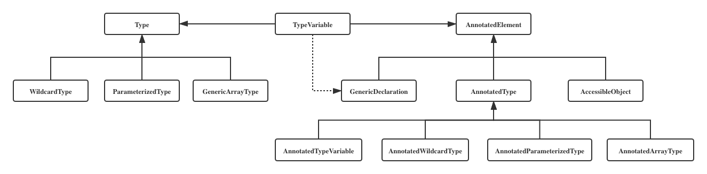

## Java 类型 And 注解


[TOC]



### Types

#### Type

- **ParameterizedType**：参数化类型，例如：java.util.List<java.lang.String>、java.util.Map<java.lang.Integer, java.lang.String>

  - actualTypeArguments：泛型实际类型列表，例如：java.lang.String、java.lang.Integer & java.lang.String
  - rawType：原始类型，例如：java.util.List、java.util.Map
  - ownerType：所有者类型（内部类会有值）：null、null

- **WildcardType**：通配符泛型

  - ```java
    public void wildcardType(TestType<? super String> param) {
    	// do nothing
    }
    
    {
      WildcardType wildcardType = (WildcardType) actualTypeArgument;
    	Type[] lowerBounds = wildcardType.getLowerBounds();
    	Type[] upperBounds = wildcardType.getUpperBounds();
    }
    
    // 表达式上边界：[class java.lang.Object]
    // 表达式下边界：[class java.lang.String]
    ```

- **GenericArrayType**：泛型数组

  - 例如：List\<String>[] testGenericArrayType
    - 泛型数组类型：java.util.List<java.lang.String>[]
    - 泛型数组成员类型：java.util.List<java.lang.String>


#### TypeVariable

类型变量（反映JVM在编译该泛型前的信息）


#### Array

判断是否为 Array 类型的方式：

- Class<?>.isArray()：类的 native 方法 isArray()
- Type 的 实现类：instanceof *GenericArrayType* 


#### Demo

WildcardType:

```java
public class TestJvmType {
  
    /**
     * 通配符泛型 - 2
     */
    public static void testWildcardType2() {
        TestJvmType testJvmType = new TestJvmType();
        testJvmType.wildcardType2(new TestType3(), new TestType4(), new TestType5(), new TestType6());
    }

    /**
     * testWildcardType call 2
     *
     * @param params params
     */
    public void wildcardType2(TestType2<?>... params) {
        for (TestType2<?> param : params) {
            Class<?> aClass = param.getClass();
            System.out.println(aClass.getTypeName());
            for (Type genericInterface : aClass.getGenericInterfaces()) {
                if (genericInterface instanceof ParameterizedType) {
                    System.out.println("ParameterizedType ActualTypeArguments：" + genericInterface.getTypeName());
                    ParameterizedType pType = (ParameterizedType) genericInterface;
                    for (Type actualTypeArgument : pType.getActualTypeArguments()) {
                        System.out.println("\t类型：" + actualTypeArgument.getTypeName());
                    }
                    System.out.println("===============================================");
                }
            }
        }
    }

    public static void main(String[] args) throws NoSuchFieldException {
        testWildcardType2();
    }

    public static class TestType<T extends String> {
        private T t;

        public TestType(T t) {
            this.t = t;
        }

        public T getT() {
            return t;
        }

        public void setT(T t) {
            this.t = t;
        }
    }

    public interface TestType2<T> { }
    public static class TestType3 implements TestType2<String> { }
    public static class TestType4 implements TestType2<Integer> { }
    public static class TestType5 implements TestType2<Boolean> { }
    public static class TestType6 implements TestType2<TestType<String>> { }
}
```


### Annotations

#### AnnotatedElement

- AnnotatedType
- GenericDeclaration


\#getAnnotation

\#isAnnotationPresent

\#getAnnotationsByType