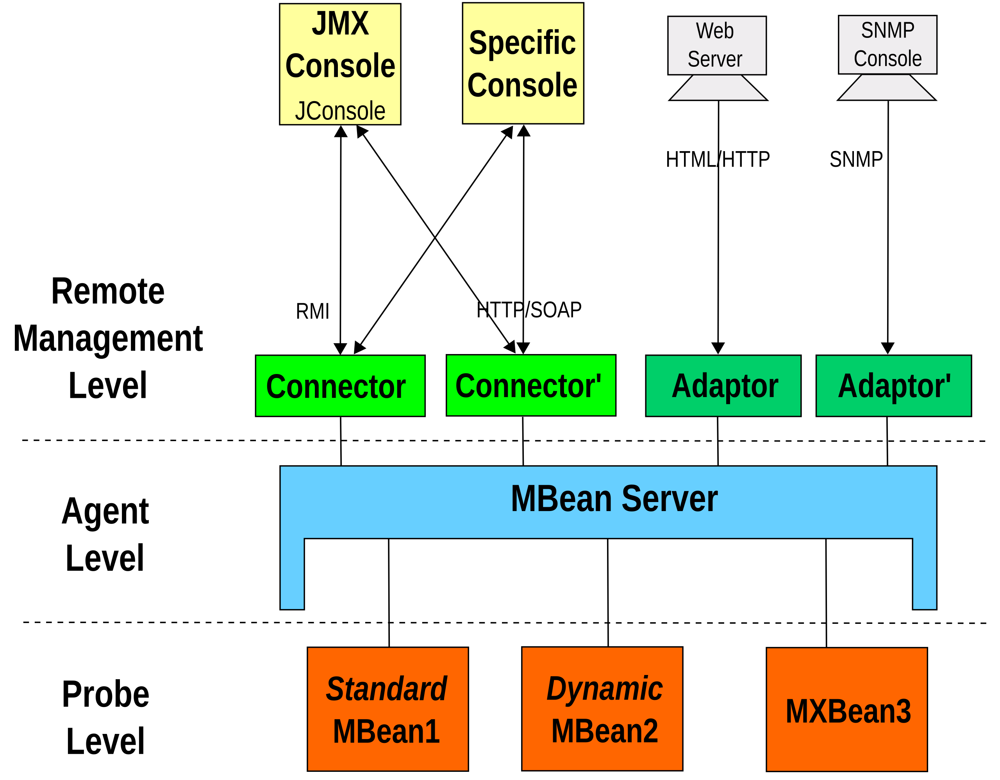

## JMX

> Java管理程序扩展（Java Management Extensions），是一个可以为Java应用程序或系统植入远程管理功能的框架

### 架构



- **Probe Level**：负责资源的检测（获取信息），包含MBeans，通常也叫做Instrumentation Level。MX管理构建（MBean）分为四种形式，分别是标砖管理构建（Standard MBean）、动态管理构建（Dynamic MBean）、开放管理构建（Open MBean）和模型管理构建（Model MBean）
- **Agent Level**：即MBeanServer，是JMX的核心，负责连接MBeans和应用程序
- **Remote Management Level**：通过connectors和adaptors来远程操作MBeanServer，常用的控制台，例如JConsole，VisualVM等


### Tomcat 中JMX的使用

> ```
> // MBean的描述
> MbeansDescriptorsDigesterSource
> 
> /org/apache/tomcat/util/modeler/mbeans-descriptors.dtd
> 
> // 具体的定义
> org\apache\catalina\core\mbeans-descriptors.xml
> ```


org.apache.tomcat.util.modeler.Registry：Tomcat通过该接口将MBean注册给自己和MBeanServer

org.apache.tomcat.util.modeler.ManagedBean：Tomcat用来管理自己的监控Bean

javax.management.DynamicMBean：JMX

javax.management.MBeanServer：JMX

```java
// org.apache.tomcat.util.modeler.Registry
// Tomcat组件在 initInternal() 阶段，会将组件或者自定义的一些需要监控的Bean放入Registry
// Registry.getRegistry(null, null).registerComponent(obj, on, null);
public void registerComponent(Object bean, ObjectName oname, String type) throws Exception {
    if (log.isDebugEnabled()) {
        log.debug("Managed= " + oname);
    }

    if (bean == null) {
        log.error(sm.getString("registry.nullBean", oname));
        return;
    }

    try {
        if (type == null) {
            type = bean.getClass().getName();
        }

        ManagedBean managed = findManagedBean(null, bean.getClass(), type);

        // The real mbean is created and registered
        DynamicMBean mbean = managed.createMBean(bean);

        // 如果已经注册过了，就移除？ 可能Tomcat希望系统不要出现重复注册情况？
        if (getMBeanServer().isRegistered(oname)) {
            if (log.isDebugEnabled()) {
                log.debug("Unregistering existing component " + oname);
            }
            getMBeanServer().unregisterMBean(oname);
        }

        // 注册
        getMBeanServer().registerMBean(mbean, oname);
    } catch (Exception ex) {
        log.error(sm.getString("registry.registerError", oname), ex);
        throw ex;
    }
}
```


##### TODO

- 自定义 MBean

- OpenType

- 动态调整线程池大小