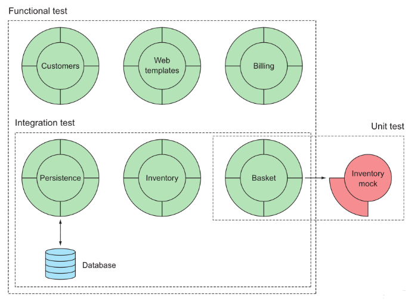
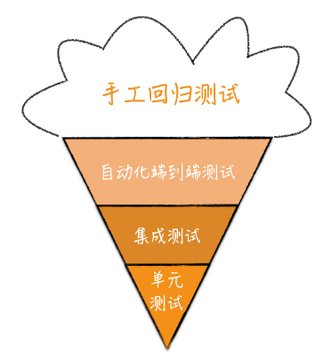
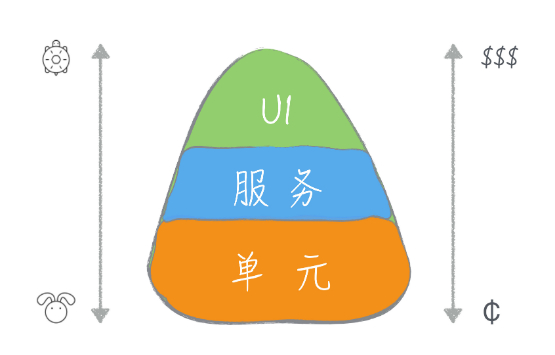

# Java Test

> - 写测试不只是写测试的事，更是写代码的事
> 
> - 思考代码的可测试性，对个人编程基本功提出要求，单一、抽象、组件化思维、DDD

### 

### 测试配比

> 单元测试、集成测试、功能测试（验收测试）、系统测试

**单元测试：** 一般只测试一个类，其他类都是模拟/桩

        是针对一个单元的测试，因为涉及面很小，所以单元测试要进行的设置会比较少。单元测试不牵扯到外部组件，一般而言只在内存中执行，执行速度很快。所以谈及单元测试的特点我们一般会说，它成本低、速度快、单个测试的覆盖面小，但整体覆盖面大。

**集成测试：** 聚焦多个类，mocks/stubs很少使用，目的是测试不同模块之间的交互性

        测试模块或服务，相比于单元测试来说，集成测试的涉及面要广一些，设置起来就比较麻烦。有的集成测试还会集成外部组件，这也就意味着设置起来要更麻烦，比如你在上一讲见识过的数据库测试，就要准备各种配置信息。同时，无论是组件多还是集成外部组件，这都意味着执行速度要比单元测试慢。所以相比于单元测试，集成测试成本要高一些、速度要慢一点；单个测试的覆盖面要大一些，但整体覆盖面要小一些。

**功能测试（验收测试）：** 假设整个系统是一个黑盒，测试端到端的交互

        测试同学对需求的功能点进行测试，模拟用户行为和GUI互动，只要结果满足期望而不关心具体细节。

**系统测试：**

        一些特殊的项目需要对整个系统进行测试，例如研发操作系统等



|                  | 单元测试  | 集成测试             | 功能测试                    |
| ---------------- | ----- | ---------------- | ----------------------- |
| 范围               | 单个类   | 多个类或单模块          | 整个系统                    |
| 焦点               | 类的正确性 | 类的交互、事物、日志、安全等   | 端到端用户体验                 |
| 依赖               | 代码    | 代码、文件系统、网络、数据库等  | 代码、文件系统、网络、数据库、GUI、API等 |
| 稳定性              | 非常稳定  | 环境改变是不稳定因素       | 脆弱                      |
| 失败代价             | 回归    | 要么回归要么环境改变       | 回归、环境更改和GUI更改           |
| 构建难度             | 很小    | 中等               | 高                       |
| 修复难度             | 小     | 中                | 高                       |
| 工具               | 测试框架  | 测试框架、容器、数据库和外部服务 | 外部工具和可测试的系统             |
| mocking/stubbing | 需要时添加 | 很少使用             | 几乎不用                    |
| 单个耗时             | 毫秒    | 秒                | 秒到分                     |
| 所有耗时             | 最多5分钟 | 小时               | 小时                      |
| 运行时机             | 代码提交  | 周期性              | 发布之前自动/手动               |
| 人员涉及             | 开发    | 开发、架构            | 开发、架构、测试、分析和客户          |

##### 测试配比模型

所谓不同的测试配比，其实就是什么样的测试多写一些。而决定什么样的测试多写一些，主要是不同人的不同出发点。有人认为一个测试应该尽可能覆盖面广一些，所以，要多写系统测试，有人认为测试应该考虑速度和成本，所以，要多写单元测试。

**冰淇淋蛋卷模型**



冰淇淋蛋卷的出发点就是从单个测试的覆盖面考虑的，只要一些系统测试，就足以覆盖系统的大部分情况。当然，对于那些系统测试无法覆盖的场景就需要有低层的测试配合，比如，集成测试和单元测试。在冰淇淋蛋卷模型里，主力就是高层测试，低层测试只是作为高层测试的补充。

**测试金字塔模型**



测试金字塔的出发点是低层测试成本低、速度快、整体覆盖面广，所以要多写。因为低层测试覆盖了几乎所有的情况，高层的测试就可以只做一些大面上的覆盖，保证不同组件之间的协作是没有问题的。在这个模型里，主力是单元测试，而高层的测试则是作为补充。

**行业最佳实践：测试金字塔模型**

测试金字塔以单元测试为基础，因为成本低、速度快等特点，单元测试可以让我们在开发过程中迅速得到反馈。对于一个想要编写测试的团队而言，测试金字塔模型也是更容易坚持做到的。

**冰淇淋蛋卷模型使用场景**

既然测试金字塔都成为了行业的最佳实践，那我们为什么还要了解冰淇淋蛋卷模型呢？因为不是所有项目都是新项目。因为各种历史原因，很多遗留项目是没有测试的。当项目发展了一段时间之后，团队开始关注产品质量，于是大家开始补测试。

在这种情况下，补测试是希望能够快速地建立起安全网，那必然是从系统测试入手来得快。只要写上一些高层测试，就能够覆盖到系统的大部分功能，属于“投资少见效快”的做法。这也是很多人喜欢冰淇淋蛋卷模型的重要原因。

**冰淇淋蛋卷模型使用建议**

它是遗留项目写测试的起点。在有了一个安全网的底线之后，我们还是要向测试金字塔方向前进，以单元测试作为整体的基础。

**总结：**

新项目使用测试金字塔模型，遗留项目先采用冰淇淋蛋卷模型，但最终还是要向测试金字塔模型演化

### 可测试性

代码的可测试性是一个衡量代码质量的重要标准, 如果代码不容易测试, 那就要考虑重构了, 这也是单测的一种正向作用  

- 任务拆分设计，**粒度足够小**

- 代码更具**模块性、抽象性、单一性**

- 先设计测试用例（设计系统功能后，真实写代码之前）- *很难做到，而且需要是新系统*

**编写单元测试的时机**

- 边写代码边写测试用例
  
  - 1. 因为没人愿意去 补测试用例
    2. 后补的测试用例理论上会更像为了写测试而写测试
  
  - 如何实现：
    
    - 关键是需求的拆分和功能的拆分，主要功能足够小，小到半小时就可以提交一次代码，这样同时写测试用例的负担就会小

**代码重构导致测试用例全部失败**

- 单测痛点 - 反向制约系统重构

- 单元测试：白盒测试  
  
  - 实际场景下，可偏向测试接口，而非具体实现细节
    - mock入参，校验出参是否符合预计，而对内部具体代码逻辑进行忽略，但是实际场景下很难做到，可以少用类似verify这样的具有特殊限定性的语法

### 高覆盖率

首先需要从心态上接受高覆盖率，100%覆盖率很难做到，但是也是有方法和途经的（阿里的要求应该是80%）

- 保证自己写的代码被完全覆盖

- 第三方不可控的组件或库
  
  - 进行代码浅隔离（浅隔离后，可以使用覆盖率框架进行exclude，类似我们项目中的adapter，agent）

- 代码块应尽量小
  
  - 取决于开发人员的代码设计能力
  
  - 现状：很多代码比较臃肿
    
    - 一个长达几百上千的代码去写测试，是很难做到高覆盖，因为代码写得太复杂了，我们理解起来很吃力，为它写测试当然也很吃力。
    
    - 所以，我们会把讨论先集中在一个新项目该如何写测试上。如果一个程序员不能够在干干净净的代码库上写好代码，你就很难指望他在面对一个遗留代码库时能够写好代码

### 历史遗留系统

特点：

- 代码冗长、耦合紧密（难点不在于测试，而是在于它的代码）

- 即使写了测试，但是也会很快退化成原来的样子

解决：

- 必要的解耦合，使对象可以被模拟

### TDD and BDD

##### 测试驱动开发

节奏：红 - 绿 - **重构**


先写测试、然后写代码完成功能，**“驱动” 体现在“重构”上**

- 重构就是一个消除代码坏味道的过程。一旦你有了测试，你就可以大胆地重构了，因为任何修改错误，测试都会替你捕获到。

- 重构和测试相互配合，这个过程就会“驱动”着我们把代码写得越来越好。不过，这只是对“驱动”一词最粗浅的理解。

**测试驱动设计（Test Driven Design） - 另一种解释**

为了写测试，首先“驱动”着我们把需求分解成一个一个的任务，然后会“驱动”着我们给出一个可测试的设计，而在具体的写代码阶段，又会“驱动”着我们不断改进写出来的代码。把这些内容结合起来看，我们真的是在用测试“驱动”着开发。

TDD 这么好，为什么行业里采用 TDD 这种工作方式的人并不多呢？首先，很多人本身对 TDD 的理解是错误的，这是我在前面分析过的；其次，TDD 看似简单的节奏中，其实需要很多前置的基础，比如任务分解、可测试的设计等等，而这些能力是很多人不具备的。换个角度看，TDD 只是冰山一角，露在海面之上的是 TDD 的节奏，而藏在海面下的是任务分解、软件设计这些需要一定时间积累的能力。

##### 行为驱动开发

单元测试框架写测试的方式更多的是面向具体的实现，这种做法的层次是很低的，BDD 希望把这个思考的层次拉高。拉到什么程度呢？软件变化的源动力在业务需求上，所以，最好是能够到业务上，而校验业务的正确与否的就是业务行为。这种想法很大程度上是受到当时刚刚兴起的领域驱动设计（Domain Driven Design）中通用语言的影响。在 BDD 的话语体系中，“测试”的概念就由“行为”所代替，所以，这种做法称之为行为驱动开发。

```spock
Scenario: List todo item
  Given todo item "foo" is added
  And todo item "bar" is added
  When list todo items
  Then todo item "foo" should be contained
  And todo item "bar" should be contained
```

**BDD 的测试用例有很强的可读性**

即便我们不熟悉技术，单凭这段文字，我们也能看出这个用例想表达的含义。这也就是我们前面说 BDD 测试用例更贴近业务的原因。它希望成为业务人员和技术团队之间沟通的桥梁，所以，它的表述方式更贴近于业务。**想写好 BDD 的测试用例，关键点在用业务视角描述**
