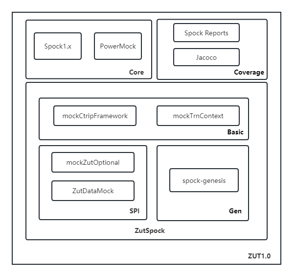

## **总体设计**

### **核心 Core**

### 

Zut1.0 基于Spock1.x + PowerMock 构建。

- 目前Spock最新已经到达2.x，但是调研下来发现，Spock2.x在设计上与1.x存在很大差异，且目前相关实践案例少，学习成本高。
- 目前国际机票也是基于Spock1.x + PowerMock，实践成熟，其项目普遍使用 Junit+PowerMock 或 Spock1.x + PowerMock进行单元测试，覆盖率在70%以上。

### **基础部分 Basic**

- Zut1.0 对 Framework 相关的基础框架部分进行通用Mock支持，包括：
  - Logger
    - BaijiLoggerMock
    - Slf4jLoggerMock
  - Foundation
    - ApplicationProvider
    - GroupProvider
    - MetadataProvider
    - NetworkProvider
    - ServerProvider
    - WebContainerProvider
- Zut1.0 对 Ztrain Common Framework 中的 TrnContext 提供全局Mock支持
  - 提供部分默认方法的默认返回支持，如需扩展添加：
    1. 可在Zut中进行新增
    2. 业务方在测试代码中进行Mock指定（可参考Zut1.0使用文档：[4. ZTrain Spock Test Case](http://conf.corp.com/display/Train/4.+ZTrain+Spock+Test+Case)）

### **扩展 SPI**

##### **ZutDataMock**

提供 Default Data Mock 支持。

- 针对项目中**相对通用或者常用基础数据**，可扩展 ZutDataMock 接口，进行默认数据的Mock

ZutDataMockUtil 为 入口工具类，封装了 ZutDataMock 供业务方使用

- 同时，针对复杂数据的Mock，ZutDataMockUtil 提供**基于Json文件**方式的Mock支持，需在业务系统中的test包下创建相关json文件（可参考Zut1.0使用文档：[4. ZTrain Spock Test Case](http://conf.corp.com/display/Train/4.+ZTrain+Spock+Test+Case)）

扩展方式：

1. 实现 ZutDataMock<T> 接口，指定需要Mock的对象Class类型（如果你需要Mock的Class是一个可选组件中的Class，那么你需要考虑使用基于Json的文件的方式，目前JDK的SPI机制不支持不存在的Class进行forName操作，具体是否可以跳过，需要测试一下！！！）
2. 在Zut项目的资源目录下配置SPI文件

##### **ZutOptionalMock**

针对可选组件，Zut提供动态识别支持。

- Common：针对 Ztrain Common Framework 基础库中封装的 可选组件中的 工具方法进行动态Mock支持
  - common-framework-config
    - QConfigUtil
    - GrayUtil
  - common-framework-core
    - ABUtil
  - common-framework-qmq
    - QmqProducerUtil
  - common-framework-redis
    - CRedisUtil
    - ZxDistributeLockService
  - common-framework-log
    - TLogger
    - LogConfig
    - TLogTag
    - ClickHouseBizUtil
    - ClickHouseUtil
- RPC：可针对 SOA 的 Rpc Client 进行 动态Mock 支持

扩展方式：

1. 实现 ZutOptionalMock → AbstractZutOptionalMock ，按接口编写Mock逻辑
2. 在Zut项目的资源目录下配置SPI文件

### **数据生成器 Gen**

Zut1.0 集成了 spock-genesis ， 可满足 日常 业务人员编写测试用例时方便的 Mock 数据。

GitHub：https://github.com/Bijnagte/spock-genesis

Doc：https://bijnagte.github.io/spock-genesis/

Demo：https://github.com/Bijnagte/spock-genesis/blob/master/src/test/groovy/spock/genesis/SamplesSpec.groovy

### **覆盖率 Coverage**

##### **spock-reports**

Zut1.0 集成了 spock-reports，利用其进行 本地代码 测试报告生成工具，业务团队无需课外引入，即可使用。


##### **Jacoco**

由于  Auto DevOps 使用 Jacoco 生成代码覆盖率报告，所以需要业务团队在业务项目中引入 Jacoco 依赖：（详细 可参考Zut1.0使用文档）

```pom
<jacoco.version>0.8.5</jacoco.version>
<sonar.coverage.exclustions>  // 根据具体项目进行配置，注意这里的配置，尽量和 GitLab Auto DevOps 的 Pipeline 中的 Test 模块的 Jacoco 的 Exclude 一致
    **/adapter/**,
    **/agent/**,
    **/utils/**,
    **/models/**,
    **/dto/**,
    **/deprecated/**,
    **/repository/**,
    **/enums/**,
    **/custom/**,
    **/constant/**,
    **/service/**,
    **/infrastructure/**,
    **/transaction/**,
    **/holder/**,
</sonar.coverage.exclustions>


<dependency>
    <groupId>org.jacoco</groupId>
    <artifactId>org.jacoco.agent</artifactId>
    <version>${jacoco.version}</version>
    <classifier>runtime</classifier>
</dependency>

<build>
    <plugins>
        <plugin>
            <groupId>org.jacoco</groupId>
            <artifactId>jacoco-maven-plugin</artifactId>
            <version>${jacoco.version}</version>
            <executions>
                <execution>
                    <id>default-instrument</id>
                    <goals>
                        <goal>instrument</goal>
                    </goals>
                </execution>
                <execution>
                    <id>default-restore-instrumented-classes</id>
                    <goals>
                        <goal>restore-instrumented-classes</goal>
                    </goals>
                </execution>
            </executions>
        </plugin>
        <plugin>
            <groupId>org.apache.maven.plugins</groupId>
            <artifactId>maven-surefire-plugin</artifactId>
            <version>2.12.2</version>
            <configuration>
                <systemPropertyVariables>
                    <jacoco-agent.destfile>target/jacoco.exec</jacoco-agent.destfile>
                </systemPropertyVariables>
            </configuration>
        </plugin>
    </plugins>
</build>
```

