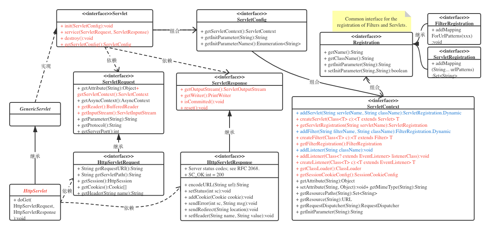

## Servlet3.0规范

- Servlet：用于处理请求（service方法）
  - GenericServlet：通用的Servlet，协议独立
  - HttpServlet：用于处理Http请求
  - 生命周期：init()、service()、destroy()

- ServletConfig：为web.xml配置文件中配置的对应的初始化参数，Web容器读取web.xml配置，封装成ServletConfig

- ServletContext：Servlet 与 `Servlet容器` 之间直接通信的接口,一个web应用只独有一个ServletContext.
  - 一个 Servlet 应用对应了一个 ServletContext，但是它 可能对应多个 Spring
  - 用于在web应用范围内存取共享数据，如setAttribute(String name, Object object)，getAttribute()
  - **在具体ServletContext 实现中，提供了添加Servlet、Filter、Listener到ServletContext里面的方法**
  - 生命周期同 web 应用生命周期一样
  - **一般由web容器实现，如Tomcat（ApplicationContext、ApplicationContextFacade）**
- Filter：对请求响应做统一处理
  - 生命周期：init()、doFilter、destroy()
  - Tomcat中的过滤器链：ApplicationFilterChain
- ServletRequest：
  - HttpServletRequest
  - 只在servlet的service方法或过滤器的doFilter方法作用域内有效，除非启用了异步处理调用了ServletRequest接口对象的startAsync方法，此时request对象会一直有效，直到调用AsyncContext的complete方法。另外，web容器通常会为了性能而不销毁ServletRequest接口的对象，而是**重复利用ServletRequest接口对象**。
- ServletResponse：
  - 为了提高输出数据的效率，ServletOutputStream和PrintWriter首先把数据写到缓冲区内。当缓冲区内的数据被提交给客户后，ServletResponse的isComitted方法返回true
  - 只在Servlet的service方法或过滤器的doFilter方法作用域内有效，除非它关联的ServletResponse接口调用了startAsync方法启用异步处理，此时ServletResponse接口会一直有效，直到调用AsyncContext的complete方法。另外，web容器通常会为了性能而不销毁ServletResponse接口对象，而是重复利用ServletResponse接口对象。
- Listener：用于对特定对象的生命周期和特定事件进行响应处理，主要用于对Session,request,context等进行监控
  - **监听域对象自身的创建和销毁的事件监听器**
    - ServletContextListener：ServletContext的创建和销毁：contextInitialized方法和contextDestroyed方法，作为定时器、加载全局属性对象、创建全局数据库连接、加载缓存信息等
    - HttpSessionListener：HttpSession的创建和销毁：sessionCreated和sessionDestroyed方法，可用于统计在线人数、记录访问日志等
    - ServletRequestListener： ServletRequest的创建和销毁：requestInitialized和requestDestroyed方法
  - **监听域对象中的属性的增加和删除的事件监听器**
    - ServletContextAttributeListener、HttpSessionAttributeListener、ServletRequestAttributeListener接口。
      - 实现方法：attributeAdded、attributeRemoved、attributeReplaced

##### Tomcat

**ServletContainerInitializer**

StandardContext（引擎上下文）：Catalina主要包括Connector和Container，StandardContext就是一个Container

StandardContextValve

ApplicationContextFacade -> 实现自 ServletContext，Facade对象，它从web应用程序屏蔽内部ApplicationContext对象。

org.apache.coyote.Request

org.apache.coyote.Response

org.apache.catalina.core.ApplicationFilterChain

org.apache.catalina.connector.RequestFacade 实现自：HttpServletRequest

org.apache.catalina.connector.ResponseFacade

Filter

FilterChain

LifecycleMBeanBase

