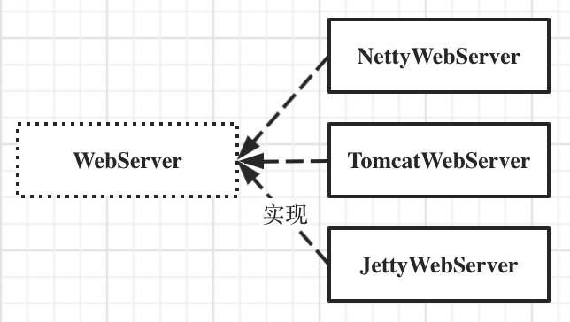
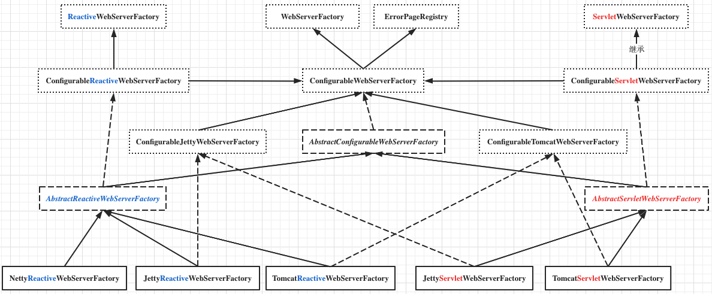

## SpringBoot

WebServer：



WebServerFactory：




### SpringBoot整合多种Web容器

ServletWebServerApplicationContext重写了 AbstractApplicationContext#refresh()#onRefresh() 方法，以启动 内嵌Tomcat容器：

```java
@Override
protected void onRefresh() {
  super.onRefresh();
  try {
    // 创建容器
    createWebServer();
  }
  catch (Throwable ex) {
    throw new ApplicationContextException("Unable to start web server", ex);
  }
}
```


#### 接口

##### WebServer

Spring Boot对内嵌式Web容器进行了抽象，定义了**WebServer**接口：

```java
public interface WebServer {
    void start() throws WebServerException;
    void stop() throws WebServerException;
    int getPort();
}
```

各种Web容器比如Tomcat和Jetty需要去实现这个接口


##### ServletWebServerFactory

创建WebServer

```java
public interface ServletWebServerFactory {
    WebServer getWebServer(ServletContextInitializer... initializers);
}
```

ServletContextInitializer：ServletContext初始化器

```java
public interface ServletContextInitializer {
    void onStartup(ServletContext servletContext) throws ServletException;
}
```

getWebServer方法会调用ServletContextInitializer的onStartup方法，也就是说如果你想在Servlet容器启动时做一些事情，比如注册你自己的Servlet，可以实现一个ServletContextInitializer，在Web容器启动时，Spring Boot会把所有实现了ServletContextInitializer接口的类收集起来，统一调它们的onStartup方法


##### WebServerFactoryCustomizerBeanPostProcessor

WebServerFactoryCustomizer 定制化 内嵌WebServer

```java
public interface WebServerFactoryCustomizer<T extends WebServerFactory> {
    void customize(T factory);
}
```


#### 启动

##### ServletWebServerApplicationContext

ServletWebServerApplicationContext -> AbstractApplicationContext

ServletWebServerApplicationContext就是通过重写**onRefresh**方法来创建内嵌式的Web容器

```java
@Override
protected void onRefresh() {
     super.onRefresh();
     try {
        //重写onRefresh方法，调用createWebServer创建和启动Tomcat
        createWebServer();
     }
     catch (Throwable ex) {
     }
}

//createWebServer的具体实现
private void createWebServer() {
    //这里WebServer是Spring Boot抽象出来的接口，具体实现类就是不同的Web容器
    WebServer webServer = this.webServer;
    ServletContext servletContext = this.getServletContext();
    
    //如果Web容器还没创建
    if (webServer == null && servletContext == null) {
        //通过Web容器工厂来创建
        ServletWebServerFactory factory = this.getWebServerFactory();
        //注意传入了一个"SelfInitializer"
        this.webServer = factory.getWebServer(new ServletContextInitializer[]{this.getSelfInitializer()});
        
    } else if (servletContext != null) {
        try {
            this.getSelfInitializer().onStartup(servletContext);
        } catch (ServletException var4) {
          ...
        }
    }

    this.initPropertySources();
}
```


##### ServletWebServerFactory.getWebServer() | Tomcat实现

org.springframework.boot.web.**embedded**.tomcat.TomcatServletWebServerFactory

以Tomcat为例，主要调用Tomcat的API去创建各种组件

```java
public WebServer getWebServer(ServletContextInitializer... initializers) {
    //1.实例化一个Tomcat，可以理解为Server组件。
    Tomcat tomcat = new Tomcat();
    
    //2. 创建一个临时目录
    File baseDir = this.baseDirectory != null ? this.baseDirectory : this.createTempDir("tomcat");
    tomcat.setBaseDir(baseDir.getAbsolutePath());
    
    //3.初始化各种组件
    Connector connector = new Connector(this.protocol);
    tomcat.getService().addConnector(connector);
    this.customizeConnector(connector);
    tomcat.setConnector(connector);
    tomcat.getHost().setAutoDeploy(false);
    this.configureEngine(tomcat.getEngine());
    
    //4. 创建定制版的"Context"组件。
  	// 这里的Context是指Tomcat中的Context组件，为了方便控制Context组件的行为，Spring Boot定义了自己的TomcatEmbeddedContext，
  	// 它扩展了Tomcat的StandardContext：
    this.prepareContext(tomcat.getHost(), initializers);
    return this.getTomcatWebServer(tomcat);
}
```

