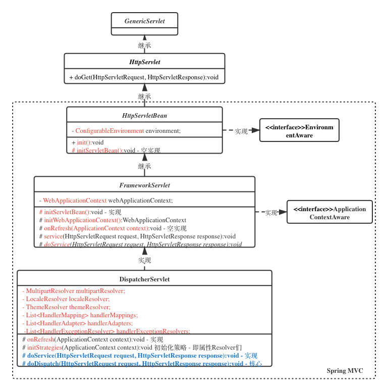

### Spring MVC




##### DispatcherServlet

执行流程 **todo 画图**

DispatcherServlet，就是在init方法里创建了自己的Spring容器

- Servlet->HttpServlet->HttpServletBean#init() -> FrameworkServlet#initServletBean

- ```java
  // 从ServletContext中取rootContext
  this.webApplicationContext = initWebApplicationContext();
  ```

Spring就实现了自己的监听器，来监听ServletContext的启动事件，目的是当Servlet容器启动时，创建并初始化全局的Spring容器

**Tomcat&Jetty在启动时给每个Web应用创建一个全局的上下文环境，这个上下文就是ServletContext，其为后面的Spring容器提供宿主环境。**

**Tomcat&Jetty在启动过程中触发容器初始化事件，Spring的ContextLoaderListener会监听到这个事件，它的contextInitialized方法会被调用，在这个方法中，Spring会初始化全局的Spring根容器，这个就是Spring的IoC容器，IoC容器初始化完毕后，Spring将其存储到ServletContext中，便于以后来获取。**

**Tomcat&Jetty在启动过程中还会扫描Servlet，一个Web应用中的Servlet可以有多个，以SpringMVC中的DispatcherServlet为例，这个Servlet实际上是一个标准的前端控制器，用以转发、匹配、处理每个Servlet请求。**

**Servlet一般会延迟加载，当第一个请求达到时，Tomcat&Jetty发现DispatcherServlet还没有被实例化，就调用DispatcherServlet的init方法，DispatcherServlet在初始化的时候会建立自己的容器，叫做SpringMVC 容器，用来持有Spring MVC相关的Bean。同时，Spring MVC还会通过ServletContext拿到Spring根容器，并将Spring根容器设为SpringMVC容器的父容器，请注意，Spring MVC容器可以访问父容器中的Bean，但是父容器不能访问子容器的Bean， 也就是说Spring根容器不能访问SpringMVC容器里的Bean。说的通俗点就是，在Controller里可以访问Service对象，但是在Service里不可以访问Controller对象。**


Tomcat/Jetty启动，对于每个WebApp，依次进行初始化工作：
1、对每个WebApp，都有一个WebApp ClassLoader，和一个ServletContext
2、ServletContext启动时，会扫描web.xml配置文件，找到Filter、Listener和Servlet配置

3、如果Listener中配有spring的ContextLoaderListener
3.1、ContextLoaderListener就会收到webapp的各种状态信息。
3.3、在ServletContext初始化时，ContextLoaderListener也就会将Spring IOC容器进行初始化，管理Spring相关的Bean。
3.4、ContextLoaderListener会将Spring IOC容器存放到ServletContext中

4、如果Servlet中配有SpringMVC的DispatcherServlet
4.1、DispatcherServlet初始化时（其一次请求到达）。
4.2、其中，DispatcherServlet会初始化自己的SpringMVC容器，用来管理Spring MVC相关的Bean。
4.3、SpringMVC容器可以通过ServletContext获取Spring容器，并将Spring容器设置为自己的根容器。而子容器可以访问父容器，从而在Controller里可以访问Service对象，但是在Service里不可以访问Controller对象。
4.2、初始化完毕后，DispatcherServlet开始处理MVC中的请求映射关系。


DispatcherServlet中的成员变量都是初始化好后就不会被改变了，所以是线程安全的，那“可见性”怎么保证呢？

这是由Web容器比如Tomcat来做到的，Tomcat在调用Servlet的init方法时，用了synchronized。

private synchronized void initServlet(Servlet servlet)
{...}


**ContextLoaderListener** -> 实现了Servlet的 **ServletContextListener**

- ```java
  /**
   * Initialize the root web application context.
   */
  @Override
  public void contextInitialized(ServletContextEvent event) {
     initWebApplicationContext(event.getServletContext());
  }
  ```

- SpringBootContextLoaderListener


Spring容器是管理service和dao的，

SpringMVC容器是管理controller对象的，

Servlet容器是管理servlet对象的。


**ApplicationContextInitializer**


**WebApplicationInitializer**

- SpringBootServletInitializer


##### SpringServletContainerInitializer

Spring Web SPI注入


**WebServer**


##### HandlerMapping：

- 获取HttpServletRequest与Handler之间的映射

- ```java
  HandlerExecutionChain getHandler(HttpServletRequest request);
  ```


##### HandlerExecutionChain：

- Handler执行链
- 组合了 适配的 HandlerInterceptor 列表


##### HandlerInterceptor：

- HandlerMethod拦截器
- 前置判断 - preHandle
  - 当且仅当方法返回 true 时，执行 HandlerMethod
- 后置处理 - postHandle
  - HandlerMethod 已经被执行，其执行结果为ModelAndView，当 ModelAndView 参数为空，说明是非视图渲染， 即 REST 场景(@since 2.5) 否则，就是视图渲染

- 完成回调 - afterCompletion
  - 正常 preHandle -> handle -> postHandle -> afterCompletion
  - preHandle 失败 -> afterCompletion


##### HandlerAdapter：

- Handler适配器，适配不同Handler，返回ModelAndView

- ```java
  ModelAndView handle(HttpServletRequest request, HttpServletResponse response, Object handler);
  ```

- HandlerMethod 与 Servlet API 做适配，利用 HandlerMethod 中的执行结果，去控制适配 ServletRequest 和 ServletResponse。


##### HandlerMethod：


##### Validation


##### Converter


##### LocaleResolver：

全球化支持


##### WebMvcConfigurer

- Spring 5 之前通常使用 WebMvcConfigurerAdapter 类 Spring 5 开始直接使用 WebMvcConfigurer 接口

- Spring Framework 留给应用程序扩展 Web MVC 特性的， WebMvcConfigurer Bean 不是必须

- **WebMvcConfigurer** **引导类** **- DelegatingWebMvcConfiguration**
  - DelegatingWebMvcConfiguration (@Configuration Class)会被 @EnableWebMvc 引导
  - DelegatingWebMvcConfiguration 继承了 WebMvcConfigurationSupport，其中 WebMvcConfigurationSupport 定义了
    - HandlerAdapter Bean - RequestMappingHandlerAdapter
    - HandlerMapping Bean 
      - RequestMappingHandlerMapping
      - BeanNameUrlHandlerMapping


##### Servlet 引擎静态资源 Servlet 处理器

- org.springframework.web.servlet.r esource.DefaultServletHttpRequest Handler


##### HandlerMethodArgumentResolver

- 提供方法参数获取元信息，并且将 Servlet API 中的信息作为 方法参数填充
- **HandlerMethod** 方法上参数注解如何处理：
  - @RequestParam - ServletRequest#getParameter(String)
  - 利用 Java 反射 API Method
    - 获取参数注解 - Annotation\[][]getParameterAnnotations()，方法允许多个参数，一个参数允许标注不同的注解
    - 获取参数名称 - Parameter[] getParameters()
- 实现 - org.springframework.web.method.annotation.**RequestParamMethodArgumentResolver**


##### HttpMessageConverter


##### HandlerExceptionResolver

实现：

- org.springframework.web.servlet.mvc.method.annotation.ExceptionHandlerExceptionResolver
- org.springframework.web.servlet.mvc.annotation.ResponseStatusExceptionResolver
- org.springframework.web.servlet.mvc.support.DefaultHandlerExceptionResolver


**SpringMVC有两个上下文？Spring的service，dao、SpringMVC的controller？**

**SpringBoot中只有一个Spring上下文：**
**org.springframework.boot.web.servlet.context.AnnotationConfigServletWebServerApplicationContext**


#### FAQ：

问：servlet容器的Filter跟 spring 的intercepter 有啥区别

Filter是Servlet规范的一部分，是Servlet容器Tomcat实现的。Intercepter是Spring发明的。它们的执行顺序是：


Filter.doFilter();

HandlerInterceptor.preHandle();

Controller

HandlerInterceptor.postHandle();

DispatcherServlet 渲染视图

HandlerInterceptor.afterCompletion();

Filter.doFilter(); Servlet方法返回