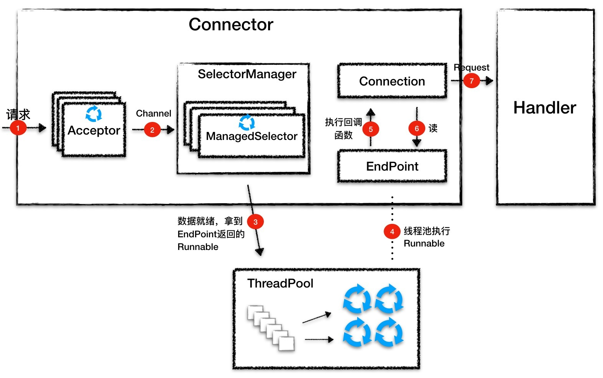

## Jetty


#### Connector

处理Http请求



**ServerConnector**实现类

基于NIO，抽象 **监听连接、I/O事件查询、数据读写**

- **Acceptor**：监听连接

  - 用于接受请求，同Tomcat一样，Jetty也有独立的Acceptor线程组来处理连接请求
  - Acceptor是ServerConnector中的一个内部类，同时也是一个Runnable，Acceptor线程是通过getExecutor()得到的线程池来执行的，前面提到这是一个全局的线程池
  - Acceptor接收到连接，会触发SocketChannel变为非阻塞，并交由SelectorManager处理

- **SelectorManager：I**/O事件查询

  - Jetty的Selector由SelectorManager类管理，而被管理的Selector叫作ManagedSelector。SelectorManager内部有一个ManagedSelector数组，真正干活的是ManagedSelector

  - SelectorManager从本身的Selector数组中选择一个Selector来处理这个Channel，并创建一个任务Accept交给ManagedSelector，ManagedSelector在处理这个任务主要做了两步：、

    - 第一步，调用Selector的register方法把Channel注册到Selector上，拿到一个SelectionKey。

      ```java
       _key = _channel.register(selector, SelectionKey.OP_ACCEPT, this);
      ```

    - 第二步，创建一个EndPoint和Connection，并跟这个SelectionKey（Channel）绑在一起：

      ```java
      private void createEndPoint(SelectableChannel channel, SelectionKey selectionKey) throws IOException
      {
          //1. 创建Endpoint
          EndPoint endPoint = _selectorManager.newEndPoint(channel, this, selectionKey);
          
          //2. 创建Connection
          Connection connection = _selectorManager.newConnection(channel, endPoint, selectionKey.attachment());
          
          //3. 把Endpoint、Connection和SelectionKey绑在一起
          endPoint.setConnection(connection);
          selectionKey.attach(endPoint);
          
      }
      
      // 上面这两个过程是什么意思呢？打个比方，你到餐厅吃饭，先点菜（注册I/O事件），服务员（ManagedSelector）给你一个单子（SelectionKey），等菜做好了（I/O事件到了），服务员根据单子就知道是哪桌点了这个菜，于是喊一嗓子某某桌的菜做好了（调用了绑定在SelectionKey上的EndPoint的方法）
      ```

      ManagedSelector并没有调用直接EndPoint的方法去处理数据，而是通过调用EndPoint的方法**返回一个Runnable，然后把这个Runnable扔给线程池执行**，所以你能猜到，这个Runnable才会去真正读数据和处理请求

      

- **Connection**：数据读写

  - 这个**Runnable**是EndPoint的一个内部类，它会调用Connection的回调方法来处理请求。Jetty的Connection组件类比就是Tomcat的Processor，负责具体协议的解析，得到Request对象，并调用Handler容器进行处理
  - HttpConnection:
    - **请求处理**：HttpConnection并不会主动向EndPoint读取数据，而是向在EndPoint中注册一堆回调方法
    - **响应处理**：Connection调用Handler进行业务处理，Handler会通过Response对象来操作响应流，向流里面写入数据，HttpConnection再通过EndPoint把数据写到Channel，这样一次响应就完成了


**Connector工作流程：**

1. Acceptor监听连接请求，当有连接请求到达时就接受连接，一个连接对应一个Channel，Acceptor将Channel交给ManagedSelector来处理。
2. ManagedSelector把Channel注册到Selector上，并创建一个EndPoint和Connection跟这个Channel绑定，接着就不断地检测I/O事件。
3. I/O事件到了就调用EndPoint的方法拿到一个Runnable，并扔给线程池执行。
4. 线程池中调度某个线程执行Runnable。
5. Runnable执行时，调用回调函数，这个回调函数是Connection注册到EndPoint中的。
6. 回调函数内部实现，其实就是调用EndPoint的接口方法来读数据。
7. Connection解析读到的数据，生成请求对象并交给Handler组件去处理。


#### Handler

处理Servlet


#### ThreadPool

Connector和Handler两个组件所需要的线程资源直接从一个全局的线程池里拿


#### Server

启动与协调核心组件工作

负责创建并初始化Connector、Handler、ThreadPool组件，然后调用start方法启动它们


#### 对比Tomcat

整体架构相似

- 区别一：Jetty中无 Service 概念
  - Tomcat中的Service包装了多个连接器和一个容器组件，一个Tomcat实例可以配置多个Service，不同的Service通过不同的连接器监听不同的端口
  - Jetty中Connector是被所有Handler共享的
- 区别二：线程池不同
  - Tomcat中每个连接器都有自己的线程池
    - Jetty中所有的Connector共享一个全局的线程池


#### 知识补充

参考本目录下的netty目录下的NIO入门中的 “八、ServerSocketChannel”

八、ServerSocketChannel

以监听新进来的TCP连接的通道, 就像标准IO中的ServerSocket一样。

- 例子

```java
// 打开
ServerSocketChannel serverSocketChannel = ServerSocketChannel.open();
// 绑定Socket端口
serverSocketChannel.socket().bind(new InetSocketAddress(9999));
// 监听连接 - 阻塞监听
while(true) {
    SocketChannel socketChannel = serverSocketChannel.accept();
    // do something with this SocketChannel.
}
// 关闭
serverSocketChannel.close();
```

- 非阻塞模式
  非阻塞模式下， accept() 方法会立刻返回，如果没有新的连接进来，返回值是null

```java
ServerSocketChannel serverSocketChannel = ServerSocketChannel.open();
serverSocketChannel.socket().bind(new InetSocketAddress(9999));
serverSocketChannel.configureBlocking(false);
while(true) {
    SocketChannel socketChannel = serverSocketChannel.accept();
    if(socketChannel != null) {
        // do something with this SocketChannel.
    }
}
serverSocketChannel.close();
```

## 