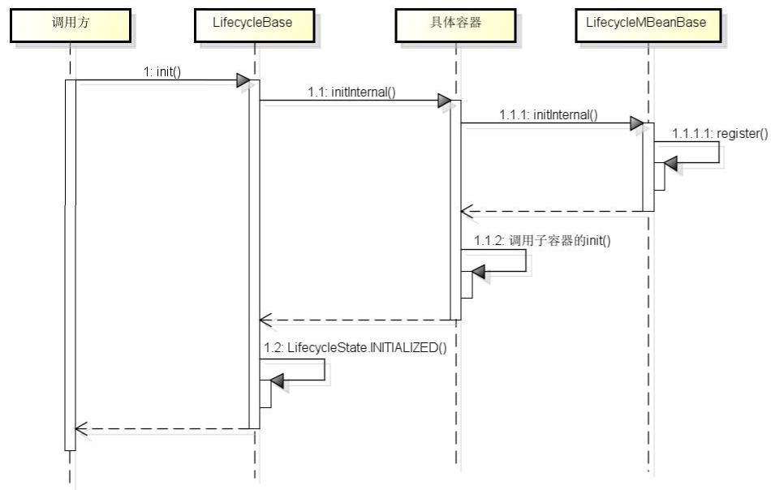
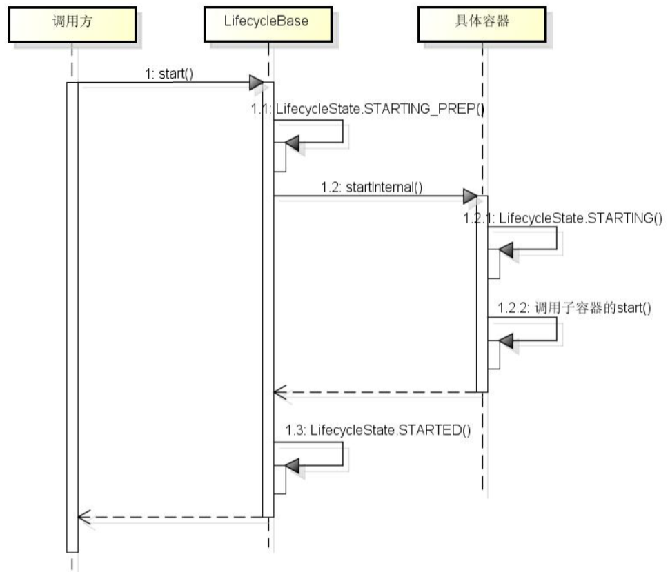

## Lifecycle

> 参考：ltd.beihu.sample.lifecycle.Lifecycle


### 生命周期流转图


- 所有状态都能转变为FAILED
- ⼀个组件在STARTING_PREP、STARTING、STARTED状态调⽤start()⽅法不会产⽣影响
- ⼀个组件在NEW状态调⽤start()⽅法时，会先调⽤init()⽅法
- ⼀个组件在STOPPING_PREP、STOPPING、STOPPED状态调⽤stop⽅法不会产⽣影响
- ⼀个组件在NEW状态调⽤stop()方法时，会将状态直接改为STOPPED。当组件⾃⼰启动失败去停⽌时，需要将⼦组件也进⾏停⽌，尽管某些⼦组件还没有启动。
- 其他状态相互转换都会抛异常
- 合法的状态转换发⽣时都会触发相应的LifecycleEvent事件，⾮合法的转换不会触发事件。


### 事件监听

##### 事件触发：

Tomcat中每个组件的状态会发送变化，变化的时候会抛出⼀些事件，Tomcat⽀持定义事件监听器来监听并消费这些事件。

##### 事件执行：

实现事件监听功能的类为org.apache.catalina.util.LifecycleBase。每个组件都会继承这个类。

该类中有⼀个属性： **List\<LifecycleListener> lifecycleListeners ;** 该属性⽤来保存事件监听器，也就是说每个组件拥有⼀个事件监听器列表。

```java
/**
 * Allow sub classes to fire {@link Lifecycle} events.
 *
 * @param type  Event type
 * @param data  Data associated with event.
 */
protected void fireLifecycleEvent(String type, Object data) {
    LifecycleEvent event = new LifecycleEvent(this, type, data);
    for (LifecycleListener listener : lifecycleListeners) {
        listener.lifecycleEvent(event);
    }
}
```

当组件的状态发⽣变化时，会调⽤fireLifecycleEvent触发事件执⾏。⽐如当Server初始化时，会调⽤：LifecycleBase.start()；start() 第一次调用又会先触发init()

```java
public final synchronized void init() throws LifecycleException {
    // ...
    setStateInternal(LifecycleState.INITIALIZING, null, false);
    initInternal();
    setStateInternal(LifecycleState.INITIALIZED, null, false);
    // ...
}

public final synchronized void start() throws LifecycleException {
    // ...
	setStateInternal(LifecycleState.STARTING_PREP, null, false);
	startInternal();
    // ...
}

private synchronized void setStateInternal(LifecycleState state, Object data, boolean check) throws LifecycleException {
    // ...
    this.state = state;
    String lifecycleEvent = state.getLifecycleEvent();
    if (lifecycleEvent != null) {
        // 触发事件监听器执行
        fireLifecycleEvent(lifecycleEvent, data);
    }
    // ...
}

// 留给子类去定制实现自己业务逻辑
protected abstract void initInternal() throws LifecycleException;
protected abstract void startInternal() throws LifecycleException;
```

- setStateInternal(xxx)： 为LifecycleBase内部私有方法，专门处理组件 LifecycleBase 在启动初期的 状态流转，及触发该状态的事件处理

- startInternal() ：为抽象方法，留个各子组件，进行扩展，子组件可在内部进行逻辑处理，并设置其生命周期状态state：

  ```java
  // 例：org.apache.catalina.core.ContainerBase
  protected synchronized void startInternal() throws LifecycleException {
      // ...
      Cluster cluster = getClusterInternal();
      // ...
      Realm realm = getRealmInternal();
      // ...
      // Start our child containers, if any
      // 启动所有的子容器
      Container children[] = findChildren();
      List<Future<Void>> results = new ArrayList<>();
      for (Container child : children) {
          results.add(startStopExecutor.submit(new StartChild(child)));
      }
      // ...
      for (Future<Void> result : results) {
          try {
              result.get();
          } catch (Throwable e) {
              // ...
          }
  
      }
       // ...
  
      // Start the Valves in our pipeline (including the basic), if any
      // 启动所有的 pipeline
      if (pipeline instanceof Lifecycle) {
          ((Lifecycle) pipeline).start();
      }
  
      // 设置容器状态为 LifecycleState.STARTING
      setState(LifecycleState.STARTING);
  
      // Start our thread
      // 启动后台监听线程
      if (backgroundProcessorDelay > 0) {
          monitorFuture = Container.getService(ContainerBase.this).getServer()
                  .getUtilityExecutor().scheduleWithFixedDelay(
                          new ContainerBackgroundProcessorMonitor(), 0, 60, TimeUnit.SECONDS);
      }
  }
  
  // org.apache.catalina.util.LifecycleBase
  protected synchronized void setState(LifecycleState state) throws LifecycleException {
      // 复用了
      setStateInternal(state, null, true);
  }
  ```


##### 事件监听器

程序员可以⾃定义事件监听器，只需实现LifecycleListener接⼝即可；

定义好事件监听器后，每个组件就可以调⽤⽗类LifecycleBase中的addLifecycleListener()⽅法添加事件
监听器到该组件的监听器列表中。

##### 总结

虽然说是事件监听，但实际上并不是异步触发，⽽是主动调⽤事件监听器。


### 容器初始化



根据初始化过程对Tomcat源码分析，其处理步骤如下：

1. 调用放调用父类LifecycleBase的init方法，LifecycleBase的init方法主要完成一些所有容器公共抽象出来的动作
2. LifecycleBase的init方法调由具体容器的initInternal方法实现，initInternal方法用于对容器本身真正的初始化
3. 具体容器的initInternal方法调用父类LifecycleMBeanBbase的initInternal方法实现，此initIneral方法用于将容器托管到JMX，便于运维管理
4. LifecycleMBeanBase的initInternal方法调用自身的register方法，将容器作为MBean方法注册到MBeanServer
5. 容器如果有子容器，会调用子容器的init方法
6. 容器初始化完毕，LifecycleBase会将容器的状态更改为初始化完毕，即`LifecycleState.INITIALIZED`


### 容器启动



根据对源码的分析，其处理步骤如下：

1. 调用方调用容器父类LifecycleBase的start方法，LifecycleBase的start方法主要完成一些容器公共抽象出来的动作
2. LifecycleBase的start方法先将容器状态改为`LifecycleState.STARTING_PREP`，然后调用具体容器的startInternal方法实现，此startInternal方法用于对容器本身真正的初始化
3. 具体容器的startInternal方法会将容器状态改为`LifecycleState.STARTING`，容器如果有子容器，会调用子容器的start方法启动子容器
4. 容器启动完毕，LifecycleBase会将容器的状态更改为启动完毕，即`LifecycleState.STARTED`


### 特殊事件

##### PERIODIC_EVENT

StandardServer.startInternal() 最后，会触发 异步线程，定时触发 Lifecycle.PERIODIC_EVENT 事件

org.apache.catalina.startup.HostConfig 会对该事件进行处理

```java
public void lifecycleEvent(LifecycleEvent event) {
	//...
    // Process the event that has occurred
    if (event.getType().equals(Lifecycle.PERIODIC_EVENT)) {
        check();
    } else if (event.getType().equals(Lifecycle.BEFORE_START_EVENT)) {
        beforeStart();
    } else if (event.getType().equals(Lifecycle.START_EVENT)) {
        start();
    } else if (event.getType().equals(Lifecycle.STOP_EVENT)) {
        stop();
    }
}
```

- check()方法响应PERIODIC_EVENT周期性检查事件，主要是检查资源是否被更改，如果被更改就会重新解压、重新加载。
- beforeStart()响应BEFORE_START_EVENT状态，主要是设置资源目录等相关配置，为START_EVENT做准备。
- start()响应START_EVENT状态，这里就是启动是读取配置、解压包、重新加载资源的操作。下面也主要以这个方法为例。

##### HostConfig

HostConfig是Host容器的状态监听器

Host这个层次做WAR解压和部署，因为Context和Wrapper是动态添加的，我们在tomcat的指定目录下每添加一个war包，tomcat加载war包时，就可以添加Context和Servlet

- deployWARs()：异步触发过个War的解压配置部署等工作
- deployWAR()：真正进行动态部署
  - war包解析，解压缩
  - 配置文件读取
  - Context类加载，类配置。可以是标准StandardContext，也可以是war中自己定义的。
  - war中自定义的状态监听器的加载。
  - Host使用addChild将context实例加入到tomcat的Host配置中。
  - **对解压缩的war包进行监控，发生变化就会触发上面说到的check()**
