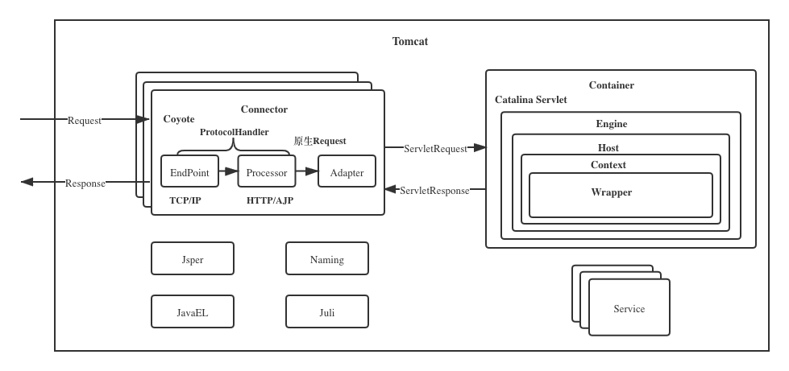

## Tomcat

#### 架构



#### 设计

- **组件化**：根据功能抽象出组件，组件内部高内聚（相似功能高度聚合）、组件之间低耦合（低依赖，组件之间基于抽象接口交互，封装变化降低耦合）
- **可管理化**：如何统一管理组件的创建、初始化、启动、停止和销毁？如何做到代码逻辑清晰？如何方便地添加或者删除组件？如何做到组件启动和停止不遗漏、不重复？


##### Catalina

Tomcat：比作是一家公司，那么Catalina应该是公司创始人，因为Catalina负责组建团队，也就是创建Server以及它的子组件

Server：是公司的CEO，负责管理多个事业群，每个事业群就是一个Service。

Service：是事业群总经理，它管理两个职能部门：一个是对外的市场部，也就是连接器组件；另一个是对内的研发部，也就是容器组件。

Engine：则是研发部经理，因为Engine是最顶层的容器组件。

server.xml解析：

- Catalina
  - Server
    - Service(可多个)
      - Connector(可多个)
      - Engine(只一个)


#### 组件

- Http服务
  - 和客户端浏览器进行交互，进行socket通信，将字节流和Request/Response等对象进行转换
  - Connector（Coyote）：连接器组件
- Servlet容器，实现Servlet规范
  - 处理业务逻辑
  - Container（Catalina）：容器组件
- 其他
  - Jasper：JSP引擎（上面图片拼错了）
  - JaveEL：表达式语言
  - Naming：提供JNDI服务
  - Juli：服务器日志


#### 连接器（Coyote）

Coyote 是Tomcat 中连接器的组件名称 , 是对外的接口。客户端通过Coyote与服务器建立连接、发送请求并接受响应。

- Coyote 封装了底层的网络通信（Socket 请求及响应处理）
- Coyote 使Catalina 容器（容器组件）与具体的请求协议及IO操作方式完全解耦-
- Coyote 将Socket 输入转换封装为 Request 对象，进一步封装后交由Catalina 容器进行处理，处理请求完成后, Catalina 通过Coyote 提供的Response 对象将结果写入输出流
- Coyote 负责的是具体协议（应用层）和IO（传输层）相关内容
- 一个连接器对应一个监听端口


**核心组件：**

- **EndPoint**：是Coyote通信监听接口，是具体的Socket接收发送处理器，是用来实现TCP/IP协议的，是对传输层的抽象。主要实现：NioEndpoint、Nio2Endpoint，有两个重要的子组件：Acceptor和SocketProcessor：
  - Acceptor：用于监听Socket连接请求，Endpoint中的Acceptor有多个，每个Acceptor跑在单独的线程里
  - SocketProcessor：用于处理接收到的Socket请求，它实现Runnable接口，在Run方法里调用协议处理组件Processor进行处理。为了提高处理能力，SocketProcessor被提交到线程池来执行。而这个线程池叫作执行器（Executor)
- **Processor**：是Coyote协议处理接口，用来接收EndPoint的Socket，读取字节流解析成Tomcat Request和Response对象，并通过Adapter提交到对应容器处理，是用来实现HTTP协议的，是对应用层的抽象。
  - **ProtocolHandler**：Coyote 协议接口，通过Endpoint和Processor组件，实现针对具体协议的处理能力。Tomcat 按照协议和I/O 提供了6个实现类 : AjpNioProtocol，AjpAprProtocol，AjpNio2Protocol，**Http11NioProtocol**，**Http11Nio2Protocol**，Http11AprProtocol
  - 由于I/O模型和应用层协议可以自由组合，比如NIO + HTTP或者NIO2 + AJP。Tomcat的设计者将网络通信和应用层协议解析放在一起考虑，设计了一个叫ProtocolHandler的接口来封装这两种变化点。各种协议和通信模型的组合有相应的具体实现类。比如：Http11NioProtocol和AjpNioProtocol。
- **Adapter**：由于协议不同，客户端发过来的请求信息格式也不相同。ProtocolHandler接口解析请求并生成Tomcat Request类。由于不同协议导致的Request差异，Tomcat设计者的解决方案是引入**CoyoteAdapter**，连接器调用CoyoteAdapter的Sevice方法，传入Tomcat Request对象， CoyoteAdapter负责将Tomcat Request转成ServletRequest，再调用容器。


#### Servlet容器（Container）

**核心组件：**

- **Engine**：Servlet引擎，用来管理多个虚拟站点，一个Service最多只能有一个Engine， 但是一个Engine可包含多个Host。
- **Host**：代表一个虚拟主机，可以给Tomcat配置多个虚拟主机地址，而一个虚拟主机下可包含多个Context.
- **Context**：表示一个Web应用程序， 一个Web应用可包含多个Wrapper
- **Wrapper**：表示一个Servlet，Wrapper 作为容器中的最底层，不能包含子容器

**调用链：**(Pipeline-Valve是责任链模式)

- Valve
- Pipeline

**Mapper：**


#### 生命周期（组件管理LifeCycle接口）

抽象生命周期中公共的部分，各组件实现之

**可扩展性：**

- **LifeCycle事件**：保证可扩展性；生命周期会触发事件，并通知给监听器（观察者模式）

  - LifeCycle接口里加入两个方法：添加监听器和删除监听器

    - ```
      void addLifecycleListener(LifecycleListener listener);
      void removeLifecycleListener(LifecycleListener listener);
      LifecycleListener[] findLifecycleListeners()
      ```

  - 生命周期状态获取

    - ```
      LifecycleState getState()
      ```

  - 生命周期状态定义

    - LifeCycleState：定义了状态 及 状态对应的 Event事件名

**重用性：**

- LifeCycleBase抽象基类

- LifecycleMBeanBase


#### 日志

- `catalina.***.log`：主要是记录Tomcat启动过程的信息，在这个文件可以看到启动的JVM参数以及操作系统等日志信息。
- `catalina.out`：是Tomcat的标准输出（stdout）和标准错误（stderr），这是在Tomcat的启动脚本里指定的，如果没有修改的话stdout和stderr会重定向到这里。所以在这个文件里可以看到我们在Servlet.java程序里打印出来的信息
- `localhost.**.log`：主要记录Web应用在初始化过程中遇到的未处理的异常，会被Tomcat捕获而输出这个日志文件。
- `localhost_access_log.**.txt`：存放访问Tomcat的请求日志，包括IP地址以及请求的路径、时间、请求协议以及状态码等信息。
- `manager.***.log/host-manager.***.log`：存放Tomcat自带的manager项目的日志信息。


#### FAQ

- Tomcat 的 Context 是一个 Web 应用; 
- Servlet 的 ServletContext 是 Web 应用上下文, 是 Context 的一个成员变量（StandardContext-**>org.apache.catalina.core.ApplicationContext**）; 
- Spring 的 **org.springframework.context.ApplicationContext** 是 spring 容器上下文, 其实现类 org.springframework.web.context.**WebApplicationContext** 是 Servlet（Servlet->GenericServlet->javax.servlet.http.HttpServlet->org.springframework.web.servlet.HttpServletBean -> FrameworkServlet -> **DispatcherServlet**） 的一个属性.
- Tomcat的 Container -> **Wrapper** -> StandardWrapper 中添加了对 Servlet 的支持


Spring MVC的加载过程：

- Servlet.init() -> FrameworkServlet.initServletBean() -> FrameworkServlet.initWebApplicationContext() 如果Spring容器没有起来，会优先加载Spring，但是一般Spring都已经起来了，因为SpringMVC会在容器初始化的时候就开始初始化Spring -> DispatcherServlet.onRefresh()->initStrategies() 里面是处理MVC相关的，比如HandlerMappings
- 此处的*这个 onRefresh() 可由Servlet初始化调用*
- Servlet一般会延迟加载，当第一个请求达到时，Tomcat&Jetty发现DispatcherServlet还没有被实例化，就调用DispatcherServlet的init方法，在初始化的时候会建立自己的容器，叫做SpringMVC 容器，用来持有Spring MVC相关的Bean

SpringBoot -> SpringApplicaton.run() ：

- 创建Spring上下文 ：createApplicationContext
- prepareContext
- refreshContext ： 触发Spring的 **refresh()** 方法
  - refresh中的onRefresh() 方法会触发 createWebServer() 创建内嵌Tomcat
    - new 一个 Tomcat 实例
    - 初始化Tomcat上下文，Context->TomcatEmbeddedContext
    - 上下文里面封装一个 **TomcatStarter** 实现了 **javax.servlet.ServletContainerInitializer**，是用来在Tomcat启动的生命周期中进行一些Spring的Initializer的初始化，它被添加到了 Tomcat的Context中 context.addServletContainerInitializer(starter, NO_CLASSES);，后续Tomcat.start() 后，会触发初始化。**我们可以实现 Spring队友的Initializer来介入Servlet启动初始化阶段。**
      - org.springframework.boot.web.servlet.ServletContextInitializer
    - 将TomcatEmbeddedContext放入Tomcat的Host中
    - 创建：org.springframework.boot.web.embedded.tomcat.TomcatWebServer，持有 Tomcat 对象，并 initialize()，启动Tomcat


非嵌入式SpringWeb的启动：

- SpringMVC: **ContextLoaderListener** - 初始化Spring核心refresh，SpringMVC相关的 由 DispatcherServlet 的 Servlet 进行初始化
- SpringBoot: **SpringBootContextLoaderListener**
  - War包方式启动 SpringBoot：WebApplicationInitializer -> SpringBootServletInitializer

Spring自己上下文初始化的 介入口子：

- org.springframework.context.ApplicationContextInitializer

- 在refresh之前会被调用

  - ```java
    // SpringBoot 的 War包方式
    customizeContext(sc, wac);
    wac.refresh();
    
    // SpringBoot方式
    SpringApplicaton.run() -> createApplicationContext -> prepareContext -> applyInitializers(context) -> refreshContext(context)
    ```


Tomcat 的抽象出了全局的Container，提供了抽象的 ContainerBase ，其持有一个 Container parent 属性，用于其所有存在嵌套关系的子容器模块能够互相关联


```
<Server>
	<Service>
		<Connector>
		</Connector>
		<Engine>
			<Host>
				<Context>
				</Context>
			</Host>
		</Engine>
	</Service>
</Server>
```

- Debug Tomcat：

建议跟SpringBoot那样，用嵌入式方式启动Tomcat，这里有例子：
https://github.com/heroku/devcenter-embedded-tomcat

- 请问tomcat什么时候会reload?

当Web应用文件发生变化的时候。


**ServletContainerInitializer**

StandardContext（引擎上下文）：Catalina主要包括Connector和Container，StandardContext就是一个Container

StandardContextValve

ApplicationContextFacade -> 实现自 ServletContext，Facade对象，它从web应用程序屏蔽内部ApplicationContext对象。


org.apache.coyote.Request -> Tomcat原始Request，会使用适配器适配到 ServletRequest

org.apache.coyote.Response


ApplicationHttpRequest


org.apache.catalina.core.ApplicationFilterChain

org.apache.catalina.connector.RequestFacade 实现自：HttpServletRequest

org.apache.catalina.connector.ResponseFacade

Filter

FilterChain

LifecycleMBeanBase