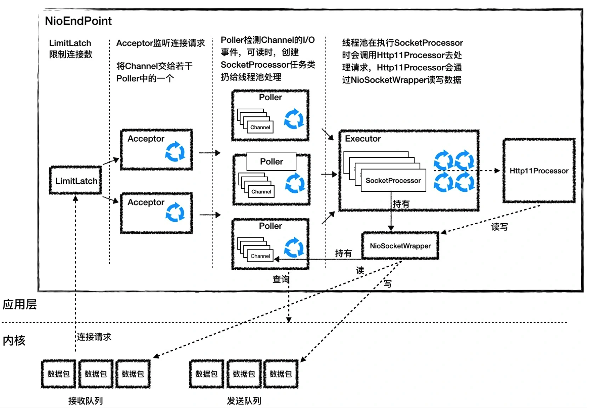

## Tomcat源码分析（二）

### NioEndPoint

工作流程：

**NioEndPoint：org.apache.tomcat.util.net.NioEndpoint**

- **LimitLatch：org.apache.tomcat.util.threads.LimitLatch**

  是连接控制器，它负责控制最大连接数，NIO模式下默认是10000，达到这个阈值后，连接请求被拒绝

- **Acceptor：org.apache.tomcat.util.net.Acceptor**

  跑在一个单独的线程里，它在一个死循环里调用accept方法来接收新连接，一旦有新的连接请求到来，accept方法返回一个Channel对象，接着把Channel对象交给Poller去处理

- **Poller：org.apache.tomcat.util.net.NioEndpoint.Poller**  NioEndPoint 的内部类

  本质是一个Selector，也跑在单独线程里。Poller在内部维护一个Channel数组，它在一个死循环里不断检测Channel的数据就绪状态，一旦有Channel可读，就生成一个SocketProcessor任务对象扔给Executor去处理

  - **SocketProcessor**：Poller会创建SocketProcessor任务类交给线程池处理，而SocketProcessor实现了Runnable接口，用来定义Executor中线程所执行的任务，主要就是调用Http11Processor组件来处理请求。Http11Processor读取Channel的数据来生成ServletRequest对象
  - **SocketWrapper**：Http11Processor并不是直接读取Channel的，只调用SocketWrapper的方法去读写数据。SocketWrapper屏蔽了不同Channel的I/O模型（Tomcat支持同步非阻塞I/O模型和异步I/O模型）

- **Executor**：Tomcat定制版的线程池，负责运行SocketProcessor任务类，SocketProcessor的run方法会调用Http11Processor来读取和解析请求数据。我们知道，Http11Processor是应用层协议的封装，它会调用容器获得响应，再把响应通过Channel写出。

### Nio2EndPoint

JavaNIO.2

### AprEndpoint

APR（Apache Portable Runtime Libraries）是Apache可移植运行时库，它是用C语言实现的，其目的是向上层应用程序提供一个跨平台的操作系统接口库。Tomcat可以用它来处理包括文件和网络I/O，从而提升性能

跟NioEndpoint一样，AprEndpoint也实现了非阻塞I/O，它们的区别是：NioEndpoint通过调用Java的NIO API来实现非阻塞I/O，而AprEndpoint是通过JNI调用APR本地库而实现非阻塞I/O的
