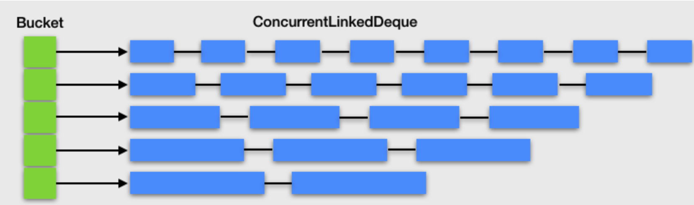

## Tomcat源码分析（五）

Java对象，特别是一个比较大、比较复杂的Java对象，它们的创建、初始化和GC都需要耗费CPU和内存资源


### 对象池技术

**空间换时间**：一个Java对象用完之后把它保存起来，之后再拿出来重复使用，省去了对象创建、初始化和GC的过程


##### Tomcat：SynchronizedStack

Tomcat用SynchronizedStack类来实现对象池

一个请求到来，Tomcat会创建一个SocketProccessor，这是个runnable，会被扔到线程池执行。

在执行过程中，会创建一个Request对象，一个Response对象，和一个Http11Processor对象（AbstractProcessor的子类）。
一次请求处理完了，这些对象会被回收保存起来，重复使用（对象池技术）。

```java
public class SynchronizedStack<T> {

    //内部维护一个对象数组,用数组实现栈的功能
    private Object[] stack;

    //这个方法用来归还对象，用synchronized进行线程同步
    public synchronized boolean push(T obj) {
        index++;
        if (index == size) {
            if (limit == -1 || size < limit) {
                expand();//对象不够用了，扩展对象数组
            } else {
                index--;
                return false;
            }
        }
        stack[index] = obj;
        return true;
    }
    
    //这个方法用来获取对象
    public synchronized T pop() {
        if (index == -1) {
            return null;
        }
        T result = (T) stack[index];
        stack[index--] = null;
        return result;
    }
    
    //扩展对象数组长度，以2倍大小扩展
    private void expand() {
      int newSize = size * 2;
      if (limit != -1 && newSize > limit) {
          newSize = limit;
      }
      //扩展策略是创建一个数组长度为原来两倍的新数组
      Object[] newStack = new Object[newSize];
      //将老数组对象引用复制到新数组
      System.arraycopy(stack, 0, newStack, 0, size);
      //将stack指向新数组，老数组可以被GC掉了
      stack = newStack;
      size = newSize;
   }
}
```


##### Jetty：ByteBufferPool

Jetty中的对象池ByteBufferPool，它本质是一个ByteBuffer对象池

**当Jetty在进行网络数据读写时，不需要每次都在JVM堆上分配一块新的Buffer，只需在ByteBuffer对象池里拿到一块预先分配好的Buffer，这样就避免了频繁的分配内存和释放内存。这种设计你同样可以在高性能通信中间件比如Mina和Netty中看到**

```java
public interface ByteBufferPool
{
    public ByteBuffer acquire(int size, boolean direct);

    public void release(ByteBuffer buffer);
}
```

ByteBufferPool是用不同的**桶（Bucket）**来管理不同长度的ByteBuffer，因为我们可能需要分配一块1024字节的Buffer，也可能需要一块64K字节的Buffer。而桶的内部用一个ConcurrentLinkedDeque来放置ByteBuffer对象的引用。




思考：

为了防止对象池的无限膨胀，必须要对池的大小做限制

对象池本身除了应该有自动扩容的功能，还需要考虑自动缩容

所有的池化技术，包括缓存，都会面临内存泄露的问题，原因是对象池或者缓存的本质是一个Java集合类，比如List和Stack，这个集合类持有缓存对象的引用，只要集合类不被GC，缓存对象也不会被GC