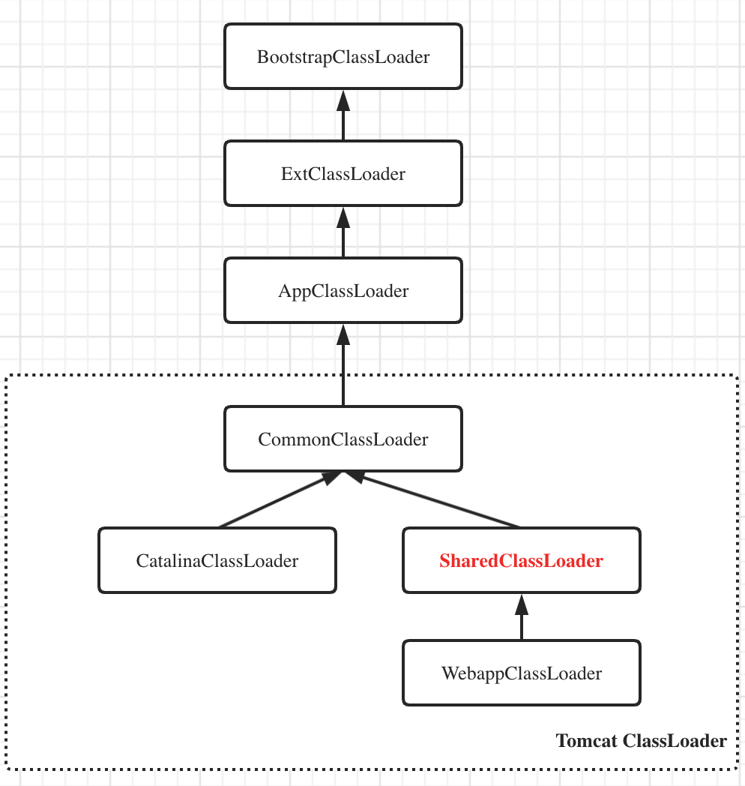

## Tomcat源码分析（六）


### 类加载器

Java中的类遵循按需加载。

所谓类加载器，就是⽤于加载 Java 类到 Java 虚拟机中的组件，它负责读取 Java 字节码，并转换成java.lang.Class 类的⼀个实例，使字节码.class ⽂件得以运⾏。⼀般类加载器负责根据⼀个指定的类找到对应的字节码，然后根据这些字节码定义⼀个 Java 类。另外，它还可以加载资源，包括图像⽂件和配置
⽂件。

类加载器在实际使⽤中给我们带来的好处是，它可以使 Java 类动态地加载到 JVM 中并运⾏，即可在程序运⾏时再加载类，提供了很灵活的动态加载⽅式。

- 启动类加载器（Bootstrap ClassLoader）：加载对象是 Java 核⼼库，把⼀些核⼼的 Java 类加载进JVM 中，这个加载器使⽤原⽣代码（C/C++）实现，并不是继承 java.lang.ClassLoader，它是所有其他类加载器的最终⽗加载器，负责加载 <JAVA_HOME>/jre/lib ⽬录下 JVM 指定的类库。其实它属于 JVM 整体的⼀部分，JVM ⼀启动就将这些指定的类加载到内存中，避免以后过多的 I/O 操作，提⾼系统的运⾏效率。启动类加载器⽆法被 Java 程序直接使⽤。
- 扩展类加载器（Extension ClassLoader）：加载的对象为 Java 的扩展库，即加载<JAVA_HOME>/jre/lib/ext ⽬录⾥⾯的类。这个类由启动类加载器加载，但因为启动类加载器并⾮⽤ Java 实现，已经脱离了 Java 体系，所以如果尝试调⽤扩展类加载器的 getParent()⽅法获取⽗加载器会得到 null。然⽽，它的⽗类加载器是启动类加载器。
- 应⽤程序类加载器（Application ClassLoader）：亦叫系统类加载器（System ClassLoader），它负责加载⽤户类路径（CLASSPATH）指定的类库，如果程序没有⾃⼰定义类加载器，就默认使⽤应⽤程序类加载器。它也由启动类加载器加载，但它的⽗加载类被设置成了扩展类加载器。如果要使⽤这个加载器，可通过 ClassLoader.getSystemClassLoader()获取。


### 双亲委派

双亲委派模型会在类加载器加载类时⾸先委托给⽗类加载器加载，除⾮⽗类加载器不能加载才⾃⼰加载。

这种模型要求，除了顶层的启动类加载器外，其他的类加载器都要有⾃⼰的⽗类加载器。假如有⼀个类要加载进来，⼀个类加载器并不会⻢上尝试⾃⼰将其加载，⽽是委派给⽗类加载器，⽗类加载器收到后⼜尝试委派给其⽗类加载器，以此类推，直到委派给启动类加载器，这样⼀层⼀层往上委派。只有当⽗类加载器反馈⾃⼰没法完成这个加载时，⼦加载器才会尝试⾃⼰加载。通过这个机制，保证了 Java 应⽤所使⽤的都是同⼀个版本的 Java 核⼼库的类，同时这个机制也保证了安全性。设想如果应⽤程序类加载器想要加载⼀个有破坏性的 java.lang.System 类，双亲委派模型会⼀层层向上委派，最终委派给启动类加载器，⽽启动类加载器检查到缓存中已经有了这个类，并不会再加载这个有破坏性的 System 类。

另外，类加载器还拥有全盘负责机制，即当⼀个类加载器加载⼀个类时，这个类所依赖的、引⽤的其他所有类都由这个类加载器加载，除⾮在程序中显式地指定另外⼀个类加载器加载。

在 Java 中，我们⽤完全匹配类名来标识⼀个类，即⽤包名和类名。⽽在 JVM 中，⼀个类由完全匹配类名和⼀个类加载器的实例 ID 作为唯⼀标识。也就是说，同⼀个虚拟机可以有两个包名、类名都相同的类，只要它们由两个不同的类加载器加载。当我们在 Java 中说两个类是否相等时，必须在针对同⼀个类加载器加载的前提下才有意义，否则，就算是同样的字节码，由不同的类加载器加载，这两个类也不是相等的。这种特征为我们提供了隔离机制，在 Tomcat 服务器中它是⼗分有⽤的。


### URLClassLoader

我们在使⽤⾃定义类加载去加载类时，我们需要指明该去哪些资源中进⾏加载，所以JDK提供了URLClassLoader来⽅便我们使⽤，我们在创建URLClassLoader时需要传⼊⼀些URLs，然后在使⽤这个URLClassLoader加载类时就会从这些资源中去加载。


### Tomcat热加载、热部署

解决方案：后台异步线程定时检测变化 或 发布事件监听处理

ContainerBase中设计了 `backgroundProcess()`方法，意味着每个容器组件都可以有自己的后台处理任务


##### 热加载

Context -> StandardContext#backgroundProcess()

##### 热部署

HostConfig#lifecycleEvent(LifecycleEvent event)


### Tomcat ClassLoader设计



##### 定制ClassLoader

Tomcat 拥有不同的⾃定义类加载器，以实现对各种资源库的控制。⼀般来说，Tomcat 主要⽤类加载器
解决以下 4 个问题。

- 同⼀个Tomcat中，各个Web应⽤之间各⾃使⽤的Java类库要互相隔离。
- 同⼀个Tomcat中，各个Web应⽤之间可以提供共享的Java类库。
- 为了使Tomcat不受Web应⽤的影响，应该使服务器的类库与应⽤程序的类库互相独⽴。
- Tomcat⽀持热部署。


##### CommonClassLoader

它的⽗类加载器是应⽤程序类加载器，负责加载 $CATALINA_ BASE/lib、$CATALINA_HOME/lib 两个⽬录下所有的.class ⽂件与.jar ⽂件。

Common 类加载器的存在使多个 Web 应⽤程序能够互相共享类库。


**WebappClassLoader **：

- **findClass**:
  - 先在Web应用本地目录下查找要加载的类。
  - 如果没有找到，交给父加载器去查找，它的父加载器就是上面提到的系统类加载器AppClassLoader。
  - 如何父加载器也没找到这个类，抛出ClassNotFound异常。
- **loadClass**:
  - 先在本地Cache查找该类是否已经加载过，也就是说Tomcat的类加载器是否已经加载过这个类。
  - 如果Tomcat类加载器没有加载过这个类，再看看系统类加载器是否加载过。
  - 如果都没有，就让**ExtClassLoader**去加载，这一步比较关键，目的**防止Web应用自己的类覆盖JRE的核心类**。因为Tomcat需要打破双亲委托机制，假如Web应用里自定义了一个叫Object的类，如果先加载这个Object类，就会覆盖JRE里面的那个Object类，这就是为什么Tomcat的类加载器会优先尝试用ExtClassLoader去加载，因为ExtClassLoader会委托给BootstrapClassLoader去加载，BootstrapClassLoader发现自己已经加载了Object类，直接返回给Tomcat的类加载器，这样Tomcat的类加载器就不会去加载Web应用下的Object类了，也就避免了覆盖JRE核心类的问题。
  - 如果ExtClassLoader加载器加载失败，也就是说JRE核心类中没有这类，那么就在本地Web应用目录下查找并加载。
  - 如果本地目录下没有这个类，说明不是Web应用自己定义的类，那么由系统类加载器去加载。这里请你注意，Web应用是通过`Class.forName`调用交给系统类加载器的，因为`Class.forName`的默认加载器就是系统类加载器。
  - 如果上述加载过程全部失败，抛出ClassNotFound异常。

- 解决类覆盖问题（打破双亲委派）
  - Tomcat的解决方案是自定义一个类加载器WebAppClassLoader， 并且给每个Web应用创建一个类加载器实例
- 解决类膨胀问题（SharedClassLoader共享库类）
  - Tomcat的设计者加了一个类加载器SharedClassLoader，作为WebAppClassLoader的父加载器，专门来加载Web应用之间共享的类。如果WebAppClassLoader自己没有加载到某个类，就会委托父加载器SharedClassLoader去加载这个类，SharedClassLoader会在指定目录下加载共享类，之后返回给WebAppClassLoader，这样共享的问题就解决了
- 实现隔离类访问问题（兄弟-类加载器）
  - **CatalinaClassloader** 与 **SharedClassLoader** 公用一个 **CommonClassLoader**，各自隔离，且公用 CommonClassLoader 的资源
  - CatalinaClassloader在Tomcat启动的时候放入了Tomcat启动线程的上下文中


##### Spring类加载实现 - 线程上下文加载器

Spring是通过调用`Class.forName`来加载业务类的

```java
public static Class<?> forName(String className) {
    Class<?> caller = Reflection.getCallerClass();
    return forName0(className, true, ClassLoader.getClassLoader(caller), caller);
}
```

可以看到在forName的函数里，会用**调用者**也就是**Spring的加载器**去加载业务类。

Web应用之间共享的JAR包可以交给SharedClassLoader来加载，从而避免重复加载。Spring作为共享的第三方JAR包，它本身是由SharedClassLoader来加载的，Spring又要去加载业务类，按照前面那条规则，加载Spring的类加载器也会用来加载业务类，但是业务类在Web应用目录下，不在SharedClassLoader的加载路径下，这该怎么办呢？

于是**线程上下文加载器**登场了，它其实是一种**类加载器传递机制**。为什么叫作“线程上下文加载器”呢，因为这个类加载器保存在线程私有数据里，只要是同一个线程，一旦设置了线程上下文加载器，在线程后续执行过程中就能把这个类加载器取出来用。**因此Tomcat为每个Web应用创建一个WebAppClassLoarder类加载器，并在启动Web应用的线程里设置线程上下文加载器，这样Spring在启动时就将线程上下文加载器取出来，用来加载Bean。**


##### FAQ

1. 在StandardContext的启动方法里，会将当前线程的上下文加载器设置为WebAppClassLoader。

```java
originalClassLoader = Thread.currentThread().getContextClassLoader();
Thread.currentThread().setContextClassLoader(webApplicationClassLoader);
```

在启动方法结束的时候，还会恢复线程的上下文加载器：

```java
Thread.currentThread().setContextClassLoader(originalClassLoader);
```

这是为什么呢？

答：**线程上下文加载器其实是线程的一个私有数据，跟线程绑定的，这个线程做完启动Context组件的事情后，会被回收到线程池，之后被用来做其他事情，为了不影响其他事情，需要恢复之前的线程上下文加载器。**


### 类加载器如何打破双亲委派加载机制（SPI原理）

1.类加载器命名空间可见性
	子类加载器可以见到父类加载器加载的类，而父类加载器看不见子类加载器加载的类

2.打破双亲委派加载机制
	1.双亲委派模型的第一次“被破坏”是重写自定义加载器的loadClass(),jdk不推荐。一般都只是重写findClass()，这样可以保持双亲委派机制.而loadClass方法加载规则由自己定义，就可以随心所欲的加载类了
	2.双亲委派模型的第二次“被破坏”是ServiceLoader和Thread.setContextClassLoader()
双亲委派模型的这个模型存在一些缺陷，双亲委派模型很好地解决了各个类加载器的基础类统一问题(越基础的类由越上层的加载器进行加载)，基础类之所以被称为“基础”，是因为它们总是作为被调用代码调用的API。但是，如果基础类又要调用用户的代码，那该怎么办呢。
这并非是不可能的事情，一个典型的例子便是JNDI服务，它的代码由启动类加载器去加载(在JDK1.3时放进rt.jar)，但JNDI的目的就是对资源进行集中管理和查找，它需要调用独立厂商实现部部署在应用程序的classpath下的JNDI接口提供者(SPI, Service Provider Interface)的代码，但启动类加载器不可能“认识”之些代码，该怎么办？
为了解决这个困境，Java设计团队只好引入了一个不太优雅的设计：线程上下文件类加载器(Thread Context ClassLoader)。这个类加载器可以通过java.lang.Thread类的setContextClassLoader()方法进行设置，如果创建线程时还未设置，它将会从父线程中继承一个；如果在应用程序的全局范围内都没有设置过，那么这个类加载器默认就是应用程序类加载器。了有线程上下文类加载器，JNDI服务使用这个线程上下文类加载器去加载所需要的SPI代码，也就是父类加载器请求子类加载器去完成类加载动作，这种行为实际上就是打通了双亲委派模型的层次结构来逆向使用类加载器，已经违背了双亲委派模型，但这也是无可奈何的事情。Java中所有涉及SPI的加载动作基本上都采用这种方式，例如JNDI,JDBC,JCE,JAXB和JBI等。

​	3.双亲委派模型的第三次“被破坏”是由于用户对程序动态性的追求导致的，这里所说的“动态性”指的是当前一些非常“热门”的名词：代码热替换、模块热部署等，简答的说就是机器不用重启，只要部署上就能用。
OSGi实现模块化热部署的关键则是它自定义的类加载器机制的实现。每一个程序模块(Bundle)都有一个自己的类加载器，当需要更换一个Bundle时，就把Bundle连同类加载器一起换掉以实现代码的热替换。在OSGi幻境下，类加载器不再是双亲委派模型中的树状结构，而是进一步发展为更加复杂的网状结构，当受到类加载请求时，OSGi将按照下面的顺序进行类搜索：
1）将java.＊开头的类委派给父类加载器加载。
2）否则，将委派列表名单内的类委派给父类加载器加载。
3）否则，将Import列表中的类委派给Export这个类的Bundle的类加载器加载。
4）否则，查找当前Bundle的ClassPath，使用自己的类加载器加载。
5）否则，查找类是否在自己的Fragment Bundle中，如果在，则委派给Fragment Bundle的类加载器加载。
6）否则，查找Dynamic Import列表的Bundle，委派给对应Bundle的类加载器加载。
7）否则，类加载器失败。


3.基本原理
当前项目中定义好接口,实现类不在当前类路径下。实现类实现当前项目提供的接口。在当前项目中调用自定义classLoder.load().根据双亲委托机制，会先尝试使用父类加载器加载，加载不成功则使用子类加载器。子类加载器加载当前Student1类，需要用到Student接口，而Student接口是使用父类加载器加载的（在类路径下面），由于父类加载器加载的类对于子类可见，则不会报错）.拿到反射实例的class后调用反射（此处不能直接new ，直接new或者直接使用Student1都会造成主动使用，从而造成appClassLoder来加载这个类，由于AppclassLoder无法加载这个类，父类加载器无法访问子类加载器加载的类，此时就会报错）。根据预先定义好的接口Student,就可以使用这个具体实现类的某些方法了


**4.实现：测试代码 - 模仿Tomcat**

> 参考：ltd.beihu.sample.loader.TestClassLoader