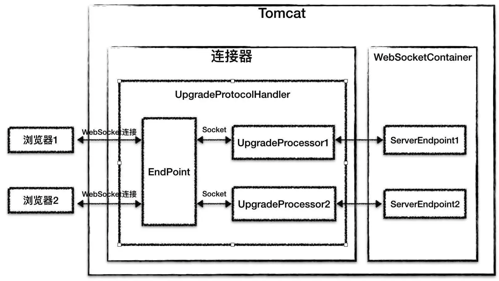

## Tomcat源码分析（四）

### WebSocket

Tomcat用ProtocolHandler组件屏蔽应用层协议的差异，其中ProtocolHandler中有两个关键组件：Endpoint和Processor。需要注意，这里的Endpoint跟上文提到的WebSocket中的Endpoint完全是两回事，连接器中的Endpoint组件用来处理I/O通信。WebSocket本质就是一个应用层协议，因此不能用HttpProcessor来处理WebSocket请求，而要用专门Processor来处理，而在Tomcat中这样的Processor叫作UpgradeProcessor。

为什么叫Upgrade Processor呢？这是因为Tomcat是将HTTP协议升级成WebSocket协议的，我们知道WebSocket是通过HTTP协议来进行握手的，因此当WebSocket的握手请求到来时，HttpProtocolHandler首先接收到这个请求，在处理这个HTTP请求时，Tomcat通过一个特殊的Filter判断该当前HTTP请求是否是一个WebSocket Upgrade请求（即包含`Upgrade: websocket`的HTTP头信息），如果是，则在HTTP响应里添加WebSocket相关的响应头信息，并进行协议升级。具体来说就是用UpgradeProtocolHandler替换当前的HttpProtocolHandler，相应的，把当前Socket的Processor替换成UpgradeProcessor，同时Tomcat会创建WebSocket Session实例和Endpoint实例，并跟当前的WebSocket连接一一对应起来。这个WebSocket连接不会立即关闭，并且在请求处理中，不再使用原有的HttpProcessor，而是用专门的UpgradeProcessor，UpgradeProcessor最终会调用相应的Endpoint实例来处理请求

Tomcat对WebSocket请求的处理没有经过Servlet容器，而是通过UpgradeProcessor组件直接把请求发到ServerEndpoint实例，并且Tomcat的WebSocket实现不需要关注具体I/O模型的细节，从而实现了与具体I/O方式的解耦