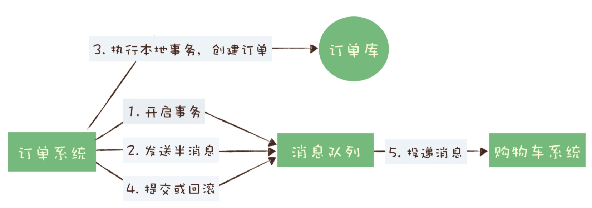
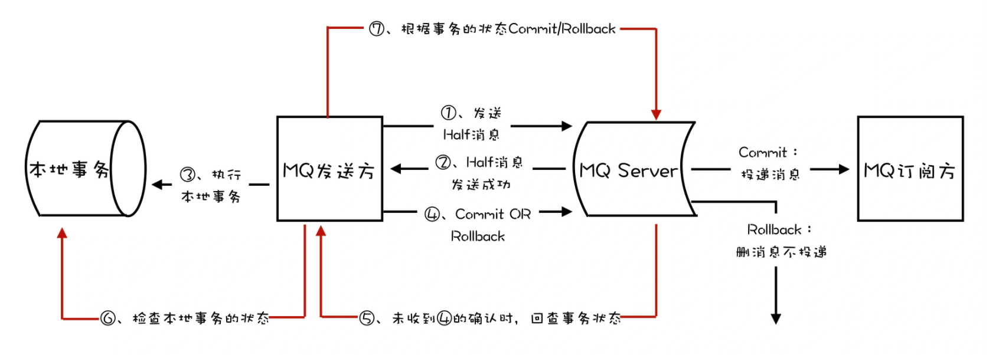
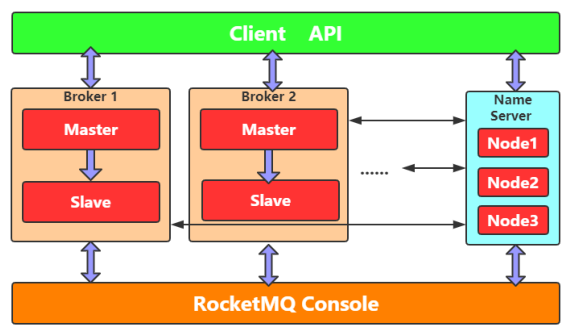
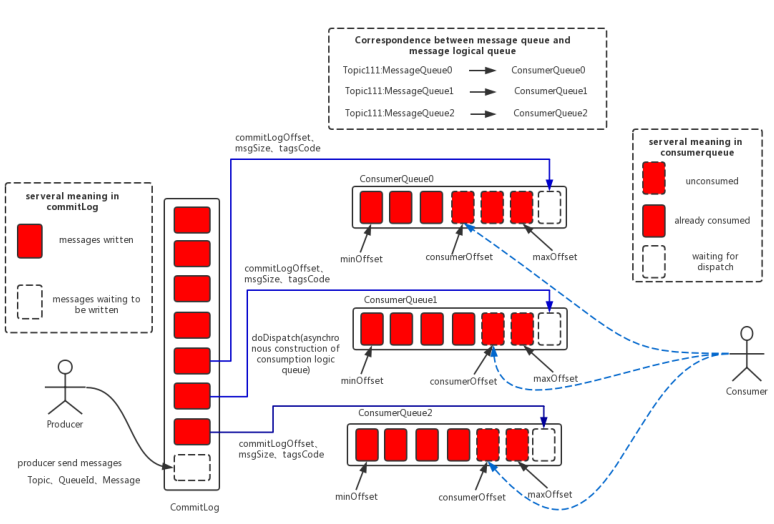
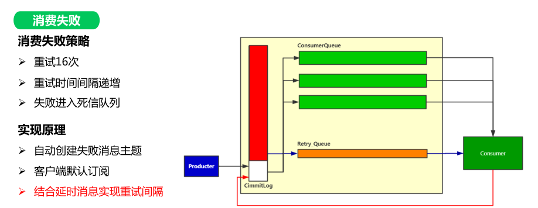

## Messaging System

### 对比

| System   | 性能                                 | **响应时延**                                                  | 缺点                |
| -------- | ---------------------------------- | --------------------------------------------------------- | ----------------- |
| RabbitMQ | 单个节点：依据硬件配置的不同，它大概每秒钟可以处理几万到十几万条消息 |                                                           | RabbitMQ对消息堆积支持不好 |
| RocketMQ | 单个节点：每秒钟大概能处理几十万条消息                | 毫秒级                                                       | 国产，在国际上还没有那么流行    |
| Kafka    | 单个节点：大约每秒钟可以处理几十万条消息               | **Kafka不太适合在线业务场景**：Kafka这种异步批量的设计带来的问题是，它的同步收发消息的响应时延比较高 |                   |
| Pulsar   |                                    | Pulsar采用存储和计算分离的设计                                        | 持续发展中             |

### 分布式事务 - 消息队列

异常处理：4.提交或回滚如果失败

- Kafka：直接抛异常，由业务方自行处理

- RocketMQ：提供事务反查机制
  
  - RocketMQ的Broker没有收到提交或者回滚的请求，Broker会定期去Producer上反查这个事务对应的本地事务的状态，然后根据反查结果决定提交或者回滚这个事务。
  
  - 为了支撑这个事务反查机制，我们的业务代码需要实现一个反查本地事务状态的接口，告知RocketMQ本地事务是成功还是失败。

### RocketMQ

##### 架构

- Broker主从部署，自身信息注册在NameServer中
- Client从NameServer中获取Broker信息
- NameServer节点相互独立，无数据交互

##### 消息存储

- CommitLog：存储消息主体（所有Topic公用的）
  - 顺序存储，随机读写（性能）
    - 文件切分，默认**1G**
    - MMap提升文件访问性能
    - SSD
- ConsumerQueue：消费消息队列（每个Topic创建多个队列）
  - 不存储时间消息内容，存储索引、文件大小、标签等信息
  - 由客户端负载到具体的队列
- IndexFile：消息索引文件

##### 消费失败

