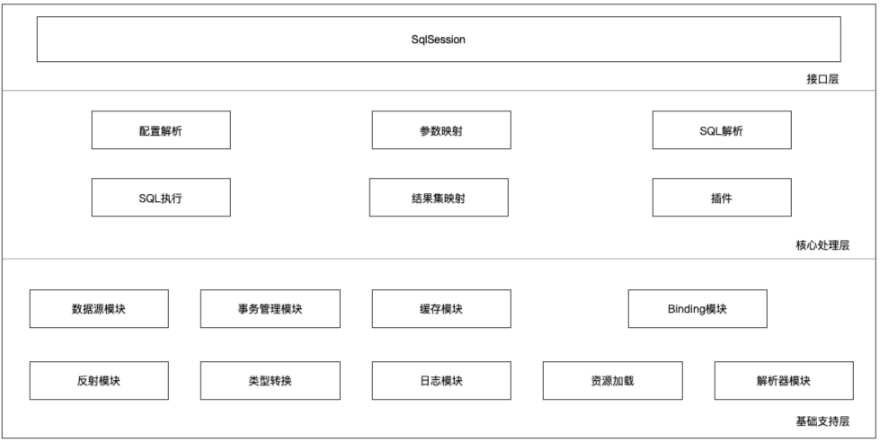
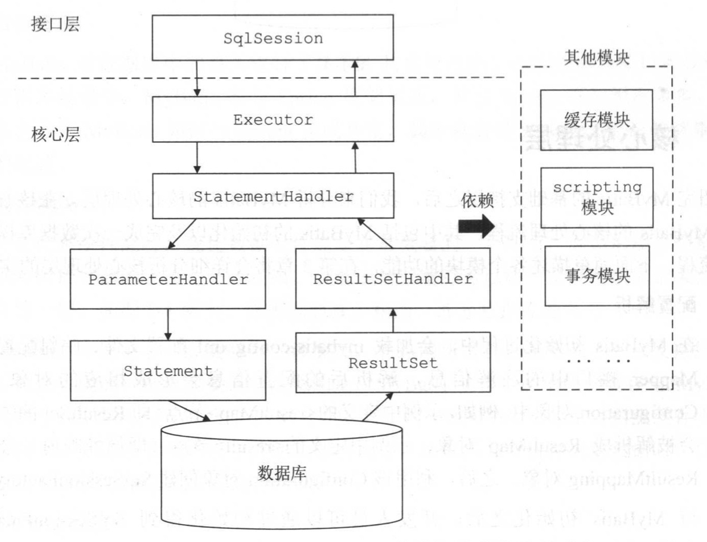

## MyBatis源码分析（一）

##### 传统JDBC方式：

> db_url -> driver -> connection -> statement ->执行sql -> resultset -> 手动转换为JavaBean


##### 注意：MyBatis版本3.5.x


##### 源码结构：

```shell
$ tree -L 1
.
├── annotations  注解
├── binding 将Mapper接口与映射配置文件关联，并自动为接口生成动态代理对象
├── builder 构造SQL或者Configuration的一些Builder：基于XML和Annotation
├── cache    缓存模块
├── cursor    游标特性模块
├── datasource  数据源模块
├── exceptions 异常模块
├── executor  执行器
├── io			资源加载工具
├── jdbc     JDBC工具
├── lang    Java语言版本定义
├── logging  日志模块
├── mapping  映射信息：ParameterMap，ResultMap，MappedStatement，SqlSoure，BoundSql
├── parsing  具体解析XPath的工具
├── plugin  插件
├── reflection  反射模块
├── scripting 解析动态SQL及占位符
├── session   对外接口&Configuration
├── transaction  事务
└── type    类型处理器
```


##### 三层架构：




##### XML方式解析：

- 加载XML文件 -> InputStream -> XPathParser

- 基于XPath解析 XML Node 

  - XMLMapperBuilder

    - mapper节点解析

    - parameterMap 节点解析

    - resultMap 节点解析

    - sql 节点解析

    - select|insert|update|delete 节点解析

      - XMLStatementBuilder.parseStatementNode() : 解析每个statementNode(select,insert,update,delete) 

        - XMLIncludeTransformer解析拼接字符串applyIncludes() ???

        - XMLScriptBuilder

          - 先解析动态SQL脚本节点

            - > trim      TrimHandler 
              >
              > where     WhereHandler
              >
              > set 、foreach  、if  、choose  、when  、otherwise 、bind     

          - 再解析SQL中的占位符 （#{xxx}）

            - > SqlSourceBuilder.parse()  -> ParameterMappingTokenHandler -> GenericTokenParse

- SQL执行

  - Executor
    - 维护一级、二级缓存；提供事务控制支持等
  - StatementHandler
    - Executor将数据库相关操作委托给StatementHandler
  - ParameterHandler
    - StatementHandler先通过ParameterHandler完成SQL语句的实参绑定
    - 之后StatementHandler调用java.sql.Statement对象执行SQL并得到返回结果集
  - ResultSetHandler
    - 最后ResultSetHandler完成结果集的映射


##### MyBatis执行一条语句的完整流程：



