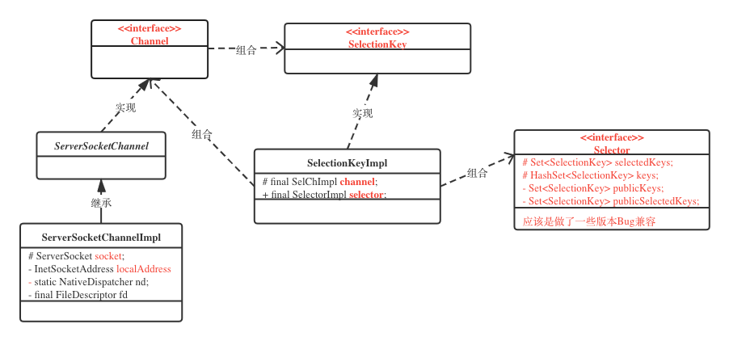

# NIO入门

---
## NIO核心类图




## 概念：
> * Channels和Buffers
    标准的IO基于字节流和字符流进行操作的，而NIO是基于通道（Channel）和缓冲区（Buffer）进行操作，数据总是从通道读取到缓冲区中，或者从缓冲区写入到通道中。
> * Non-blocking IO
    Java NIO可以让你非阻塞的使用IO，例如：当线程从通道读取数据到缓冲区时，线程还是可以进行其他事情。当数据被写入到缓冲区时，线程可以继续处理它。从缓冲区写入通道也类似。

## 一、Channel

最重要的通道的实现:

* FileChannel ： 从文件中读写数据。
* DatagramChannel ： 能通过UDP读写网络中的数据。
* SocketChannel : 能通过TCP读写网络中的数据。
* ServerSocketChannel : 可以监听新进来的TCP连接，像Web服务器那样。对每一个新进来的连接都会创建一个SocketChannel。

## 二、 Buffer

### 1. Buffer读写数据的步骤：

1. 读取数据到缓存
2. 缓存flip() : 切换缓存到读模式
3. 读取数据
4. 清空缓存clear() 或 compact()

注：
    clear() ： 清空整个缓冲区
    compact() : 清空已读， 未读记录全部移到缓冲区开始位置，新的缓冲数据将存放在其后面。
    
### 2. Buffer属性

区分读写模式（含义不同）：

> * capacity
    读/写：缓冲区容量
> * position
    写： 当前写的位置， 范围为 0 ~ (capacity-1)
    读： position被重置为0,随着读的index增加
> * limit
    写： 缓冲区最大容量 等于 capacity
    读： 将写模式下的position位置变成limit（即缓冲区实际数据大小）

### 3. Buffer类型
ByteBuffer
**MappedByteBuffer**
CharBuffer
DoubleBuffer
FloatBuffer
IntBuffer
LongBuffer
ShortBuffer

**Java NIO 还有个 MappedByteBuffer，用于表示内存映射文件**

### 4. simple use

> * 初始化capacity:
CharBuffer buf = CharBuffer.allocate(1024);
> * Channel写到Buffer的例子
int bytesRead = inChannel.read(buf); //read into buffer.
> * 通过put方法写Buffer的例子：
buf.put(127);
put方法有很多版本，允许你以不同的方式把数据写入到Buffer中。例如， 写到一个指定的位置，或者把一个字节数组写入到Buffer。 更多Buffer实现的细节参考JavaDoc。
> * Buffer读取数据到Channel的例子：
int bytesWritten = inChannel.write(buf);
> * 使用get()方法从Buffer中读取数据的例子
byte aByte = buf.get();
get方法有很多版本，允许你以不同的方式从Buffer中读取数据。例如，从指定position读取，或者从Buffer中读取数据到字节数组。更多Buffer实现的细节参考JavaDoc。

### 5. make() and reset()
> * make()方法，标记buffer中一个特定position，然后可用过reset()方法恢复到这个position

### 6 equals() and compareTo()
> * equals():
当满足下列条件，表示两个buffer相等：
 * 有相同的类型（byte、char、int）
 * buffer内元素个数相等（Buffer中剩余的byte、char等的个数相等）
 * buffer内元素值相等（Buffer中所有剩余的byte、char等都相同）

如你所见，equals只是比较Buffer的一部分，不是每一个在它里面的元素都比较。实际上，它只比较Buffer中的剩余元素。

> * compareTo(): 
比较两个Buffer的剩余元素(byte、char等)， 如果满足下列条件，则认为一个Buffer“小于”另一个Buffer：
 * 第一个不相等的元素小于另一个Buffer中对应的元素 。
 * 所有元素都相等，但第一个Buffer比另一个先耗尽(第一个Buffer的元素个数比另一个少)。

##三、Scatter and Gather
> * Scatter（分散）:
    指读channel时，将数据分散到多个buffer中。

```java
ByteBuffer header = ByteBuffer.allocate(128);
ByteBuffer body   = ByteBuffer.allocate(1024);
ByteBuffer[] bufferArray = { header, body };
channel.read(bufferArray);
// 注意buffer首先被插入到数组，然后再将数组作为channel.read() 的输入参数。read()方法按照buffer在数组中的顺序将从channel中读取的数据写入到buffer，当一个buffer被写满后，channel紧接着向另一个buffer中写。
// Scattering Reads在移动下一个buffer前，必须填满当前的buffer，这也意味着它不适用于动态消息(译者注：消息大小不固定)。换句话说，如果存在消息头和消息体，消息头必须完成填充（例如 128byte），Scattering Reads才能正常工作。
```

> * Gather（聚集）:
    指写channel时，将多个buffer中的数据写入同一个channel

```java
ByteBuffer header = ByteBuffer.allocate(128);
ByteBuffer body   = ByteBuffer.allocate(1024);
ByteBuffer[] bufferArray = { header, body };
channel.write(bufferArray);
// buffers数组是write()方法的入参，write()方法会按照buffer在数组中的顺序，将数据写入到channel，注意只有position和limit之间的数据才会被写入。因此，如果一个buffer的容量为128byte，但是仅仅包含58byte的数据，那么这58byte的数据将被写入到channel中。因此与Scattering Reads相反，Gathering Writes能较好的处理动态消息。
```

## 四、通道间数据传输
在Java NIO中，如果两个通道中有一个是FileChannel，那你可以直接将数据从一个channel传输到另外一个channel。

> * transferFrom()
> * transferTo()

```java
RandomAccessFile fromFile = new RandomAccessFile("fromFile.txt", "rw");
FileChannel      fromChannel = fromFile.getChannel();
RandomAccessFile toFile = new RandomAccessFile("toFile.txt", "rw");
FileChannel      toChannel = toFile.getChannel();
long position = 0;
long count = fromChannel.size();
// transferFrom()
toChannel.transferFrom(position, count, fromChannel);
// transferTo()
fromChannel.transferTo(position, count, toChannel);
// 此外要注意，在SoketChannel的实现中，SocketChannel只会传输此刻准备好的数据（可能不足count字节）。因此，SocketChannel可能不会将请求的所有数据(count个字节)全部传输到FileChannel中。

```

## 五、Selector
选择器，是Java NIO中能够检测一到多个NIO通道，并能知晓通道是否为诸如读写事件做好准备的组件。

用Selector可实现单个线程管理多个channel，从而管理多个网络连接。

- Selector的创建：
```java
Selector selector = Selector.open();
```
- 向Selector注册通道channel：
```java
// 通过 register() 方法实现
channel.configureBlocking(false);
SelectionKey key = channel.register(selector, SelectionKey.OP_READ);
```
**注：**
> * 与Selector一个使用时，channel必须处于非阻塞状态。
这意味着不能将FileChannel与Selector一起使用，因为FileChannel不能切换到非阻塞模式下，SocketChannel是可以的
> * register() 第二个参数是一个 “interest集合” , 表示通过Selector监听Channel时对什么事件感兴趣:(可选项)
**1.Connect(连接就绪) ： SelectionKey.OP_CONNECT
2.Accept(接收就绪) ： SelectionKey.OP_ACCEPT
3.Read(读就绪) ： SelectionKey.OP_READ
4.Write(写就绪) ： SelectionKey.OP_WRITE**
如果你对不止一种事件感兴趣，那么可以用“位或”操作符将常量连接起来，如下：
**int interestSet = SelectionKey.OP_READ | SelectionKey.OP_WRITE;**

- SelectionKey
register()方法返回一个SelectionKey对象，该对象包含一些你感兴趣的属性：
> * Interest 集合
> * Ready 集合
> * Channel
> * Selector
> * 附加的对象（可选）

1. Interest集合
  你所感兴趣的事件集合：
    ```java
  int interestSet = selectionKey.interestOps();
  // 位与 操作
  boolean isInterestedInAccept  = (interestSet & SelectionKey.OP_ACCEPT) == SelectionKey.OP_ACCEPT；
  ...
    ```
2. Ready集合
  通道已经准备就绪 的操作的集合：（一次Selection，首先访问这个集合）
    ```java
  int readySet = selectionKey.readyOps();
  // 检测Channel中什么事件或操作已经就绪，可以使用上面“位与”操作，也可以：
  selectionKey.isAcceptable();
  selectionKey.isConnectable();
  selectionKey.isReadable();
  selectionKey.isWritable();
    ```
3. Channel and Selector
    ```java
    Channel  channel  = selectionKey.channel();
    Selector selector = selectionKey.selector();
    ```
 4. 附加对象
   可以将一个对象或者更多信息附着在SelectionKey上，这样就能方便的识别某个给定通道，例如，可以附加 与通道一起使用的Buffer，或是包含聚集数据的某个对象。
    ```java
   // 使用方法如下：
   selectionKey.attach(theObject);
   Object attachedObj = selectionKey.attachment();
   // 还可以：
   SelectionKey key = channel.register(selector, SelectionKey.OP_READ, theObject);
    ```

- 通过Selector选择通道
一旦向Selector注册了一个或多个通道，就可以使用重载的 select()方法，返回 你所感兴趣的（事件） 已经准备就绪的那些通道：
```java
int select();           // 阻塞 到至少有一个通道在你注册的事件上就绪了
int select(long timeout);   // 最长阻塞 timeout 毫秒 
int selectNow()             // 非阻塞（立即返回，没有就返回 0 ）
```

**select(); 方法的返回值 表示就绪的通道数**
当 select() 方法返回一个或多个通道就绪了， 就可以调用 selector的 selectedKeys() 访问已选键集中就绪的通道：
```java
Set selectedKeys = selector.selectedKeys();
// 遍历访问就绪通道
Iterator keyIterator = selectedKeys.iterator();
while(keyIterator.hasNext()) {
    SelectionKey key = keyIterator.next();
    // SelectionKey.channel()方法返回的通道需要转型成你要处理的类型，如ServerSocketChannel或SocketChannel等。
    if(key.isAcceptable()) {
        // a connection was accepted by a ServerSocketChannel.
    } else if (key.isConnectable()) {
        // a connection was established with a remote server.
    } else if (key.isReadable()) {
        // a channel is ready for reading
    } else if (key.isWritable()) {
        // a channel is ready for writing
    }
    // 注意每次迭代末尾的keyIterator.remove()调用。Selector不会自己从已选择键集中移除SelectionKey实例。必须在处理完通道时自己移除。下次该通道变成就绪时，Selector会再次将其放入已选择键集中。
    keyIterator.remove()
}
```

wakeUp() ： 强制唤醒 阻塞的 select() 线程： **如果有其它线程调用了wakeup()方法，但当前没有线程阻塞在select()方法上，下个调用select()方法的线程会立即“醒来（wake up）”。 ---- ？？？？**

close() : 关闭该 selector ：**使注册到该Selector上的所有SelectionKey实例无效。通道本身并不会关闭**

```
// 完整例子
Selector selector = Selector.open();
channel.configureBlocking(false);
SelectionKey key = channel.register(selector, SelectionKey.OP_READ);
while(true) {
  int readyChannels = selector.select();
  if(readyChannels == 0) continue;
  Set selectedKeys = selector.selectedKeys();
  Iterator keyIterator = selectedKeys.iterator();
  while(keyIterator.hasNext()) {
    SelectionKey key = keyIterator.next();
    if(key.isAcceptable()) {
        // a connection was accepted by a ServerSocketChannel.
    } else if (key.isConnectable()) {
        // a connection was established with a remote server.
    } else if (key.isReadable()) {
        // a channel is ready for reading
    } else if (key.isWritable()) {
        // a channel is ready for writing
    }
    keyIterator.remove();
  }
}
```

## 六、FileChannel
连接到文件的通道 - 读写文件
**！！！无法设置为非阻塞的通道！！！**

- 打开
无法直接打开FileChannel通道，需要通过一个 Inputstream、Outputstream或者RandomAccessFile来获取：
```java
RandomAccessFile raf = new RandomeAccessFile("data/test.text", "rw");
FileChannel fileChannel = raf.getChannel();
```
- 读取
```java
ByteBuffer buf = ByteBuffer.allocate(48);
// int 表示多少个字节被读到buffer中， -1 表示文件末尾
int bytesRead = fileChannel.read(buf);
```
- 写
```java
String newData = "New String to write to file..." + System.currentTimeMillis();
ByteBuffer buf = ByteBuffer.allocate(48);
buf.clear();
buf.put(newData.getBytes());
buf.filp();
while(buf.hasRemaining()) {
    fileChannel.write(buf);
}
```
- 关闭 (用完FileChannel后，**必须**将其关闭) 
```java
fileChannel.close();
```

- FileChannel的position()方法：（指定从某个位置进行数据的读写操作）
也可以用 position(long pos) 设置FileChannel的位置。
```java
long currentPosition = fileChannel.position();
fileChannel.position(currentPosition + 123); // 如果超过文件位置，那么读取时为 -1 文件结束标志；
// 如果将位置设置在文件结束符之后，然后向通道中写数据，文件将撑大到当前位置并写入数据。这可能导致“文件空洞”，磁盘上物理文件中写入的数据间有空隙。
```
- FileChannel的size()方法：获取关联文件大小
```java
long fileSize = fileChannel.size();
```
- FileChannel的truncate() 方法：截取文件，将指定文件的指定长度的后面删除掉；
```java
fileChannel.truncate(1024); // 截取文件的前 1024个字节 
```
- FileChannel的force() 方法：将通道里尚未写入磁盘的数据强制写到磁盘。
出于性能考虑，操作系统会将数据缓冲在内存中，所以无法保证写入FileChannel的数据一定会及时写入磁盘。要保证这点，需使用 force()方法。
force(boolean isMatadata)  参数表示是否将文件元数据（权限等）写入磁盘。
```java
fileChannel.force(true);
```

## 七、SocketChannel
连接到TCP网络套接字的通道；

- 打开
```java
SocketChannel socketChannel = SocketChannel.open();
socketChannel.connect(new InetSocketAddress("http://jenkov.com", 80));
```
- 读取
```java
ByteBuffer buf = ByteBuffer.allocate(48);
int bytesRead = socketChannel.read(buf);
```

- 写
```java
String newData = "New String to write to file..." + System.currentTimeMillis();
ByteBuffer buf = ByteBuffer.allocate(48);
buf.clear();
buf.put(newData.getBytes());
buf.flip();
while(buf.hasRemaining()) {
    socketChannel.write(buf);
}
```

- 关闭 (用完需要关闭SocketChannel)
```java
socketChannel.close();
```

- 非阻塞模式
可设置 SocketChannel为非阻塞模式（non-blocking mode）,设置后，可在异步模式下调用 connect()、read()、write();

 - connect(): 确保连接以建立：
    ```java 
    socketChannel.configureBlocking(false);
    socketChannel.connect(new InetSocketAddress("http://jenkov.com", 80)); // 未等连接完成就已经返回
    while(!sockectChannel.finishConnect()) {
        // do wait or do something else 
    }
    ```
 - write(): 尚未真正写入，该方法就已经返回，所以需要利用循环while，如前面；
 - read(): 非阻塞模式下,read()方法在尚未读取到任何数据时可能就返回了。所以需要关注它的int返回值，它会告诉你读取了多少字节。(关注 -1 节点)

 - 非阻塞模式搭配选择器使用：非阻塞模式与选择器搭配会工作的更好，通过将一或多个SocketChannel注册到Selector，可以询问选择器哪个通道已经准备好了读取，写入等。

## 八、ServerSocketChannel
以监听新进来的TCP连接的通道, 就像标准IO中的ServerSocket一样。

- 例子
```java
// 打开
ServerSocketChannel serverSocketChannel = ServerSocketChannel.open();
// 绑定Socket端口
serverSocketChannel.socket().bind(new InetSocketAddress(9999));
// 监听连接 - 阻塞监听
while(true) {
    SocketChannel socketChannel = serverSocketChannel.accept();
    // do something with this SocketChannel.
}
// 关闭
serverSocketChannel.close();
```

- 非阻塞模式
非阻塞模式下， accept() 方法会立刻返回，如果没有新的连接进来，返回值是null
```java
ServerSocketChannel serverSocketChannel = ServerSocketChannel.open();
serverSocketChannel.socket().bind(new InetSocketAddress(9999));
serverSocketChannel.configureBlocking(false);
while(true) {
    SocketChannel socketChannel = serverSocketChannel.accept();
    if(socketChannel != null) {
        // do something with this SocketChannel.
    }
}
serverSocketChannel.close();
```

## 九、DatagramChannel
能收发UDP包的通道。因为UDP是无连接的网络协议，所以不能像其它通道那样读取和写入。它发送和接收的是数据包。

- 例子
```java
// 打开
DatagramChannel datagramChannel = DatagramChannel.open();
// 绑定UDP端口
datagramChannel.socket().bind(new InetSocketAddress(9999));
// 接收数据 receive()
ByteBuffer buf = ByteBuffer.allocate(48);
buf.clear();
datagramChannel.receive(buf);
```

Importance:
> * receive() 方法将接收到的内容复制到Buffer中，如果Buffer容不下，多出部分数据则丢弃！！！

- 发送数据
```java
String newData = "New String to write to file..." + System.currentTimeMillis();
ByteBuffer buf = ByteBuffer.allocate(48);
buf.clear();
buf.put(newData.getBytes());
buf.flip();
int bytesSent = datagramChannel.send(buf, new InetSocketAddress("jenkov.com", 80));
```

- 连接到特定的地址
  可以将DatagramChannel“连接”到网络中的特定地址的。由于UDP是无连接的，连接到特定地址并不会像TCP通道那样创建一个真正的连接。而是锁住DatagramChannel ，让其只能从特定地址收发数据。

    ```java
  // 注意这里的 uri 并非 基于 TCP协议的HTTP
  datagramChannel.connect(new InetSocketAddress("jenkov.com", 80));
    ```
  当连接后，也可以使用read()和write()方法，就像在用传统的通道一样。只是在数据传送方面没有任何保证。
    ```java
  int bytesRead = datagramChannel.read(buf);
  int bytesWritten = datagramChannel.write(buf);
    ```

 ## 十、Pipe 管道
 Java NIO 是两个线程之间的**单向数据连接**。
 Pipe有一个Sink通道和一个Source通道，数据会被写到 Sink通道， 从Source通道读取。
 

- 例子
```java
// 打开
Pipe pipe = Pipe.open();
// 获取写通道
Pipe.SinkChannel sinkChannel = pipe.sink();
// 写数据
String newData = "New String to write to file..." + System.currentTimeMillis();
ByteBuffer buf = ByteBuffer.allocate(48);
buf.clear();
buf.put(newData.getBytes());
buf.flip();
while(buf.hasRemaining()) {
    sinkChannel.write(buf);
}

// 获取读通道
Pipe.SourceChannel sourceChannel = pipe.source();
ByteBuffer buf = ByteBuffer.allocate(48);
int bytesRead = sourceChannel.read(buf);
```

## 十一、Path|Files|AsynchronousFileChannel 
JDK1.7后NIO增加对文件操作的API，主要包含以下两方面：

 1. 新增Path接口，Paths工具类，Files工具类。 这些接口和工具类对NIO中的功能进行了高度封装，大大简化了文件系统的IO编程。
 2. 基于异步Channel的IO,新增了多个Aysnchronous开头的channel接口和类。

### 1. Path接口
表示一个与平台无关的路径。

 - getRoot()  Path对象的根路径
 - toAbsolutePath() Path对象的绝对路径
 - getNameCount() Path对象里包含的路径数量

###2. Paths工具类
Paths工具类包含了两个返回Path对象的静态方法。

 - static Path get(URI uri) 直接通过路径返回Path对象
 - static Path get(String first, String...more)通过给出的String字符串组装成一个Path对象

###2. Files工具类
常用方法:

 - copy(...) 拷贝文件，有3个重载方法，通常需要跟Path结合使用
 - 操作文件
    - createDirectory(...) 创建目录
    - createFile(...) 创建文件
    - delete(Path path) 删除文件
 - 判断属性
    - isHidden(Path path)
    - isReadable(Path path)
    - isDirectory(...)
 - 读写文件
    - lines(Path path) 使用默认编码读文件所有行进数组
    - readAlllines(path ,cs) 使用指定编码读所有行到数组
    - write(...) 写文件，可以批量将数组中的数据写入文件，也可以指定编码
    - walkFileTree() 遍历路径