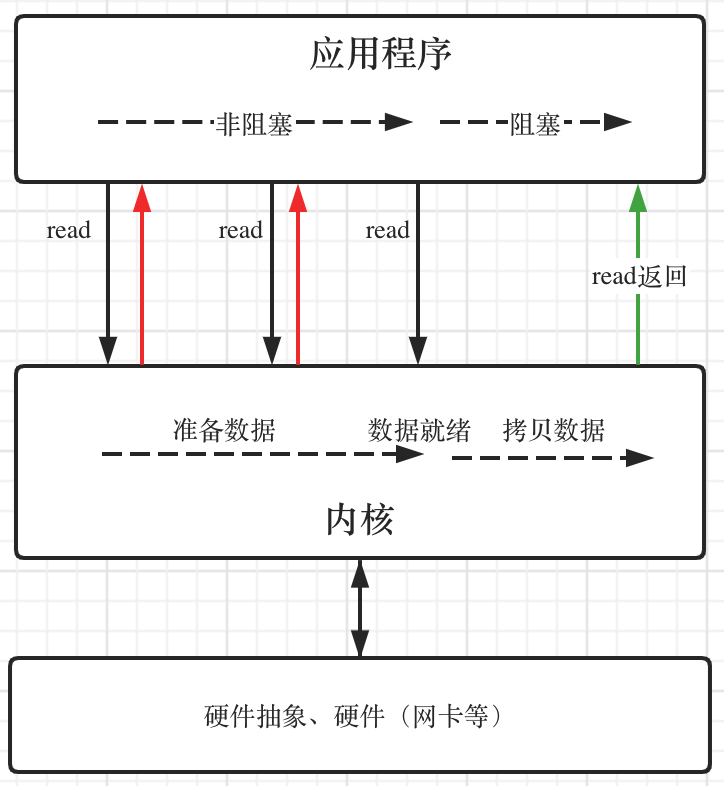
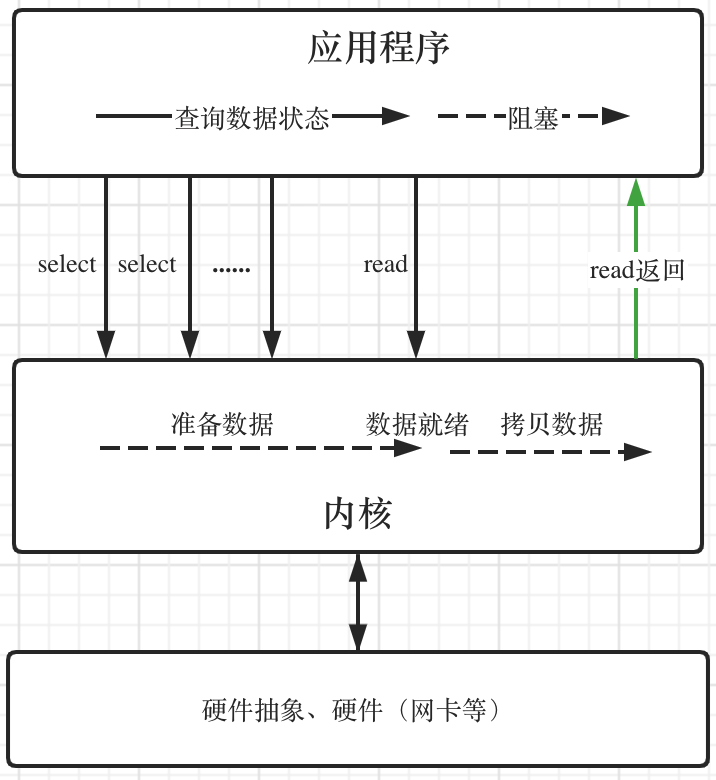
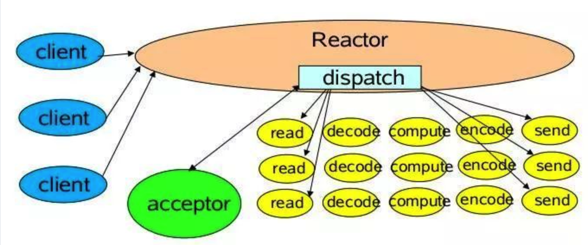
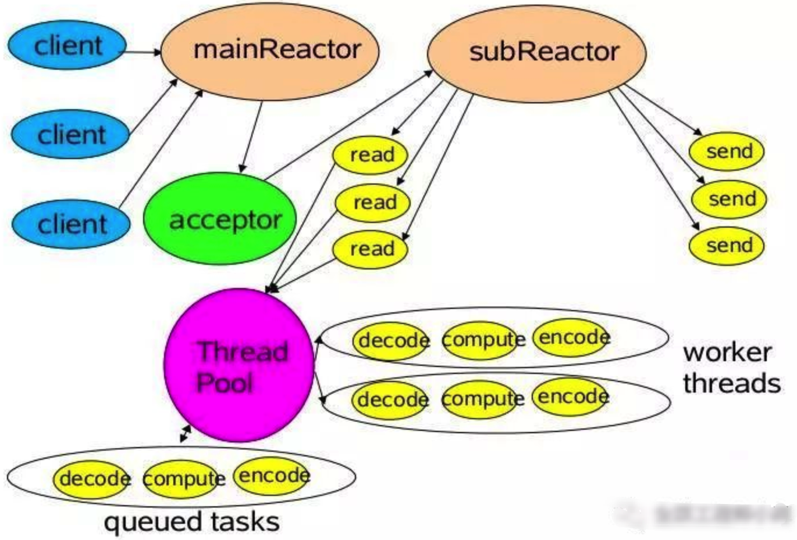
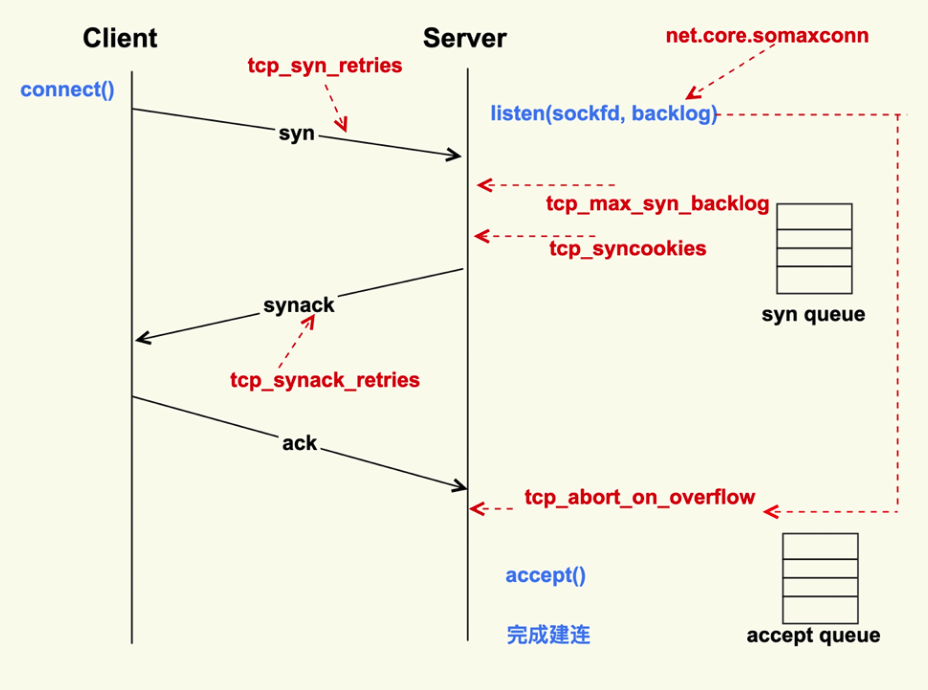

## 高性能网络

### 操作系统架构


HAL层：硬件抽象层


### 线程


### I/O模型

对于一个网络I/O通信过程，比如网络数据读取，会涉及两个对象，一个是调用这个I/O操作的用户线程，另外一个就是操作系统内核。一个进程的地址空间分为用户空间和内核空间，用户线程不能直接访问内核空间

当用户线程发起I/O操作后，网络数据读取操作会经历两个步骤：

- **用户线程等待内核将数据从网卡拷贝到内核空间**
- **内核将数据从内核空间拷贝到用户空间**

各种I/O模型的区别就是：它们实现这两个步骤的方式是不一样的

##### 同步阻塞I/O

用户线程发起read调用后就阻塞了，让出CPU。内核等待网卡数据到来，把数据从网卡拷贝到内核空间，接着把数据拷贝到用户空间，再把用户线程叫醒


##### 同步非阻塞I/O

用户线程不断的发起read调用，数据没到内核空间时，每次都返回失败，直到数据到了内核空间，这一次read调用后，在等待数据从内核空间拷贝到用户空间这段时间里，线程还是阻塞的，等数据到了用户空间再把线程叫醒




##### I/O多路复用

用户线程的读取操作分成两步了，线程先发起select调用，目的是问内核数据准备好了吗？等内核把数据准备好了，用户线程再发起read调用。在等待数据从内核空间拷贝到用户空间这段时间里，线程还是阻塞的。那为什么叫I/O多路复用呢？**因为一次select调用可以向内核查多个数据通道（Channel）的状态**，所以叫多路复用。



- select
  - **一次只能监听1024个文件描述符**
- poll
  - 一次允许监听超过1024个文件描述符
  - **需要遍历每个文件描述符，检测该文件描述符是否就绪，然后再进行处理**
- epoll
  - epoll对象中包含两个数据结构
    - 记录需要监听的文件描述符
    - 已经就绪的文件描述符
  - 可避免遍历查询哪些文件描述符已经就绪


##### 异步I/O

用户线程发起read调用的同时**注册一个回调函数**，read立即返回，等内核将数据准备好后，再调用指定的回调函数完成处理。在这个过程中，用户线程一直没有阻塞


### Reactor模型和Proactor模型

在高性能的I/O设计中，有两个著名的模型：Reactor模型和Proactor模型，其中**Reactor模型用于同步I/O**，而**Proactor模型运用于异步I/O操作**。

无论是Reactor模型还是Proactor模型，对于支持多连接的服务器，一般可以总结为2种fd和3种事件


##### 2种fd

1. listenfd：一般情况，只有一个。用来监听一个特定的端口(如80)。
2. connfd：每个连接都有一个connfd。用来收发数据。

##### 3种事件

1. listenfd进行accept阻塞监听，创建一个connfd
2. 用户态/内核态copy数据。每个connfd对应着2个应用缓冲区：readbuf和writebuf。
3. 处理connfd发来的数据。业务逻辑处理，准备response到writebuf。


### Reactor模型（I/O多路复用）

无论是C++还是Java编写的网络框架，大多数都是基于Reactor模型进行设计和开发，Reactor模型基于事件驱动，特别适合处理海量的I/O事件。

Reactor模型中定义的三种角色：

- **Reactor**：负责监听和分配事件，将I/O事件分派给对应的Handler。新的事件包含连接建立就绪、读就绪、写就绪等。
- **Acceptor**：处理客户端新连接，并分派请求到处理器链中。
- **Handler**：将自身与事件绑定，执行非阻塞读/写任务，完成channel的读入，完成处理业务逻辑后，负责将结果写出channel。可用资源池来管理。


##### 1.单Reactor单线程模型



##### 2.单Reactor多线程模型


##### 3.主从Reactor多线程模型




### Proactor模型（异步I/O）


### TCP（[写的非常好的文章](https://www.cnblogs.com/xiaolincoding/p/12995358.html)）

TCP 协议栈内核通常会为每一个LISTEN状态的Socket维护两个队列：

SYN队列（半连接队列）：这些连接已经接到客户端SYN；
ACCEPT队列（全连接队列）：这些连接已经接到客户端的ACK，完成了三次握手，等待被accept系统调用取走。

##### TCP连接过程



- **net.ipv4.tcp_syn_retries** = 2：默认值 6，syn失败重试次数
  - syn失败后，客户端会重试6次，（1+2+4+8+16+32+64）秒后产生ETIMEOUT错误
  - **对应网络质量比较好的内部服务，可调小该值，以减少异常Server导致的业务阻塞**
- **net.ipv4.tcp_max_syn_backlog** = 16384： 半连接队列的长度
  - 队列中半连接数量超过 配置项，则新的半连接就会被丢弃
  - 低版本内核可能不只是这个参数控制，同时需要修改内核参数somaxconn，或者Nginx的backlog参数
  - 全连接队列(accept queue)的长度是由 listen(sockfd, backlog) 这个函数里的 backlog 控制的，而该 backlog 的最大值则是 somaxconn。somaxconn 在 5.4 之前的内核中， 默认都是 128(5.4 开始调整为了默认 4096)，建议将该值适当调大一些:
    - **net.core.somaxconn = 16384**
- **net.ipv4.tcp_synack_retries** = 2：重传SYNACK包
- **net.ipv4.tcp_syncookies** = 1：缓解 TCP SYN Flood 攻击
  - 开启后，SYN 半连接队列已满，在 Server 收到 SYN 包时，不去分配资源来保存 Client 的信息，而是根据这个 SYN 包计 算出一个 Cookie 值，然后将 Cookie 记录到 SYNACK 包中发送出去。对于正常的连接， 该 Cookies 值会随着 Client 的 ACK 报文被带回来。然后 Server 再根据这个 Cookie 检查 这个 ACK 包的合法性，如果合法，才去创建新的 TCP 连接。通过这种处理，SYN Cookies 可以防止部分 SYN Flood 攻击
  - syncookies 参数主要有以下三个值：
    - 0 值，表示关闭该功能；
    - 1 值，表示仅当 SYN 半连接队列放不下时，再启用它；  - **设置为1即可**
    - 2 值，表示无条件开启功能；
  - 其他防御SYN攻击的方法：
    - 增大半连接队列；
    - 减少 SYN+ACK 重传次数
      - 减少重传之后，可加快断开无效连接
- TCP RESET：
  - Server 在将新连接 丢弃时，有的时候需要发送 **reset** 来通知 Client，这样 Client 就不会再次重试了
  - 默认行为是直接丢弃不去通知 Client。
  - 至于是否需要给 Client 发送 reset，是由 tcp_abort_on_overflow 这个配置项来控制的，该值默认为 0，即不发送 reset 给 Client。推荐也是将该值配置为 0，给客户端重试的机会
    - net.ipv4.tcp_abort_on_overflow = 0


### Keepalive

TCP层Keepalive；类似于心跳检测（应用层Keepalive），当对方出现无法应答的情况时，会就行Keepalive询问，如果对方在无法应答Keepalive的询问，则认为检测不通过，关闭/回收连接资源

##### 如何设计：

- 出现问题的概率小，所以没有必要频繁发起Keepalive询问
- 判断无法应答时需谨慎，不能武断，存在多次无法应答时，再判死刑

##### 核心参数：

```shell
# sysctl -a|grep tcp_keepalive
net.ipv4.tcp_keepalive_time=7200
net.ipv4.tcp_keepalive_intvl=75
net.ipv4.tcp_keepalive_probes=9

# 当启用（默认关闭）keepalive时，TCP在连接没有数据通过的7200秒后发送 keepalive 消息，当探测没有应答，按75秒的重试频率重发，一直发9个探测包都没有应答，则连接失败
```

##### 为何还需要应用层Keepalive

- 协议分层，各层关注点不同，分层思想，设计替换可扩展
- TCP层的Keepalive默认关闭
- TCP层Keepalive时间长，默认2小时，虽然可修改，但配置属于操作系统层配置，改动会影响所有应用

##### HTTP的Keep-Alive

概念不能混：HTTP Keep-Alive 指的是 **对 长连接 与 短连接 的选择**

- Connection:Keep-Alive 长连接
- Connection：Close 短连接

##### Idle检测

配合Keepalive，以减少Keepalive消息

Keepalive设计：

- V1：定时Keepalive消息
- V2：空闲监测 + 判断为Idle时，才发Keepalive

