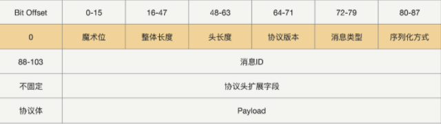

## RPC协议设计

- 协议头
  - 协议长度、序列化方式、协议标识、消息ID、链路ID、消息类型等
  - 支持可扩展的协议头
- 协议体
  - 请求接口方法名、参数值、扩展属性等

- 序列化协议选择
  - 效率、性能、体积、**通用性和兼容性（重要）**
  - 安全性（安全漏洞）

- 代理
  - Byte Buddy

- 插件架构
  - 面向接口契约
- 注册中心
  - AP
- 健康检测
  - 心跳检测（服务存活情况）+业务可用率（服务质量情况）
- 路由策略
  - 变更服务，降低发生故障的概率
    - 灰度发布
    - 路由策略实现流量隔离
- 负载均衡
  - 自适应负载均衡器
    - 打分器：根据指标收集器收集的指标，计算综合打分
    - 指标收集器：状态（CPU核数、CPU负载、内存），请求耗时（平均耗时、TP99，TP999）
    - 权重计算器：根据指标收集器收集的指标，设置指标权重
    - 随机权重策略：根据权重+分数，计算综合权重。最后根据随机权重策略，选择服务节点
- 异常重试
  - 重试策略
    - 重试计数
    - 指定需要重试的异常（可配置通用的 + 服务特定的业务异常重试策略）
  - 重试导致超时时间失效
    - 重试前先检测超时时间，如果超时了，则抛异常，如果未超时，则重置重试时间，再发起重试
  - 开启重试需对业务做幂等
  - 去除异常节点，再次负载均衡，选择目标节点
- 优雅关闭
  - 注册关闭钩子（ShutdownHook）
    - 开启服务关闭标识，用于拒绝新请求
    - 通知服务下线
    - 等待正在处理的请求结束（请求计数器为0）
    - 释放资源
- 优雅启动
  - 启动预热
  - 延迟暴露
- 熔断限流
  - 熔断
    - 服务调用者自我保护
    - RPC熔断判断逻辑应该在整个链路靠前的位置
  - 限流
    - 服务提供者自我保护
    - 配置中心限流配置：限流量+服务节点数，由每个服务节点自己计算其限流阈值（避免扩容）
- 业务分组（隔离流量）
  - 服务提供方支持分组，主要由注册中心进行区分，服务调用方请求时，同样需要带上所调分组信息