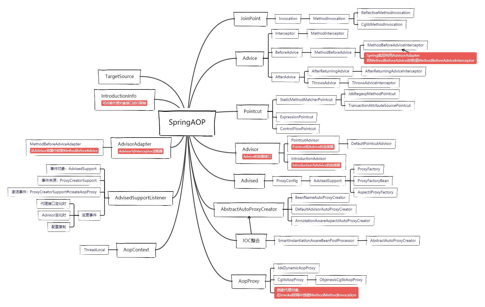

## SpringAop源码分析（二）

##### 问题：为什么Spring不需要实现 Around Advice

线索：

- AspectJ@Around与org.aspectj..lang.ProceedingJoinPoint配合执行被代理方法
- ProceedingJoinPointi#proceed()方法类似于Java Method:#invoke(Object.,Object)
- Spring AOP底层API ProxyFactory可通过addAdvice方法与Advice实现关联
- 接口Advice是Interceptor的父亲接口，而接口Methodlnterceptor又扩展了Interceptor
- MethodInterceptor的invoke方法参数MethodInvocation与ProceedingJoinPoint类似

##### 控制 Advice执行顺序

- 可使用 Ordered 控制 Advice的执行顺序

##### 自动动态代理

- org.springframework.aop.framework.autoproxy.BeanNameAutoProxyCreator
- org.springframework.aop.framework.autoproxy.DefaultAdvisorAutoProxyCreator
- **org.springframework.aop.aspectj.annotation.AnnotationAwareAspectJAutoProxyCreator**

##### TargetSource

Spring用于跟踪保持目标源的类

- org.springframework.aop.target.HotSwappableTargetSource
- org.springframework.aop.target.AbstractPoolingTargetSource
- org.springframework.aop.target.PrototypeTargetSource
- org.springframework.aop.target.ThreadLocalTargetSource
- org.springframework.aop.target.SingletonTargetSource
- org.springframework.aop.target.LazyInitTargetSource

##### Joinpoint

Interceptor 执行上下文： Invocation

- MethodInvocation : 方法级别
- *ConstructorInvocation：构造器级别* - Spring未支持，AspectJ支持

MethodInvocation实现

- ProxyMethodInvocation -> ReflectiveMethodInvocation
- ProxyMethodInvocation -> ReflectiveMethodInvocation -> CglibMethodInvocation

##### Advisor

Advice的容器接口

##### PointcutAdvisor

Pointcut和Advice的连接器

##### IntroductionAdvisor

Introduction与Advice的连接器

##### AdvisorAdapter

Advisor与Interceptor适配器

- MethodBeforeAdviceAdapter
- AfterReturningAdviceAdapter
- ThrowsAdviceAdapter

##### AdvisedSupport 事件监听

org.springframework.aop.framework.AdvisedSupportListener

事件对象：AdvisedSupport

事件来源：ProxyCreatorSupport

激活事件：ProxyCreatorSupport#createAopProxy

变更事件：

- 代理接口变化时
- Advisor变化时
- 配置复制

##### AopUtils

代表方法：

- isAopProxy - 判断对象是否为代理对象
- isJdkDynamicProxy - 判断对象是否为JDK动态代理对象
- isCglibProxy - 判断对象是否为CGLIB代理对象
- getTargetSource - 从对象中获取目标类型
- invokeJoinpointUsingReflection - 使用Java反射调用Joinpoint（目标方法）

##### 核心

> Spring IOC整合

- Spring内部流程：用户通过添加 Advice + Pointcut 方式；
  - SmartInstantiationAwareBeanPostProcessor -> AbstractAutoProxyCreator
  - Spring利用IOC依赖查找方式获取所有注册的 Advisor (Advice + Pointcut)
  - postProcessBeforeInstantiation：
    - 如果是定制的 CustomTargetSource 则会在实例化阶段就进行代理拦截 
      - 注意：这样会打断Spring的InstantiationAwareBeanPostProcessor生命周期 - AbstractAutowireCapableBeanFactory#applyBeanPostProcessorsBeforeInstantiation
  - postProcessAfterInitialization：
    - 非定制 CustomTargetSource  情况下，会触发SpringIOC查找Advisor
      - getAdvicesAndAdvisorsForBean
      - 进而创建代理对象
- Spring BeanPostProcessor定制流程：用户通过实现 AbstractBeanFactoryAwareAdvisingPostProcessor 进行定制的 advisor 添加
  - 这部分添加的 advisor 与 Spring内部方式的 独立开来的
  - 可参考本项目自定义实现的：**@EnableRpcLogV2** 来熟悉定制方案
    - **RpcLogAnnotationBeanPostProcessor**

