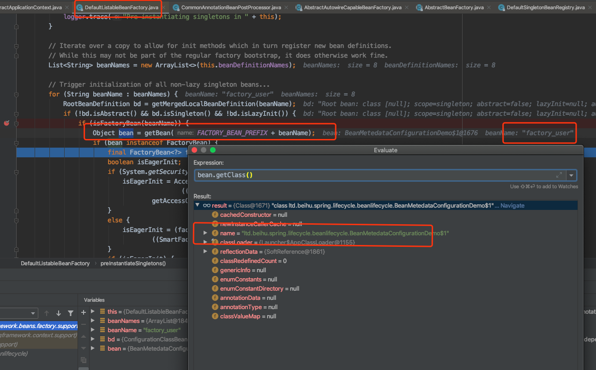

## Spring源码分析（八）

> Spring Bean 生命周期


- Spring Bean元信息配置阶段

  - XML: XmlBeanDefinitionReader
  - Properties：PropertiesBeanDefinitionReader
  - Groovy

  

- Spring Bean元信息解析阶段
  - 面向资源的BeanDefinition解析
    - BeanDefinitionReader
      - 指定资源进行读取解析
      - XML解析器 - BeanDefinitionParser
  - 面向注解的BeanDefinition解析
    - AnnotationBeanDefinitionReader
      - 指定包或者class文件进行解析
  - API方式


- Spring Bean注册阶段

  - BeanDefinitionRegistry

    - DefaultListableBeanFactroy

    ```java
    /** 
     * Map of bean definition objects, keyed by bean name.  
     * BeanName->BeanDefinition映射
     */
    private final Map<String, BeanDefinition> beanDefinitionMap = new ConcurrentHashMap<>(256);
    
    /** List of bean definition names, in registration order.  保证顺序 */
    private volatile List<String> beanDefinitionNames = new ArrayList<>(256);
    
    public void registerBeanDefinition(String beanName, BeanDefinition beanDefinition)
    ```

    


- Spring BeanDefinition合并阶段
  - 父子BeanDefinition合并
    - 当前BeanFactory查找
    - 层次BeanFactory查找
  - RootBeanDefinition不需要合并
    - 不允许设置parent
  - GenericBeanDefinition：默认一开始所有构建的BeanDefinition都是GenericBeanDefinition，在合并时会逐步递归，最终变成RootBeanDefinition；注意这个Merge的过程是不会改变原有BeanDefinition的，只会copy一份过来，重写当前被merge的BeanDefinition 


- Spring Bean Class 加载阶段

  - ClassLoader类加载：利用Java基础的ClassLoader进行加载

  - Java Security 安全控制

  - ConfigurableBeanFactory 临时 ClassLoader

  - BeanDefinition

    - getBeanClassName()
    - getParentName()
    - getFactoryBeanName()
    - getFactoryMethodName()

  - getBean()

    - 先去单例对象注册中心查找：（这类Bean是无Spring的生命周期的）找到直接返回

    - 没有找到会调用singletonFactory.getObject(): 会调用createBean(beanName, mbd, args)

    - 在子类：AbstractAutowireCapableBeanFactory中实现了createBean

    - resolveBeanClass(mbd, beanName)：获取Class对象

    - hasBeanClass(): 判断当前的BeanDefinition是否已经存在Class对象了

    - ```java
      @Nullable
      private volatile Object beanClass;  // 在AbstractBeanDefinition中定义为Object
      ```

    - 一开始这个值是一个String类型：所有为 false

    - ```java
      /**
       * Return whether this definition specifies a bean class.
       * @see #getBeanClass()
       * @see #setBeanClass(Class)
       * @see #resolveBeanClass(ClassLoader)
       */
      public boolean hasBeanClass() {
         return (this.beanClass instanceof Class);
      }
      ```

    - false后，触发Class构建 ：doResolveBeanClass(mbd, typeMatch)：

      - typeMatch为空无所谓，有值的话是指定类型去构建Class

    - doResolveBeanClass() 中会获取 ClassLoader 和 dynamicClassLoader（临时ClassLoader）

      - 边角：BeanClassLoaderAware 可获取ClassLoader

    - mdb.resolveBeanClass(beanClassLoader)： AbstractBeanDefinition中处理Class的加载

    - 将之前的String类型的 beanClass 直接替换为 Class对象


- Spring Bean 实例化前阶段

  - InstantiationAwareBeanPostProcessor#postProcessBeforeInstantiation()
  - 会打破Spring的注册
  - 调用链路： getBean#createBean#resolveBeforeInstantiation

  

- Spring Bean 实例化阶段

  - 传统实例化策略：InstantiationStrategy

    - AbstractAutowireCapableBeanFactory#doCreateBean#createBeanInstance#instantiateBean

    - 使用无参构造器进行实例化

    - 默认使用CglibSubclassingInstantiationStrategy策略进行Bean实例的创建

      - ```
        <p>Uses CGLIB to generate subclasses dynamically if methods need to be overridden by the container to implement <em>Method Injection</em>.
        只有在方法需要被重写的时候，才会使用CGLIB进行子类动态生成
        ```

  - 构造器注入是按照类型进行注入的：resolveDependency

    - ·按照类型进行注入
    - BeanDefinition#ConstructorArgumentValues


- Spring Bean 实例化后阶段
  - Bean属性**赋值**（Populate）判断
  - InstantiationAwareBeanPostProcessor#postProcessAfterInstantiation()
    - 返回True表示需要属性被赋值
  - 调用链路：getBean#doGetBean#createBean#doCreateBean#populateBean
    - populateBean里面会判断是否有InstantiationAwareBeanPostProcessor
      - false时直接return
      - 全部为true时：
        - PropertyValues：mbd.getPropertyValues()


- Spring Bean 属性赋值前阶段
  - Bean属性值元信息：PropertyValues （MutablePropertyValues）集合对象
  - Bean属性赋值前回调（**属性值也是可以修改的**）
    - Spring 1.2-5.0 : InstantiationAwareBeanPostProcessor#postProcessPropertyValues
    - Spring 5.1 ：InstantiationAwareBeanPostProcessor#postProcessProperties
  - populateBean#applyPropertyValues(beanName, mbd, bw, pvs)
    - 将PropertyValues赋值到BeanWrapper上
      - bw.setPropertyValues(mpvs);
      - 类型转换


- Spring Bean Aware接口回调阶段（按顺序）

  - getBean#doGetBean#createBean#doCreateBean#initializeBean#invokeAwareMethods
    - BeanNameAware
    - BeanClassLoaderAware
    - BeanFactoryAware

  - ApplicationContext中包含的生命（AbstractApplicationContext#refresh#prepareBeanFactory）
    - beanFactory.addBeanPostProcessor(new ApplicationContextAwareProcessor(this))
    - 是一个：BeanPostProcessor#postProcessBeforeInitialization
    - 同样在initializeBean的invokeAwareMethods的后面被递归调用
      - EnvironmentAware
      - EmbeddedValueResolverAware
      - ResouceLoaderAware
      - ApplicationEventPublisherAware
      - MessageSourceAware
      - ApplicationContextAware


- Spring Bean 初始化前阶段

  - BeanPostProcesso#postProcessBeforeInitialization
  - getBean#doGetBean#createBean#doCreateBean#initializeBean#applyBeanPostProcessorsBeforeInitialization

- Spring Bean 初始化阶段

  - invokeInitMethods：调用实现InitializingBean接口的afterPropertiesSet()方法
  - mbd.getInitMethodName()：执行 自定义的 初始化方法
  - 问题：如果是走的ApplicationContext，那么 @PostConstruct 会最先执行初始化
    - 原因：CommonAnnotationBeanPostProcessor 生命周期回调时会处理标注对应注解的类的方法
      - setInitAnnotationType(PostConstruct.class);
      - 具体实现在CommonAnnotationBeanPostProcessor的父类InitDestroyAnnotationBeanPostProcessor中

- Spring Bean 初始化后阶段

  - getBean#doGetBean#createBean#doCreateBean#initializeBean#applyBeanPostProcessorsAfterInitialization

- Spring Bean 初始化完成阶段

  - **完成阶段方法回调**

    - Spring4.1+ ： SmartInitializingSingleton#afterSingletonsInstantiated方法回调

    - 类实现SmartInitializingSingleton接口并实现afterSingletonsInstantiated()方法，源码调用点：

      - AbstractApplicationContext#refresh#finishBeanFactoryInitialization#preInstantiateSingletons实例化非延迟bean时
      - 在getBean后，进行回调：

      ```java
      // Trigger post-initialization callback for all applicable beans...
      for (String beanName : beanNames) {
         Object singletonInstance = getSingleton(beanName);
         if (singletonInstance instanceof SmartInitializingSingleton) {
            final SmartInitializingSingleton smartSingleton = (SmartInitializingSingleton) singletonInstance;
            // 省略 jvm 安全机制代码
            smartSingleton.afterSingletonsInstantiated();
         }
      }
      ```


- Spring Bean 销毁前阶段
- Spring Bean 销毁阶段
- Spring Bean 垃圾收集


##### FactoryBean的处理逻辑：

- RootBeanDefinition

```java
/** Package-visible field for caching if the bean is a factory bean. */
@Nullable
volatile Boolean isFactoryBean;
```


##### AbstractApplicationContext：

- obtainFreshBeanFactory 创建一个新的 BeanFactory、读取和解析 bean 定义。

  - GenericApplicationContext：构建DefaultListableBeanFactory

    ```java
    public GenericApplicationContext() {
       this.beanFactory = new DefaultListableBeanFactory();
    }
    ```

  - AbstractRefreshableApplicationContext：

- invokeBeanFactoryPostProcessors 提供给开发者对 BeanFactory 进行扩展。

- registerBeanPostProcessors 提供给开发者对 bean 进行扩展。

- finishBeanFactoryInitialization 实例化剩余的所有非懒加载单例 bean。


##### AnnotationConfigApplicationContext：

- AnnotationConfigApplicationContext继承自GenericApplicationContext
  - 提供了注解配置（例如：Configuration、Component、inject等）和类路径扫描（scan方法）的支持，可以使用register(Class<?>... annotatedClasses)来注册一个一个的进行注册。
  - 实现了AnnotationConfigRegistry接口，来完成对注册配置的支持，只有两个方法：register和scan。
  - 内部使用AnnotatedBeanDefinitionReader来完成注解配置的解析，使用ClassPathBeanDefinitionScanner来完成类路径下的bean定义的扫描。


##### WebApplicationContext：

- 该接口提供了在web应用中的配置，接口提供了一个ServletContext getServletContext()用来获取ServletContext对象。
- 该接口会和ServletContext的一个属性进行绑定，这个属性就是ROOT_WEB_APPLICATION_CONTEXT_ATTRIBUTE。
- 定义了三个作用域的名称：SCOPE_REQUEST,SCOPE_SESSION,SCOPE_APPLICATION。
- 在工厂中的bean的名称：SERVLET_CONTEXT_BEAN_NAME。
- ServletContext初始化参数名称：CONTEXT_PARAMETERS_BEAN_NAME。
- 在工厂中ServletContext属性值环境bean的名称：CONTEXT_ATTRIBUTES_BEAN_NAME。


##### ConfigurableWebApplicationContext：

- ConfigurableWebApplicationContext继承自WebApplicationContext和ConfigurableApplicationContext，提供了web应用上下文的可配置的能力。相关接口定义如下：

```java
// 设置web应用上下文的ServletContext
void setServletContext(@Nullable ServletContext servletContext);
// 设置web应用上下文的ServletConfig
void setServletConfig(@Nullable ServletConfig servletConfig);
// 获取web应用上下文的ServletConfig
ServletConfig getServletConfig();
// 设置web应用上下文的命名空间
void setNamespace(@Nullable String namespace);
// 获取web应用上下文的命名空间
String getNamespace();
// 以初始化参数的形式设置web应用上下文的配置文件位置
void setConfigLocation(String configLocation);
// 设置web应用上下文的配置文件的位置
void setConfigLocations(String... configLocations);
// 获取web应用上下文的配置文件位置
String[] getConfigLocations();
```

上面的接口主要都是一些设置或者获取的方法，在web应用上下文中需要用到的一些东西。


##### GenericWebApplicationContext：

- GenericWebApplicationContext继承自GenericApplicationContext，实现了ConfigurableWebApplicationContext和ThemeSource接口。
- 该类设计的目的不是在web.xml中进行声明式的安装，而是编程式的安装，例如使用WebApplicationInitializers来构建内嵌的上下文。
- 该接口在ConfigurableWebApplicationContext的内容都是一个伪实现，调用其中的大多数方法都会抛出异常。
- 你也许注意到了，他实现了ThemeSource接口，那么他有什么用呢？字面意思是主题源，它设计的目的主要是用于消息的国际化。


##### AnnotationConfigWebApplicationContext：

- AnnotationConfigWebApplicationContext继承自AbstractRefreshableWebApplicationContext，接受注解的类作为输入（特殊的@Configuration注解类，一般的@Component注解类，与JSR-330兼容的javax.inject注解）。
- 允许一个一个的注入，同样也能使用类路径扫描。对于web环境，基本上是和AnnotationConfigApplicationContext等价的。
- 使用AnnotatedBeanDefinitionReader来对注解的bean进行处理，使用ClassPathBeanDefinitionScanner来对类路径下的bean进行扫描。


##### ApplicationContextInitializer：

```java
// 创建一个 ApplicationContextInitializer 接口的实现类，例如下面的 SpringApplicationContextInitializer，并在 initialize 方法中进行自己的逻辑操作，例如：添加监听器、添加 BeanFactoryPostProcessor。
public class SpringApplicationContextInitializer implements ApplicationContextInitializer<ConfigurableApplicationContext> {
    @Override
    public void initialize(ConfigurableApplicationContext applicationContext) {
        // 自己的逻辑实现   
// 例子1：通过硬编码的方式添加监听器
    EarlyListener earlyListener = new EarlyListener();
    applicationContext.addApplicationListener(earlyListener);
 
    // 例子2：通过硬编码的方式添加BeanFactoryPostProcessor
    MyBeanFactoryPostProcessor myBeanFactoryPostProcessor = new MyBeanFactoryPostProcessor();
    applicationContext.addBeanFactoryPostProcessor(myBeanFactoryPostProcessor);
}
}
```





