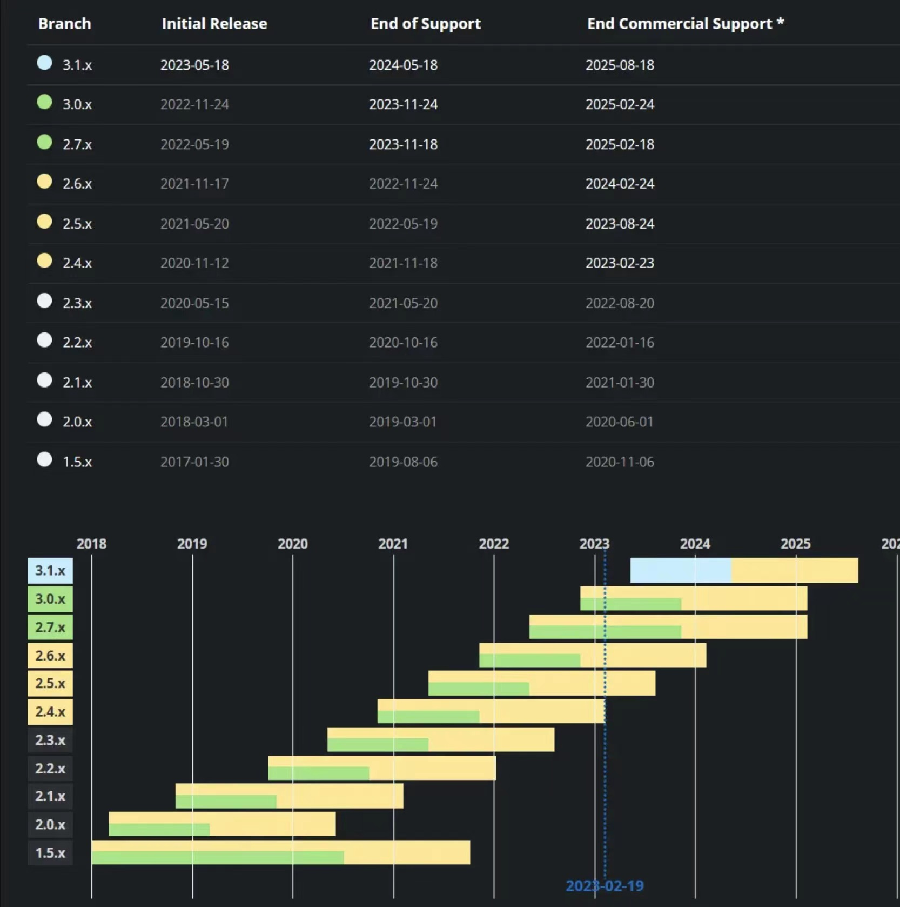
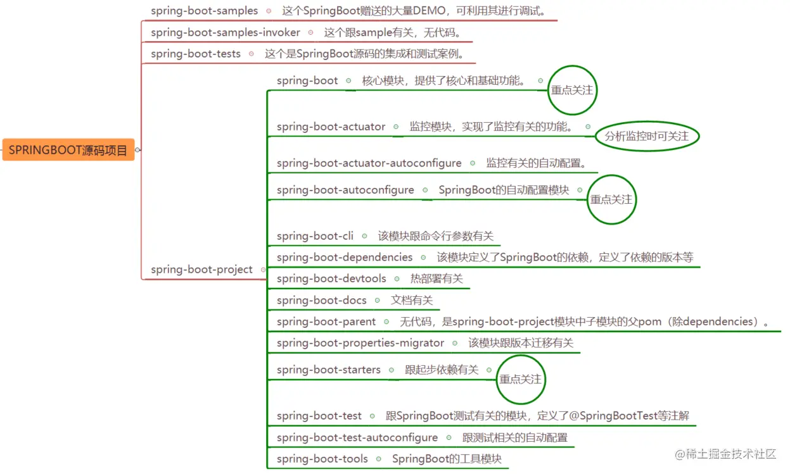
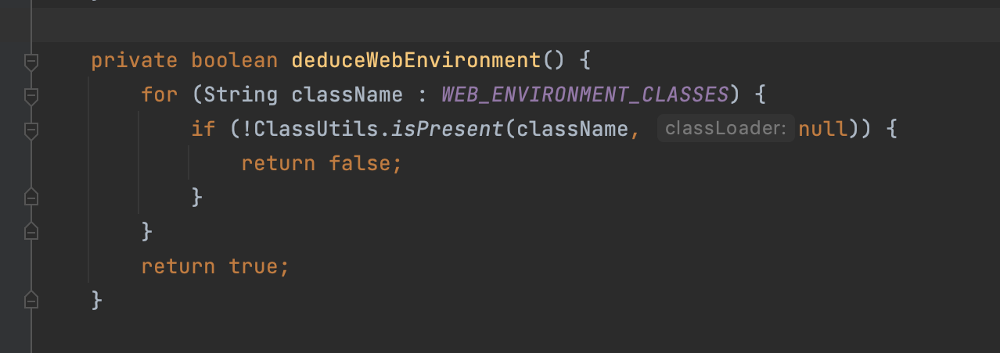
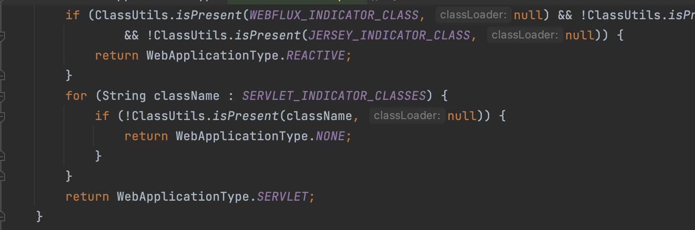

 

# SpringBoot升级

### 项目背景

截止2023.05.18，springboot发布了最新版本3.1.0。而在我们开发项目中，springboot一直使用的是1.5.8版本(相差6年的维护更新)。版本差距较大，很多新功能未能得到使用。例如近几年Loom的兴起，springboot也在3.0开始对虚拟线程进行了支持。

所以项目组开始计划对项目中的springboot版本进行升级改造。翻阅了springboot官方升级指引，不建议直接对springboot版本进行较大跨度的升级。小组制定了从1.5.8->2.1.0,2.1.0->2.7.9,2.7.9->3.0.5的升级改造计划。

### SpringBoot代码模块

模块众多我们真正要看的模块有`spring-boot`，`spring-boot-autoconfigure`，`spring-boot-starters`和`spring-boot-actuator`模块

#### **1) spring-boot-parent**

这个模块没有代码，是spring-boot模块的父项目，被其他子模块继承。

#### **2) spring-boot**

这个模块是SpringBoot项目的核心，可以说一些基础核心的功能都在这里实现，为SpringBoot的其他模块组件功能提供了支持，主要包括以下核心功能：

- `SpringApplication`类，这个是SpringBoot的启动类，提供了一个静态的`run`方法来启动程序，该类主要用来创建并且刷新Spring[容器](https://cloud.tencent.com/product/tke?from=20065&from_column=20065)`ApplicationContext`.
- 支持选择不同的容器比如Tomcat,Jetty、等来作为应用的嵌入容器。
- 外部配置支持，这个指的是我们执行`java -jar xxx.jar`命令时可以带一些参数，比如执行`java -jar demo.jar --server.port=8888`来将应用端口修改为8888.
- 该模块内置了一些SpringBoot启动时的生命周期事件和一些容器初始化器(`ApplicationContext` initializers)，来执行一些SpringBoot启动时的初始化逻辑。

#### **3) spring-boot-autoconfigure**

这个模块跟SpringBoot的自动配置有关。比如SpringBoot能基于类路径来自动配置某个项目模块，自动配置最为关键的注解是`@EnableAutoConfiguration`,这个注解能触发Spring上下文的自动配置。

除了根据类路径来进行自动配置外，还有根据容器中是否存在某个bean等方式来进行自动配置。

#### **4) spring-boot-starters**

这个模块是跟SpringBoot的启动依赖有关。SpringBoot通过提供众多起步依赖降低项目依赖的复杂度。起步依赖其实就是利用maven项目模型将其他相关的依赖给聚合起来，里面各种依赖的版本号都给定义好，避免用户在引入依赖时出现各种版本冲突，方便了我们的使用。

注意，该模块没有代码，主要是通过maven的pom.xml来组织各种依赖。

#### **5) spring-boot-actuator**

这个跟SpringBoot的监控有关。可以通过HTTP端点或JMX等来管理和监控应用。审计、运行状况和度量收集可以自动应用到应用程序。这个监控模块是开箱即用的，提供了一系列端点包括`HealthEndpoint`, `EnvironmentEndpoint`和`BeansEndpoint`等端点。

用一张思维导图解释模块关系

## 

# Springboot新特性

## [2.1.0新特性](https://github.com/spring-projects/spring-boot/wiki/Spring-Boot-2.0-Release-Notes)

最低支持jdk8,支持tomcat9

对响应式编程的支持，spring-boot-starter-webflux starter POM可以快速开始使用Spring WebFlux，它由嵌入式Netty服务器支持

| 1.5.8                                                        | 2.1.0                                                        | 2.7.0 | 3.0.0 |
| :----------------------------------------------------------- | :----------------------------------------------------------- | :---- | :---- |
|  |  |       |       |
|                                                              |                                                              |       |       |

Configuration properties migration

当升级到新功能版本时，一些配置可能会重命名或者被移除。SpringBoot提供一种方式去分析你应用的环境和在启动时打印诊断内容，还可以在运行时为你临时迁移属性。要启用该特性，添加下方的依赖到你的工程中：

<dependency>
 <groupId>org.springframework.boot</groupId>
 <artifactId>spring-boot-properties-migrator</artifactId>
 <scope>runtime</scope>
</dependency>

Gradle Plugin 增强

支持kotlin

Spring Boot 2.0 开始支持 GIF banners. See [this project](https://github.com/snicoll-demos/demo-animated-banner) for an example.

## [2.7.0新特性](https://github.com/spring-projects/spring-boot/wiki/Spring-Boot-2.7-Release-Notes)

自动配置注册文件,文件位置发生变更,

之前都是写在下面 文件中的：META-INF/spring.factories>现在改名了：META-INF/spring/org.springframework.boot.autoconfigure.AutoConfiguration.imports

为了向后兼容，META-INF/spring.factories 虽然现在被标识废弃了，但现在仍然可以使用，后续可能被彻底删除，建议使用新的规范。

支持 GraphQL,集成了对 GraphQL 的自动配置、指标支持等，Starter 名为：`spring-boot-starter-graphql`

由于 OkHttp 3 不再维护，Spring Boot 2.7 已升级到 OkHTTP 4。OkHttp 4向后兼容OkHttp 3

新注解（@AutoConfiguration）

新增了一个自动配置注解 `@AutoConfiguration`，用来代替之前的 `@Configuration`，用于标识新自动配置注册文件中的顶级自动配置类，由 `@AutoConfiguration` 注解嵌套、导入进来的其他配置类可以继续使用 `@Configuration` 注解。

另外，为方便起见，`@AutoConfiguration` 注解还支持 `after`, `afterNames`, `before` 和 `beforeNames` 属性进行自动配置排序，用于代替之前的 `@AutoConfigureAfter` 和 `@AutoConfigureBefore` 注解。

这个注解可以说更加细分了吧，自动配置专用注解，用专门的注解来干专门的事，这样也可以用来区分用 `@Configuration` 标识的普通配置类。

2.6.0开始禁止循环引用

如果您的应用程序由于 BeanCurrentlyInCreationException 而无法启动，强烈建议您更新配置以打破依赖循环。

如果您无法这样做，可以通过将 spring.main.allow-circular-references 设置为 true 或在 SpringApplication 和 SpringApplicationBuilder 上使用新的 setter 方法来再次允许循环引用

## [3.0.0新特性](https://github.com/spring-projects/spring-boot/wiki/Spring-Boot-3.0-Release-Notes)

[spring6](https://docs.spring.io/spring-framework/docs/6.0.0/reference/html/index.html)

Java 17是Spring Boot 3.0的最低版本要求，spring6 tomcat10也是springboot3的最低版本要求

Spring Boot 3.0的一个重要变化，即从Java EE迁移至javarta.包名由javax变成javarta

oracle在19年把javax捐给eclipse基金会，但不允许使用javax的命名空间，所以eclipse才继续发展成现在的javaee标准Jakarta EE，

Spring Boot 3.0 应用程序现在可以直接转换为 GraalVM 原生镜像（无需本地安装GraalVM环境），这可以提供显著的内存和启动性能改进。

可参考文章:[Spring Native](http://conf.ctripcorp.com/display/~zyuan.wang/Spring+Native)

[GraalVM与Spring Native初体验](https://juejin.cn/post/7048902171777040421)

https://docs.spring.io/spring-boot/docs/3.0.0/reference/html/native-image.html#native-image

mvn -Pnative spring-boot:build-image

docker run --rm -p 8080:8080 [docker.io/library/myproject:0.0.1-SNAPSHOT](http://docker.io/library/myproject:0.0.1-SNAPSHOT)

| 对比     | spring-native打包镜像 | JVM  |
| :------- | :-------------------- | :--- |
| 启动速度 |                       |      |
| 大小     |                       |      |

Auto-configuration Files

Spring Boot 2.7 引入了一个新的 META-INF/spring/org.springframework.boot.autoconfigure.AutoConfiguration.imports 文件，用于注册自动配置，同时保持与 spring.factories 中注册的向后兼容性。在此版本中，已删除对在 spring.factories 中注册自动配置的支持，以支持导入文件。

Spring官方在（Spring Boot3.0，Spring Framework6.0、Tomcat10.1.6-M16以上兼容支持JDK19) 实验虚拟线程

### [ 3.1新特性](https://github.com/spring-projects/spring-boot/wiki/Spring-Boot-3.1-Release-Notes)

1、最低环境要求

Spring Boot 3.0 的发布，其最低要求 Java 17，并向上兼容支持 Java 19，Spring Boot 3.1 可以支持 Java 20 了，因为前段时间 Java 20 发布了。

**对 Java 开发环境的要求对比表：**

| Spring Boot | JDK     | Spring  | Maven  | Gradle                 |
| :---------- | :------ | :------ | :----- | :--------------------- |
| 3.1.0       | 17 ~ 20 | 6.0.9+  | 3.6.3+ | 7.5+,8.x               |
| 3.0.0       | 17 ~ 19 | 6.0.2+  | 3.5+   | 7.5+                   |
| 2.7.12      | 8 ~ 20  | 5.3.27+ | 3.5+   | 6.8.x, 6.9.x, 7.x, 8.x |

2、移除 HttpClient 4

因为 Spring 6 删除了 RestTemplate 对 Apache HttpClient 4 的支持，取而代之的则是 Apache HttpClient 5。

而 Spring Boot 3.0 又同时包含了 HttpClient 4 和 HttpClient 5 两个依赖的管理，如果同时管理这两个版本，有的人可能会继续使用 HttpClient 4，应用程序在使用 RestTemplate 时可能会有潜在的错误，导致诊断困难。

所以，Spring Boot 3.1 移除了 HttpClient 4 的依赖管理，转而逼迫用户强制使用 HttpClient 5，大家有依赖 HttpClient 4 的升级时需要注意了。

3、Servlet 和 Filter 注册失败时抛异常

大家知道，Spring Boot 注册 Servlet 和 Filter 时用的 ServletRegistrationBean 和 FilterRegistrationBean 这两个类，之前注册失败时是记录 warn 级别的日志，现在则是直接抛出 IllegalStateException 异常。

如果不想注册失败抛出异常，还是想像以前一样记录 warn 警告日志，可以调用这两个类的 setIgnoreRegistrationFailure(true) 方法.

# Springboot升级项目实践

升级基本步骤:

1. 熟悉并确认升级的springboot版本,并了解其新特性
2. 根据官方相关依赖文档,确认并更新依赖版本
3. 熟读官方升级指南,
4. 项目升级,测试应用程序,分析解决相关问题（依赖roc的，直接升级roc相关springboot版本）

## V1.5.8→V2.1.0

### 基础准备

springboot2.1.0+spring5.1.2+jdk11+framework-bom6.5.1

最低 JDK 8，支持 JDK 9，不再支持 Java 6 和 7

不建议升级到2.0.0.RELEASE，一般来说，2.x表示新特性增加，2.0.x表示各类问题修复，不会引入新特性。所以，可以直接升级到比如2.1.0.RELEASE，2.0x最新的版本。

[其他相关依赖参考](https://docs.spring.io/spring-boot/docs/2.0.x/reference/html/appendix-dependency-versions.html)，很重要，相关依赖不匹配，导致问题排查难度增加。切记，升级前，核对升级相关依赖版本

### 问题与解决办法

[升级指南](https://github.com/spring-projects/spring-boot/wiki/Spring-Boot-2.0-Migration-Guide)

## V2.1.8→V2.7.0

### 基础准备

jdk11+springboot2.7.9+spring5.3.25

[相关依赖参考](https://docs.spring.io/spring-boot/docs/2.7.x/reference/html/dependency-versions.html#appendix.dependency-versions)

### 问题与解决办法

[升级指南](https://github.com/spring-projects/spring-boot/wiki/Spring-Boot-Config-Data-Migration-Guide)

## V2.7.0→V3.0.2

### 基础准备

jdk17+springboot3.0.1+spring6.0.2

spring6.0.2必须升级包括 Kotlin 1.7、Hibernate ORM 6.1、用于 JSON 和 XML 解析的 Jackson 2.14 以及用于反应式数据库访问的 R2DBC 1.0

[相关依赖参考](https://docs.spring.io/spring-boot/docs/3.0.x/reference/html/dependency-versions.html#appendix.dependency-versions)

### 问题与解决办法

[升级指南](https://github.com/spring-projects/spring-boot/wiki/Spring-Boot-3.0-Migration-Guide)

# 个人收获

# 问题讨论

**如何保证升级无问题，通过哪些方面来衡量?**

响应报文一致、无报错、性能(服务耗时、cpu、内存消耗)无明显变化

https://github.com/spring-projects-experimental/spring-boot-migrator/releases

https://zhuanlan.zhihu.com/p/574266547

**自动装配**

装配文件位置发生变,需要各组件修改.由META-INF/spring.factories改为META-INF/spring/org.springframework.boot.autoconfigure.AutoConfiguration.imports

 