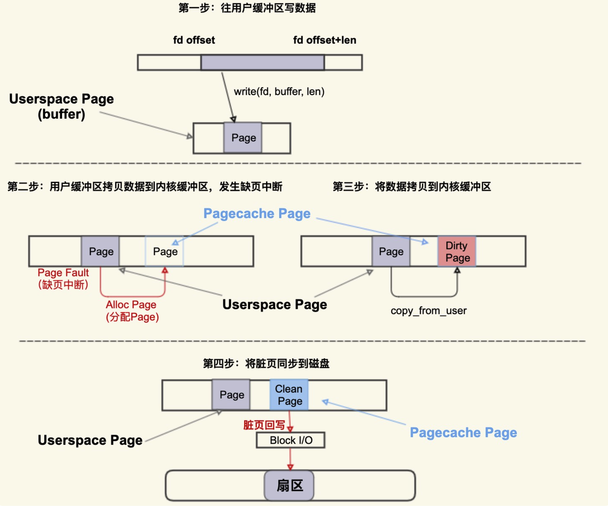
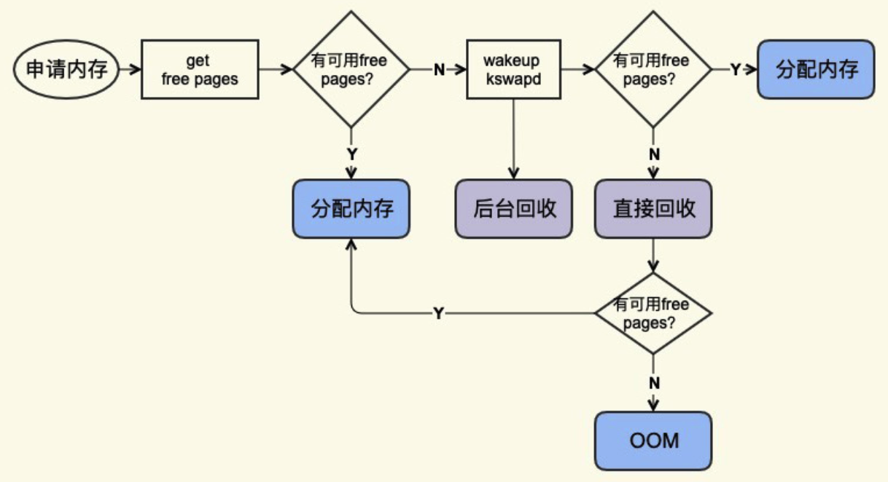

## Linux内核问题


### PageCache问题

##### PageCache的产生

- Buffered I/O(标准 I/O)
  - 需要进行数据拷贝（**内核缓存区[Pagecache Page]** 与 **用户缓存区[Userpace Page**]）
- Memory-Mapped I/O(存储映射 I/O)
  - 直接将Pagecache Page给映射到用户地址空间，用户直接读写Pagecache Page中的内容


##### PageCache的运行机制



```shell
# 查看系统中脏页情况
$ cat /proc/vmstat | egrep "dirty|writeback"
# 表示当前系统中积压了多少脏页(单位 Page(4KB))
nr_dirty 40
# 表示有多少脏页正 在回写到磁盘中 (单位 Page(4KB))
nr_writeback 2
```


##### PageCache的释放



- 后台回收
- 直接回收 - 阻塞进程

```shell
# 观察命令 PageCache 的 回收
$ sar -B 1
# pgscank/s : kswapd(后台回收线程) 每秒扫描的 page 个数
# pgscand/s: Application 在内存申请过程中每秒直接扫描的 page 个数
# pgsteal/s: 扫描的 page 中每秒被回收的个数
# %vmeff: pgsteal/(pgscank+pgscand), 回收效率，越接近 100 说明系统越安全，越接 近 0 说明系统内存压力越大。
```

