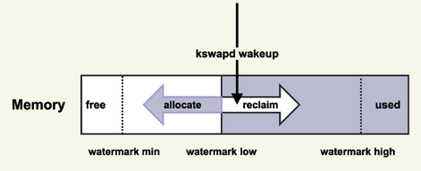

## Linux内核问题


### PageCache问题

##### PageCache的产生

- Buffered I/O(标准 I/O)
  - 需要进行数据拷贝（**内核缓存区[Pagecache Page]** 与 **用户缓存区[Userpace Page**]）
- Memory-Mapped I/O(存储映射 I/O)
  - 直接将Pagecache Page给映射到用户地址空间，用户直接读写Pagecache Page中的内容


##### PageCache的运行机制


```shell
# 查看系统中脏页情况
$ cat /proc/vmstat | egrep "dirty|writeback"
# 表示当前系统中积压了多少脏页(单位 Page(4KB))
nr_dirty 40
# 表示有多少脏页正 在回写到磁盘中 (单位 Page(4KB))
nr_writeback 2
```


##### PageCache的释放


- 后台回收
- 直接回收 - 阻塞进程

```shell
# 观察命令 PageCache 的 回收
$ sar -B 1
# pgscank/s : kswapd(后台回收线程) 每秒扫描的 page 个数
# pgscand/s: Application 在内存申请过程中每秒直接扫描的 page 个数
# pgsteal/s: 扫描的 page 中每秒被回收的个数
# %vmeff: pgsteal/(pgscank+pgscand), 回收效率，越接近 100 说明系统越安全，越接 近 0 说明系统内存压力越大。
```


##### PageCache难以回收导致系统Load变高

> 系统很卡顿，敲命令响应非常慢; 应用程序的 **RT（Response-time）** 变得很高，或者抖动得很厉害

- 直接内存回收引起的 load 飙高

  - 直接内存回收是指在进程上下文同步进行内存回收 - 阻塞进程

  - 解决方案：**及早地触发后台回收来避免应用程序进行直接内存回收**

    

    - 当内存水位低于 watermark low 时，就会唤醒 kswapd 进行后台回收，然 后 kswapd 会一直回收到 watermark high

    - 可以增大 min_free_kbytes 这个配置选项来及早地触发后台回收
      - CentOS-6(2.6.32 内核版本)  ： vm.extra_free_kbytes = 4194304
      - CentOS-7(3.10.0 以及以上内核版本)：vm.min_free_kbytes = 4194304
    - 对于大于等于 128G 的系统而言，将 min_free_kbytes 设置为 4G 比较合理，这是我们在 处理很多这种问题时总结出来的一个经验值，既不造成较多的内存浪费，又能避免掉绝大 多数的直接内存回收。

- 系统中脏页积压过多引起的 load 飙高;

  - 脏页回写磁盘IO阻塞（延迟大）

  - 解决方案：

    - 控制系统脏页

      - ```shell
        vm.dirty_background_bytes = 0 
        vm.dirty_background_ratio = 10 
        vm.dirty_bytes = 0 
        vm.dirty_expire_centisecs = 3000 
        vm.dirty_ratio = 20
        
        # 查看调优效果
        $ grep "nr_dirty_" /proc/vmstat
        ```

      - **这些值调整大多少比较合适，也是因系统和业务的不同而异，我的建议也是一边调整 一边观察，将这些值调整到业务可以容忍的程度就可以了**

- 系统 NUMA 策略配置不当引起的 load 飙高

  - 解决方案：
    - 因为相比内存回收的危害而言，NUMA 带来的性能提升几乎可以忽略，所以配置为 0，利 远大于弊
      - vm.zone_reclaim_mode = 0


##### PageCache专业分析工具

- ftrace
- ebpf
- perf
- systemtap


### 内存泄露问题

> 检测工具：valgrind
>
> $ valgrind --leak-check=full ./a.out