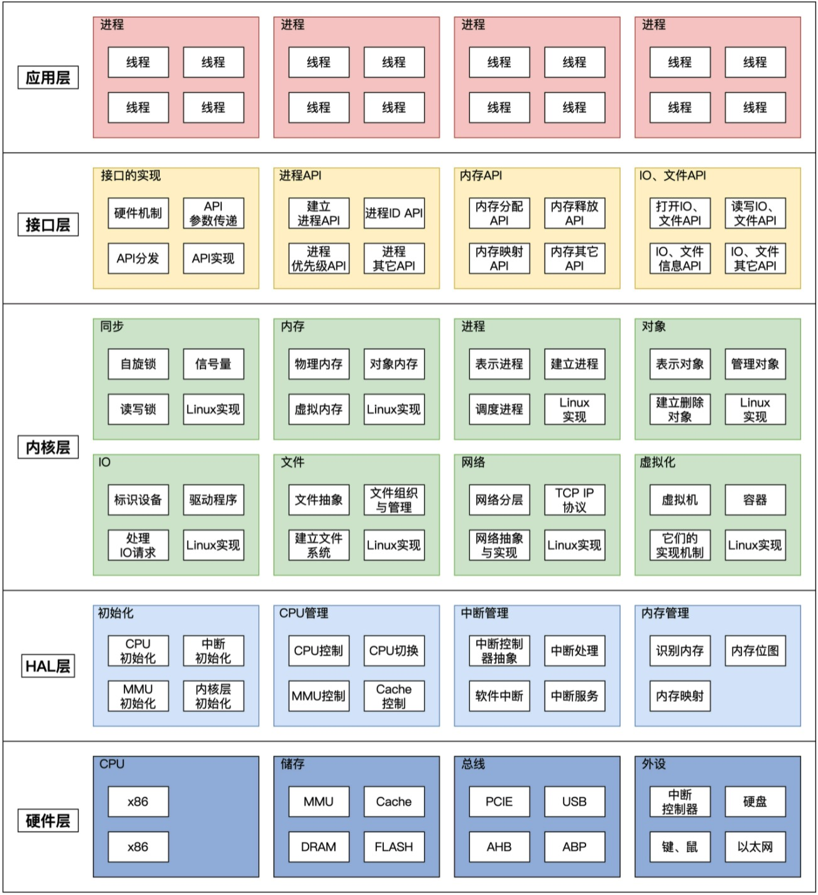
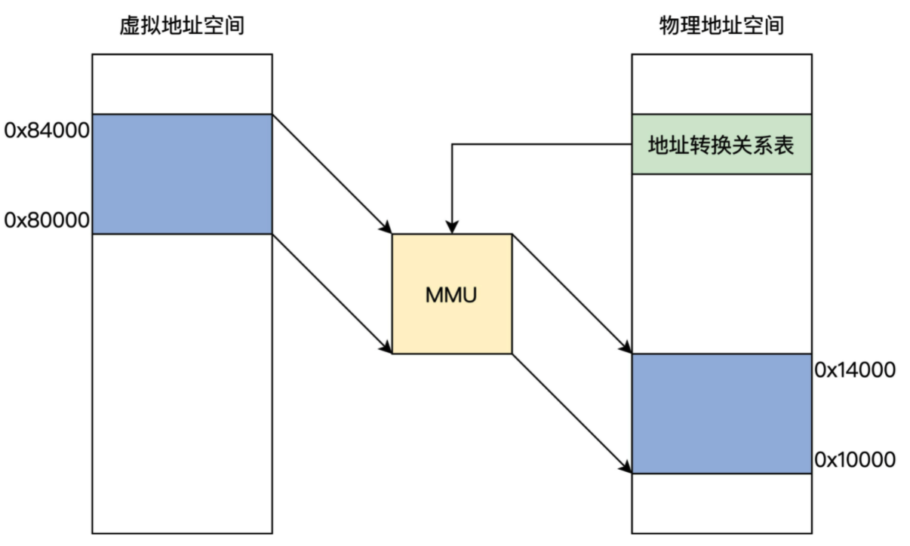
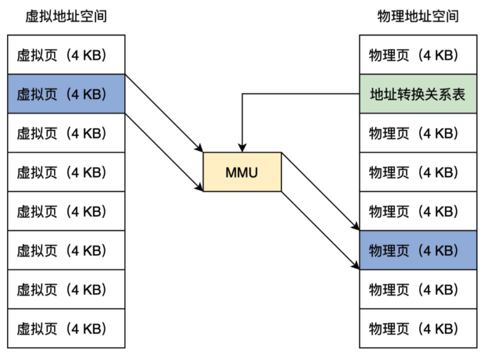
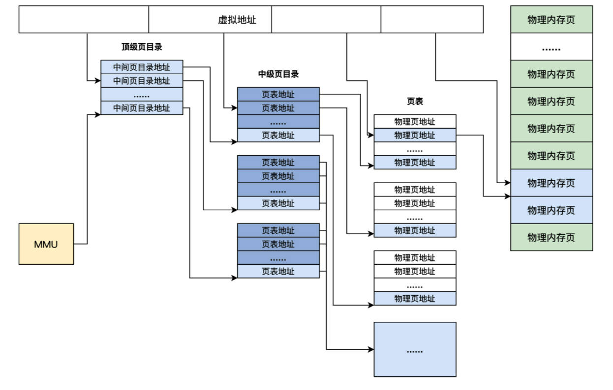
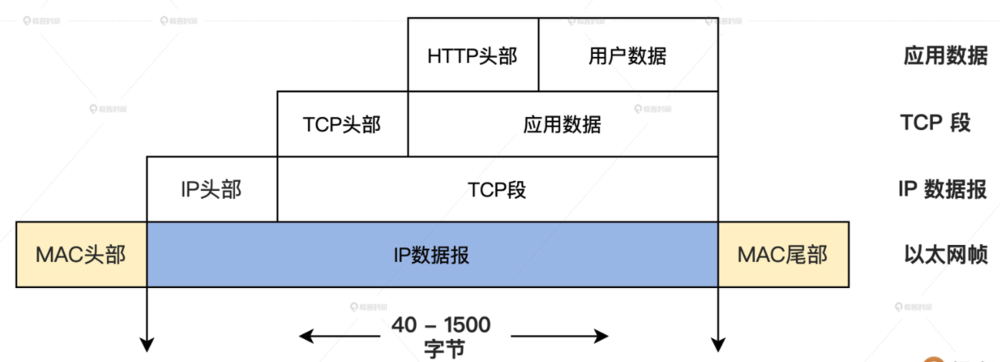

## 操作系统




### 内存分配

##### 虚拟地址

每个应用程序的**虚拟地址空间**是相同的，但是互相独立

创建：链接器，程序编译后，需链接成可执行文件，链接器将多个代码模块组装在一起，并解决模块间的引用，即处理程序代码间的地址引用，形成程序运行的静态内存空间视图


##### 物理地址

内存只认识 物理地址（逻辑上也是一个数据，这个数据会被地址译码器等电子器件变成电子信号，放到地址总线上，地址总线电子信号的各种组合就可以选择到内存的储存单元了）


##### 虚拟地址 转换成 物理地址

**MMU（内存管理单元）**：可以接受软件给出的地址对应关系数据，进行地址转换



**地址转换表（页表）**：存储在物理内存中！

**分页模型**：

虚拟地址和物理地址都分成同等大小的块，或者叫页，按照虚拟页和物理页进行转换




##### MMU（内存管理单元）

页表中不存储虚拟地址与物理地址的对应关系（为了增加灵活性，节约物理内存），只存储 物理页面的地址。

MMU以虚拟地址为索引去查询表返回物理页面地址。

页表是分级的：

- 顶级页目录
- 中级页目录
- 页表

逻辑图：（每种模式下的分页具体实现不一样）



一个虚拟地址被分为 **四个段**


##### 内存控制器

集成在北桥中，现代系统主板将北桥集成到了CPU芯片中，可大大提升CPU访问内存的性能


##### Cache（硬件支持：高速存储器）

程序具有局部性原理，即CPU大多数时间在访问相同或者相邻的地址，所以在内存与CPU之间设计一个小而快的高速缓存

Cache也集成在CPU内部

Cache组成：

- 高速的静态存储器
  - Cache将高速静态存储器和内存分成大小相同的行，每行大小通常为32字节或者64字节，Cache和内存交换的最小单位就是一行，为方便管理，Cache内部多个行又会形成一组
- 地址转换模块
  - 接收CPU发出的地址，将地址分成3段：组号、行号、行内偏移
- Cache行替换模块
  - 脏位、回写位、访问位

Cache工作流程：

- CPU发出地址，由地址转换器转换
- Cache依据地址转换器的转换后的 组号、行号，定位到高速静态存储器的对应行
  - 如果命中，则使用行内偏移读取并返回数据给CPU
  - 未命中，则分配一个新行并访问内存，把内存中的对应的数据加载到Cache中并返回给CPU
    - 如果没有新行了，则进行行替换逻辑，找出一个Cache行，将其回写内存，腾出空间
  - 写入操作（内存）：
    - 回写：写入对应Cache行就结束了
    - 直写：写入Cache行的同时写入内存

Cache数据一致性问题：

- 三级缓存的CPU：
  - 一级Cache是指令和数据分开的，CPU核心互相独立
    - 一个CPU核心中的指令和数据Cache的一致性
  - 二级Cache对CPU核心互相独立
    - 多个CPU核心各自二级Cache的一致性的问题
  - 三级Cache所有CPU核心共享
    - 三级缓存对应CPU维度来说没有一致性问题，但是三级缓存 与 设备内存，如 DMA、网卡帧存储、显存之间存在一致性问题

- 解决：Cache数据同步协议（MESI、MOESI）
  - MESI（Modified修改、Exclusive独占、Shared共享、Invalid无效）：定义了四种状态
- 解决并发数据同步问题
  - 原子变量
    - Linux提供一个原子类型变量 atomic_t，需使用Linux提供的函数去操作使用
  - 控制中断
    - 关闭中断，防止因多个中断引起的对共享数据访问问题（如设备驱动程序在设置设备寄存器时，需要让CPU停止响应中断）
  - 多核CPU，使用自旋锁 协调多个CPU核心
    - **自旋锁** 的实现由有系统硬件提供的，CPU会给我提供一个原子交换指令（x86系统CPU：xchg指令）：他可以让寄存器里面的一个值与内存空间中的一个之值进行交换，并且不受CPU干扰
      - 中断关闭下，获取自旋锁，恢复中断，则释放自旋锁
  - 使用信号量
    - 自旋锁 不适合长时间等待的情况
  - 读写锁
    - Linux 读写锁的原理本质是基于计数器，初始值为 0x01000000，获取读锁时对其减 1，结果不小于 0 则表示获取读锁成功，获取写锁时直接减去 0x01000000。
      1. 获取读锁时，锁值变量 lock 计数减去 1，判断结果的符号位是否为 1。若结果符号位为 0 时，获取读锁成功，即表示 lock 大于 0。
      2. 获取读锁时，锁值变量 lock 计数减去 1，判断结果的符号位是否为 1。若结果符号位为 1 时，获取读锁失败，表示此时读写锁被修改数据的进程占有，此时调用 __read_lock_failed 失败处理函数，循环测试 lock+1 的值，直到结果的值大于等于 1。
      3. 获取写锁时，锁值变量 lock 计数减去 RW_LOCK_BIAS_STR，即 lock-0x01000000，判断结果是否为 0。若结果为 0 时，表示获取写锁成功。
      4. 获取写锁时，锁值变量 lock 计数减去 RW_LOCK_BIAS_STR，即 lock-0x01000000，判断结果是否为 0。若结果不为 0 时，获取写锁失败，表示此时有读取数据的进程占有读锁或有修改数据的进程占有写锁，此时调用 __write_lock_failed 失败处理函数，循环测试 lock+0x01000000，直到结果的值等于 0x01000000。


### 网卡

OSI网络分层

- 应用层
  - 提供为应用软件而设计的接口，以设置与另一应用软件之间的通信。例如：HTTP、HTTPS、FTP、Telnet、SSH、SMTP、POP3等
- 表示层
  - 把数据转换为能与接收者的系统格式兼容并适合传输的格式
- 会话层
  - 负责在数据传输中设置和维护计算机网络中两台计算机之间的通信连接
- 传输层
  - 把传输表头（TH）加至资料以形成分组。传输表头包含了所使用的协议等发送信息。例如:传输控制协议（TCP）等
- 网络层
  - 决定数据的路径选择和转寄，将网络表头（NH）加至数据包，以形成分组。网络表头包含了网络资料。例如:互联网协议（IP）等
- 数据链路层
  - 负责网络寻址、错误侦测和改错。当表头和表尾被加至数据包时，会形成信息框（Data Frame）。数据链表头（DLH）是包含了物理地址和错误侦测及改错的方法。数据链表尾（DLT）是一串指示数据包末端的字符串。例如以太网、无线局域网（Wi-Fi）和通用分组无线服务（GPRS）等
  - 分为两个子层：
    - 逻辑链路控制（logical link control，LLC）子层
    - 介质访问控制（Media access control，MAC）子层
- 物理层
  - 在局域网上发送数据帧（Data Frame），它负责管理电脑通信设备和网络媒体之间的互通。包括了针脚、电压、线缆规范、集线器、中继器、网卡、主机接口卡等




### Socket

##### 套接字与文件

套接字的连接建立起来之后，用户进程就可以使用**常规文件**操作访问套接字了

实现：Linux的VFS文件系统，在VFS中，每个文件都有一个VFS inode结构，每个套接字都分配一个该类型的inode，套接字中的inode指针连接管理常规文件的其他结构

套接字的文件描述符的文件访问的重定向，对网络协议栈是透明的，而inode和socket的链接是通过直接分配一个辅助结构体来实现的

```c
struct socket_slloc {
	struct socket socket;
	struct inode vfs_inode;
}
```

##### Socket Buffer

网络数据包在内核中的对象实例，组成：

- 数据包：存放了在网络中实际流通的数据
- 管理数据结构（struct sk_buff）：内核需要一写其他数据来管理和操作数据包，例如协议直接的交换信息、数据的状态、时间等